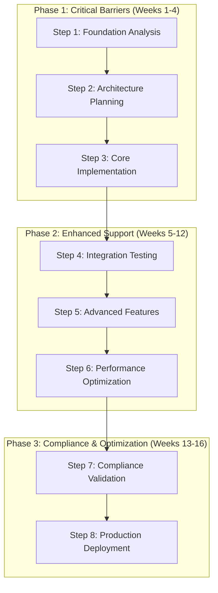

# MultiCardz Accessibility Implementation Plan

**Document ID**: 015-2025-09-18-MultiCardz-Accessibility-Implementation-Plan-v1
**Created**: September 18, 2025
**Author**: System Architect
**Status**: Implementation Roadmap - Ready for Execution
**Dependencies**: [014-2025-09-18-MultiCardz-Accessibility-Gap-Analysis-v1.md]

---

## Executive Summary

This implementation plan provides a detailed, step-by-step roadmap for transforming MultiCardz into a fully accessible platform that meets WCAG 2.1 AA standards while preserving the revolutionary spatial manipulation capabilities. The plan follows an 8-step incremental approach that ensures continuous functionality and allows for iterative testing and refinement.

**Key Implementation Principles**:
- **Progressive Enhancement**: Accessibility features enhance rather than replace existing functionality
- **Performance First**: All accessibility implementations must maintain sub-millisecond performance targets
- **Patent Compliance**: Accessibility solutions must preserve patent-protected spatial manipulation behaviors
- **Universal Design**: Features benefit all users, not just those requiring accessibility support

**Timeline**: 16-week implementation across 3 priority phases
**Resource Requirements**: 2 senior developers, 1 accessibility specialist, 1 UX designer
**Success Metrics**: Zero WCAG violations, 90%+ task completion for assistive technology users

## 1. Implementation Overview

### 1.1 Eight-Step Implementation Strategy

The accessibility implementation follows a proven 8-step methodology that ensures systematic coverage of all accessibility requirements:



### 1.2 Risk Mitigation Strategy

Each implementation step includes built-in risk mitigation:
- **Feature flags** for gradual rollout and instant rollback capability
- **Performance monitoring** to ensure accessibility features don't degrade core functionality
- **Automated testing** to prevent accessibility regressions
- **User testing** with assistive technology users at each milestone

## 2. Step 1: Foundation Analysis and Preparation (Week 1)

### 2.1 Current State Audit

**Objective**: Establish baseline accessibility metrics and identify integration points

#### 2.1.1 Automated Accessibility Scanning
```bash
# Install accessibility testing tools
npm install --save-dev @axe-core/playwright
npm install --save-dev lighthouse
npm install --save-dev pa11y

# Create accessibility test suite
mkdir tests/accessibility
```

```javascript
// tests/accessibility/baseline-audit.test.js
import { test, expect } from '@playwright/test';
import AxeBuilder from '@axe-core/playwright';

test.describe('Baseline Accessibility Audit', () => {
  test('Spatial interface accessibility scan', async ({ page }) => {
    await page.goto('/multicardz/spatial-interface');

    const accessibilityScanResults = await new AxeBuilder({ page })
      .include('#spatial-zones')
      .include('#card-grid')
      .include('#tag-cloud')
      .analyze();

    // Document current violations for remediation tracking
    console.log('Current violations:', accessibilityScanResults.violations.length);

    // Create baseline report
    await page.screenshot({ path: 'tests/accessibility/baseline-screenshot.png' });

    // Save detailed violation report
    require('fs').writeFileSync(
      'tests/accessibility/baseline-violations.json',
      JSON.stringify(accessibilityScanResults.violations, null, 2)
    );
  });

  test('Keyboard navigation assessment', async ({ page }) => {
    await page.goto('/multicardz/spatial-interface');

    // Test current keyboard accessibility
    const focusableElements = await page.locator('[tabindex]:not([tabindex="-1"]), button, input, select, textarea, a[href]').all();
    console.log('Currently focusable elements:', focusableElements.length);

    // Test tab navigation flow
    for (let i = 0; i < Math.min(focusableElements.length, 10); i++) {
      await page.keyboard.press('Tab');
      const focused = await page.locator(':fextContent();
      console.log(`Tab ${i + 1}: ${focused}`);
    }
  });
});
```

#### 2.1.2 Performance Baseline Establishment
```javascript
// tests/accessibility/performance-baseline.test.js
import { test } from '@playwright/test';

test('Performance baseline before accessibility implementation', async ({ page }) => {
  await page.goto('/multicardz/spatial-interface');

  // Measure current performance
  const performanceMetrics = await page.evaluate(() => {
    return new Promise((resolve) => {
      new PerformanceObserver((list) => {
        const entries = list.getEntries();
        const metrics = {
          spatialOperationTime: 0,
          cardRenderTime: 0,
          interactionResponseTime: 0
        };

        entries.forEach(entry => {
          if (entry.name.includes('spatial-operation')) {
            metrics.spatialOperationTime = entry.duration;
          }
          if (entry.name.includes('card-render')) {
            metrics.cardRenderTime = entry.duration;
          }
        });

        resolve(metrics);
      }).observe({ entryTypes: ['measure'] });

      // Trigger typical operations for measurement
      setTimeout(() => {
        performance.mark('spatial-operation-start');
        // Simulate spatial operation
        performance.mark('spatial-operation-end');
        performance.measure('spatial-operation', 'spatial-operation-start', 'spatial-operation-end');
      }, 100);
    });
  });

  console.log('Baseline performance metrics:', performanceMetrics);

  // Store baseline for comparison
  require('fs').writeFileSync(
    'tests/accessibility/performance-baseline.json',
    JSON.stringify(performanceMetrics, null, 2)
  );
});
```

### 2.2 Architecture Integration Planning

#### 2.2.1 Web Components Accessibility Enhancement Strategy
```javascript
// src/accessibility/web-components-a11y-mixin.js
export const AccessibilityMixin = (BaseClass) => {
  return class extends BaseClass {
    constructor() {
      super();
      this.accessibilityManager = new ComponentAccessibilityManager(this);
    }

    connectedCallback() {
      super.connectedCallback();
      this.setupAccessibilityFeatures();
    }

    setupAccessibilityFeatures() {
      this.accessibilityManager.enhanceSemantics();
      this.accessibilityManager.setupKeyboardNavigation();
      this.accessibilityManager.setupScreenReaderSupport();
    }

    // Accessibility-aware attribute changes
    attributeChangedCallback(name, oldValue, newValue) {
      super.attributeChangedCallback(name, oldValue, newValue);
      this.accessibilityManager.handleAttributeChange(name, newValue);
    }
  };
};
```

#### 2.2.2 HTMX Accessibility Integration Points
```javascript
// src/accessibility/htmx-a11y-integration.js
document.addEventListener('htmx:beforeSwap', (event) => {
  // Prepare accessibility context before DOM updates
  const accessibilityContext = captureAccessibilityContext(event.target);
  event.detail.accessibilityContext = accessibilityContext;
});

document.addEventListener('htmx:afterSwap', (event) => {
  // Restore and enhance accessibility after DOM updates
  restoreAccessibilityContext(event.detail.accessibilityContext);
  enhanceNewContent(event.target);
});

function captureAccessibilityContext(element) {
  return {
    focusedElement: document.activeElement,
    ariaLiveRegions: Array.from(element.querySelectorAll('[aria-live]')),
    selectedElements: Array.from(element.querySelectorAll('[aria-selected="true"]'))
  };
}

function enhanceNewContent(container) {
  // Apply accessibility enhancements to new content
  const accessibilityEnhancer = new ContentAccessibilityEnhancer();
  accessibilityEnhancer.process(container);
}
```

## 3. Step 2: Architecture Planning and Design (Week 2)

### 3.1 Accessibility Architecture Design

#### 3.1.1 Functional Architecture for Accessibility
```python
# src/accessibility/architecture.py
from typing import Protocol, TypeVar, Generic
from dataclasses import dataclass
from abc import abstractmethod

T = TypeVar('T')

@dataclass(frozen=True)
class AccessibilityContext:
    """Immutable context for accessibility operations."""
    user_preferences: dict[str, any]
    assistive_technology: str | None
    interaction_modality: str  # 'keyboard', 'screen-reader', 'voice', 'touch'
    current_focus: str | None
    spatial_position: tuple[int, int] | None

class AccessibilityEnhancer(Protocol[T]):
    """Protocol for accessibility enhancement implementations."""

    @abstractmethod
    async def enhance_component(
        self,
        component: T,
        context: AccessibilityContext
    ) -> T:
        """
        Enhance component with accessibility features.

        Returns enhanced component with proper ARIA attributes,
        keyboard navigation, and screen reader support.
        """
        ...

    @abstractmethod
    def supports_modality(self, modality: str) -> bool:
        """Check if enhancer supports specific interaction modality."""
        ...

# Functional implementation for spatial component enhancement
class SpatialAccessibilityEnhancer:
    """Enhances spatial manipulation components with accessibility features."""

    async def enhance_component(
        self,
        component: SpatialComponent,
        context: AccessibilityContext
    ) -> SpatialComponent:
        """Apply accessibility enhancements using pure functions."""
        enhanced_component = apply_semantic_structure(component)
        enhanced_component = apply_keyboard_navigation(enhanced_component, context)
        enhanced_component = apply_screen_reader_support(enhanced_component, context)
        enhanced_component = apply_alternative_interactions(enhanced_component, context)

        return enhanced_component

def apply_semantic_structure(component: SpatialComponent) -> SpatialComponent:
    """Apply ARIA landmarks and semantic structure."""
    return enhance_with_aria_attributes(
        component=component,
        role=determine_semantic_role(component),
        label=generate_accessible_name(component),
        description=generate_accessible_description(component)
    )

def apply_keyboard_navigation(
    component: SpatialComponent,
    context: AccessibilityContext
) -> SpatialComponent:
    """Apply keyboard navigation capabilities."""
    navigation_strategy = select_navigation_strategy(component.type, context)
    return navigation_strategy.apply(component)

def apply_screen_reader_support(
    component: SpatialComponent,
    context: AccessibilityContext
) -> SpatialComponent:
    """Apply screen reader announcements and live regions."""
    if context.interaction_modality == 'screen-reader':
        return enhance_with_screen_reader_features(component)
    return component
```

#### 3.1.2 Alternative Interaction Architecture
```python
# src/accessibility/alternative_interactions.py
from typing import Union
from abc import abstractmethod

class InteractionStrategy(Protocol):
    """Protocol for alternative interaction methods."""

    @abstractmethod
    async def execute_spatial_operation(
        self,
        operation: SpatialOperation,
        context: AccessibilityContext
    ) -> OperationResult:
        """Execute spatial operation using alternative interaction method."""
        ...

class KeyboardSpatialStrategy:
    """Keyboard-driven spatial manipulation."""

    async def execute_spatial_operation(
        self,
        operation: SpatialOperation,
        context: AccessibilityContext
    ) -> OperationResult:
        """Execute spatial operation via keyboard interface."""

        # Convert spatial drag-and-drop to keyboard-driven menu selection
        if operation.type == 'tag_placement':
            return await self.execute_keyboard_tag_placement(operation)
        elif operation.type == 'card_movement':
            return await self.execute_keyboard_card_movement(operation)
        elif operation.type == 'zone_organization':
            return await self.execute_keyboard_zone_organization(operation)

        raise ValueError(f"Unsupported operation type: {operation.type}")

    async def execute_keyboard_tag_placement(
        self,
        operation: TagPlacementOperation
    ) -> OperationResult:
        """Place tags using keyboard navigation and selection."""
        tag_selector = create_accessible_tag_selector(operation.available_tags)
        zone_selector = create_accessible_zone_selector(operation.available_zones)

        # Present menu-driven interface for tag placement
        selected_tag = await tag_selector.get_user_selection()
        selected_zone = await zone_selector.get_user_selection()

        # Execute the same set theory operations as drag-and-drop
        result = await execute_tag_placement(
            tag=selected_tag,
            zone=selected_zone,
            set_operations=operation.set_operations
        )

        return OperationResult(
            success=True,
            affected_cards=result.cards,
            announcement=generate_operation_announcement(operation, result)
        )

class VoiceControlStrategy:
    """Voice-controlled spatial manipulation."""

    async def execute_spatial_operation(
        self,
        operation: SpatialOperation,
        context: AccessibilityContext
    ) -> OperationResult:
        """Execute spatial operation via voice commands."""

        voice_command_parser = VoiceCommandParser()
        spatial_command = voice_command_parser.parse(operation.voice_input)

        # Convert voice intent to spatial operation
        return await self.execute_voice_spatial_command(spatial_command)

class TouchAccessibleStrategy:
    """Touch-accessible spatial manipulation for assistive technology."""

    async def execute_spatial_operation(
        self,
        operation: SpatialOperation,
        context: AccessibilityContext
    ) -> OperationResult:
        """Execute spatial operation with assistive touch support."""

        # Alternative touch patterns that don't conflict with screen reader gestures
        if context.assistive_technology in ['VoiceOver', 'TalkBack']:
            return await self.execute_assistive_touch_operation(operation)
        else:
            return await self.execute_standard_touch_operation(operation)
```

### 3.2 Component Enhancement Specifications

#### 3.2.1 Card Multiplicity Accessibility Enhancement
```python
# src/accessibility/card_multiplicity_a11y.py
@dataclass(frozen=True)
class AccessibleCardInstance:
    """Enhanced card instance with accessibility metadata."""
    base_card: Card
    instance_position: SpatialPosition
    total_instances: int
    instance_index: int
    accessible_name: str
    accessible_description: str
    navigation_instructions: str

def enhance_card_multiplicity_accessibility(
    card_instances: frozenset[CardInstance],
    context: AccessibilityContext
) -> frozenset[AccessibleCardInstance]:
    """Apply accessibility enhancements to card multiplicity system."""

    instance_groups = group_cards_by_content(card_instances)
    enhanced_instances = set()

    for content_key, instances in instance_groups.items():
        if len(instances) > 1:
            enhanced_group = enhance_multiplicity_group(instances, context)
            enhanced_instances.update(enhanced_group)
        else:
            # Single instance - standard enhancement
            enhanced_instance = enhance_single_card(instances[0], context)
            enhanced_instances.add(enhanced_instance)

    return frozenset(enhanced_instances)

def enhance_multiplicity_group(
    instances: list[CardInstance],
    context: AccessibilityContext
) -> frozenset[AccessibleCardInstance]:
    """Enhance group of duplicate card instances."""
    enhanced_instances = set()

    for index, instance in enumerate(instances):
        accessible_name = generate_multiplicity_accessible_name(
            instance=instance,
            total_count=len(instances),
            current_index=index
        )

        accessible_description = generate_multiplicity_description(
            instance=instance,
            related_instances=instances,
            current_index=index
        )

        navigation_instructions = generate_multiplicity_navigation_instructions(
            instance=instance,
            related_instances=instances,
            current_index=index
        )

        enhanced_instance = AccessibleCardInstance(
            base_card=instance.card,
            instance_position=instance.position,
            total_instances=len(instances),
            instance_index=index,
            accessible_name=accessible_name,
            accessible_description=accessible_description,
            navigation_instructions=navigation_instructions
        )

        enhanced_instances.add(enhanced_instance)

    return frozenset(enhanced_instances)

def generate_multiplicity_accessible_name(
    instance: CardInstance,
    total_count: int,
    current_index: int
) -> str:
    """Generate comprehensive accessible name for card instance."""
    base_title = instance.card.title
    tag_summary = ', '.join(sorted(instance.card.tags)[:3])  # Limit for brevity
    position_info = f"instance {current_index + 1} of {total_count}"
    location_info = describe_spatial_location(instance.position)

    return f"{base_title}, tagged as {tag_summary}, {position_info}, located in {location_info}"

def generate_multiplicity_navigation_instructions(
    instance: CardInstance,
    related_instances: list[CardInstance],
    current_index: int
) -> str:
    """Generate navigation instructions for moving between instances."""
    prev_available = current_index > 0
    next_available = current_index < len(related_instances) - 1

    instructions = []
    if prev_available:
        instructions.append("Press Shift+Tab to go to previous instance")
    if next_available:
        instructions.append("Press Tab to go to next instance")

    instructions.append("Press Enter to focus on this instance")
    instructions.append("Press Escape to exit instance navigation")

    return ". ".join(instructions)
```

#### 3.2.2 System Tags Accessibility Enhancement
```python
# src/accessibility/system_tags_a11y.py
@dataclass(frozen=True)
class AccessibleSystemTag:
    """System tag enhanced with accessibility features."""
    tag_text: str
    operation_type: str  # 'aggregation', 'modification', 'mutation'
    safety_level: str    # 'safe', 'caution', 'destructive'
    accessible_name: str
    operation_description: str
    expected_result: str
    safety_warnings: list[str]
    keyboard_instructions: str

def enhance_system_tag_accessibility(
    system_tag: SystemTag,
    context: AccessibilityContext
) -> AccessibleSystemTag:
    """Apply accessibility enhancements to system tags."""

    operation_metadata = get_system_tag_operation_metadata(system_tag.text)

    accessible_name = generate_system_tag_accessible_name(
        system_tag, operation_metadata
    )

    operation_description = generate_operation_description(
        system_tag, operation_metadata
    )

    expected_result = generate_expected_result_description(
        system_tag, operation_metadata
    )

    safety_warnings = generate_safety_warnings(
        system_tag, operation_metadata
    )

    keyboard_instructions = generate_system_tag_keyboard_instructions(
        system_tag, operation_metadata
    )

    return AccessibleSystemTag(
        tag_text=system_tag.text,
        operation_type=operation_metadata.type,
        safety_level=operation_metadata.safety_level,
        accessible_name=accessible_name,
        operation_description=operation_description,
        expected_result=expected_result,
        safety_warnings=safety_warnings,
        keyboard_instructions=keyboard_instructions
    )

def generate_system_tag_accessible_name(
    system_tag: SystemTag,
    metadata: SystemTagMetadata
) -> str:
    """Generate comprehensive accessible name for system tag."""
    base_name = f"System operation: {system_tag.text}"
    operation_summary = f"performs {metadata.type} operation"
    safety_indicator = f"safety level {metadata.safety_level}"

    return f"{base_name}, {operation_summary}, {safety_indicator}"

def generate_operation_description(
    system_tag: SystemTag,
    metadata: SystemTagMetadata
) -> str:
    """Generate detailed operation description."""
    descriptions = {
        '#COUNT': 'Counts cards in each column and adds count cards to column headers',
        '#SORT_BY_TIME': 'Sorts cards chronologically within each grid cell',
        '#MIGRATE_SPRINT': 'Moves cards from sprint-1 tags to sprint-2 tags permanently',
        '#ROLLBACK': 'Reverses the last mutation operation if possible'
    }

    return descriptions.get(system_tag.text, f"Performs {metadata.type} operation on cards")

def generate_safety_warnings(
    system_tag: SystemTag,
    metadata: SystemTagMetadata
) -> list[str]:
    """Generate appropriate safety warnings."""
    warnings = []

    if metadata.safety_level == 'destructive':
        warnings.extend([
            "Warning: This operation permanently modifies card data",
            "Warning: This operation cannot be automatically undone",
            "Warning: Review preview carefully before confirming"
        ])
    elif metadata.safety_level == 'caution':
        warnings.append("Caution: This operation modifies card display and grouping")

    return warnings
```

## 4. Step 3: Core Implementation (Weeks 3-4)

### 4.1 Keyboard Navigation System Implementation

#### 4.1.1 Spatial Zone Keyboard Navigation
```javascript
// src/accessibility/keyboard-spatial-navigation.js
class SpatialKeyboardNavigation {
  constructor() {
    this.currentZone = null;
    this.zones = new Map();
    this.navigationMode = 'browse'; // 'browse', 'select', 'operate'
    this.announcements = new ScreenReaderAnnouncements();
    this.setupGlobalKeyboardHandlers();
  }

  setupGlobalKeyboardHandlers() {
    document.addEventListener('keydown', this.handleGlobalKeyboard.bind(this));

    // Register all spatial zones
    this.registerSpatialZones();

    // Setup zone-specific navigation
    this.setupZoneNavigation();
  }

  registerSpatialZones() {
    const zones = document.querySelectorAll('.spatial-zone');
    zones.forEach((zone, index) => {
      const zoneId = zone.id || `zone-${index}`;

      // Make zones focusable
      zone.tabIndex = 0;
      zone.setAttribute('role', 'application');

      // Add zone metadata
      this.zones.set(zoneId, {
        element: zone,
        type: zone.dataset.zoneType,
        index: index,
        items: this.getZoneItems(zone)
      });

      // Setup zone-specific keyboard handling
      zone.addEventListener('keydown', this.handleZoneKeyboard.bind(this));
      zone.addEventListener('focus', this.handleZoneFocus.bind(this));
    });
  }

  handleGlobalKeyboard(event) {
    // Global keyboard shortcuts
    switch(event.key) {
      case 'F1':
        event.preventDefault();
        this.showKeyboardHelp();
        break;

      case 'Alt':
        if (event.altKey && event.key >= '1' && event.key <= '9') {
          event.preventDefault();
          this.navigateToZone(parseInt(event.key) - 1);
        }
        break;

      case 'Escape':
        event.preventDefault();
        this.cancelCurrentOperation();
        break;

      case 'h':
        if (!this.isInputFocused()) {
          event.preventDefault();
          this.showKeyboardHelp();
        }
        break;
    }
  }

  handleZoneKeyboard(event) {
    const zone = event.currentTarget;
    const zoneData = this.getZoneData(zone);

    switch(event.key) {
      case 'Enter':
      case ' ':
        event.preventDefault();
        this.activateZone(zone);
        break;

      case 'ArrowUp':
      case 'ArrowDown':
        event.preventDefault();
        this.navigateZones(event.key === 'ArrowUp' ? -1 : 1);
        break;

      case 'ArrowLeft':
      case 'ArrowRight':
        event.preventDefault();
        this.navigateWithinZone(zone, event.key === 'ArrowLeft' ? -1 : 1);
        break;

      case 'Tab':
        // Allow normal tab navigation, but announce zone changes
        this.announceZoneNavigation(zone);
        break;

      case 'f':
        if (!this.isInputFocused()) {
          event.preventDefault();
          this.activateFilterMode(zone);
        }
        break;

      case 'c':
        if (!this.isInputFocused()) {
          event.preventDefault();
          this.activateColumnMode(zone);
        }
        break;

      case 'r':
        if (!this.isInputFocused()) {
          event.preventDefault();
          this.activateRowMode(zone);
        }
        break;
    }
  }

  activateZone(zone) {
    this.currentZone = zone;
    this.navigationMode = 'operate';

    const zoneType = zone.dataset.zoneType;
    const zoneName = this.getZoneName(zone);

    this.announcements.announce(
      `${zoneName} activated. Use arrow keys to navigate, Enter to select items, F to filter, C for columns, R for rows, Escape to exit.`
    );

    // Show visual activation indicator
    zone.classList.add('keyboard-active');

    // Create operation interface for this zone
    this.createZoneOperationInterface(zone);
  }

  createZoneOperationInterface(zone) {
    const zoneType = zone.dataset.zoneType;

    switch(zoneType) {
      case 'filter':
        this.createFilterInterface(zone);
        break;
      case 'row':
        this.createRowInterface(zone);
        break;
      case 'column':
        this.createColumnInterface(zone);
        break;
      case 'staging':
        this.createStagingInterface(zone);
        break;
    }
  }

  createFilterInterface(zone) {
    const availableTags = this.getAvailableTags();
    const currentFilters = this.getCurrentFilters();

    const interface = document.createElement('div');
    interface.className = 'keyboard-operation-interface';
    interface.setAttribute('role', 'menu');
    interface.setAttribute('aria-label', 'Filter tag selection menu');

    interface.innerHTML = `
      <div class="operation-header">
        <h3>Filter Operations</h3>
        <p>Select tags to add to intersection filter</p>
      </div>

      <div class="tag-list" role="menubar">
        ${availableTags.map((tag, index) => `
          <button role="menuitem"
                  class="tag-option ${currentFilters.has(tag) ? 'selected' : ''}"
                  data-tag="${tag}"
                  tabindex="${index === 0 ? '0' : '-1'}"
                  aria-pressed="${currentFilters.has(tag)}">
            ${tag}
            ${currentFilters.has(tag) ? '(currently selected)' : ''}
          </button>
        `).join('')}
      </div>

      <div class="operation-controls">
        <button class="apply-operation">Apply Filters</button>
        <button class="clear-operation">Clear All Filters</button>
        <button class="cancel-operation">Cancel</button>
      </div>
    `;

    this.setupInterfaceNavigation(interface);
    zone.appendChild(interface);

    // Focus first option
    interface.querySelector('.tag-option').focus();
  }

  setupInterfaceNavigation(interface) {
    const options = interface.querySelectorAll('[role="menuitem"]');

    options.forEach((option, index) => {
      option.addEventListener('keydown', (event) => {
        switch(event.key) {
          case 'ArrowDown':
            event.preventDefault();
            this.focusNextOption(options, index);
            break;

          case 'ArrowUp':
            event.preventDefault();
            this.focusPreviousOption(options, index);
            break;

          case 'Enter':
          case ' ':
            event.preventDefault();
            this.toggleTagSelection(option);
            break;

          case 'Escape':
            event.preventDefault();
            this.closeOperationInterface();
            break;
        }
      });
    });
  }

  toggleTagSelection(option) {
    const tag = option.dataset.tag;
    const isSelected = option.getAttribute('aria-pressed') === 'true';

    option.setAttribute('aria-pressed', (!isSelected).toString());
    option.classList.toggle('selected');

    // Update internal state
    if (isSelected) {
      this.removeFilterTag(tag);
      this.announcements.announce(`${tag} removed from filters`);
    } else {
      this.addFilterTag(tag);
      this.announcements.announce(`${tag} added to filters`);
    }

    // Update visual indicators
    this.updateFilterDisplay();
  }
}
```

#### 4.1.2 Screen Reader Integration
```javascript
// src/accessibility/screen-reader-integration.js
class ScreenReaderIntegration {
  constructor() {
    this.liveRegions = new Map();
    this.announcements = new Queue();
    this.setupLiveRegions();
    this.setupAnnouncementSystem();
  }

  setupLiveRegions() {
    // Create specialized live regions for different types of announcements
    this.createLiveRegion('polite', 'general-announcements');
    this.createLiveRegion('assertive', 'urgent-announcements');
    this.createLiveRegion('polite', 'spatial-changes');
    this.createLiveRegion('polite', 'operation-results');
  }

  createLiveRegion(politeness, id) {
    const region = document.createElement('div');
    region.id = id;
    region.setAttribute('aria-live', politeness);
    region.setAttribute('aria-atomic', 'true');
    region.className = 'sr-only';
    region.style.cssText = `
      position: absolute;
      left: -10000px;
      width: 1px;
      height: 1px;
      overflow: hidden;
    `;

    document.body.appendChild(region);
    this.liveRegions.set(id, region);
  }

  announce(message, urgency = 'polite') {
    const regionId = urgency === 'assertive' ? 'urgent-announcements' : 'general-announcements';
    const region = this.liveRegions.get(regionId);

    // Clear previous announcement and add new one
    region.textContent = '';

    // Small delay to ensure screen reader picks up the change
    setTimeout(() => {
      region.textContent = message;
    }, 50);
  }

  announceSpatialChange(operation, result) {
    const region = this.liveRegions.get('spatial-changes');
    const message = this.generateSpatialChangeAnnouncement(operation, result);

    region.textContent = '';
    setTimeout(() => {
      region.textContent = message;
    }, 50);
  }

  generateSpatialChangeAnnouncement(operation, result) {
    const operationDescriptions = {
      'tag_placement': 'Tag placed in zone',
      'card_filtering': 'Cards filtered',
      'zone_organization': 'Spatial organization changed',
      'card_grouping': 'Cards regrouped'
    };

    const baseMessage = operationDescriptions[operation.type] || 'Spatial operation completed';
    const cardCount = result.affectedCards?.length || 0;
    const cardText = cardCount === 1 ? 'card' : 'cards';

    let message = `${baseMessage}. ${cardCount} ${cardText} affected.`;

    if (operation.type === 'card_filtering') {
      message += ` ${cardCount} cards now visible.`;
    }

    if (result.newZoneConfiguration) {
      message += ` New spatial arrangement: ${this.describeSpatialLayout(result.newZoneConfiguration)}.`;
    }

    return message;
  }

  describeSpatialLayout(configuration) {
    const descriptions = [];

    if (configuration.filterTags.length > 0) {
      descriptions.push(`filtered by ${configuration.filterTags.join(', ')}`);
    }

    if (configuration.rowTags.length > 0) {
      descriptions.push(`grouped in rows by ${configuration.rowTags.join(', ')}`);
    }

    if (configuration.columnTags.length > 0) {
      descriptions.push(`grouped in columns by ${configuration.columnTags.join(', ')}`);
    }

    return descriptions.join(', ');
  }

  announceCardMultiplicity(card, instances) {
    const region = this.liveRegions.get('general-announcements');
    const instanceText = instances.length === 1 ? 'instance' : 'instances';
    const locationList = instances.map(i => i.location).join(', ');

    const message = `Card "${card.title}" has ${instances.length} ${instanceText} in locations: ${locationList}`;

    region.textContent = '';
    setTimeout(() => {
      region.textContent = message;
    }, 50);
  }

  announceSystemTagOperation(systemTag, preview) {
    const region = this.liveRegions.get('operation-results');

    const operationName = systemTag.replace('#', '');
    const affectedCount = preview.affectedCards?.length || 0;
    const cardText = affectedCount === 1 ? 'card' : 'cards';

    let message = `System operation ${operationName} will affect ${affectedCount} ${cardText}.`;

    if (systemTag === '#MIGRATE_SPRINT') {
      message += ' Warning: This operation permanently modifies card tags.';
    }

    if (preview.summary) {
      message += ` ${preview.summary}`;
    }

    region.textContent = '';
    setTimeout(() => {
      region.textContent = message;
    }, 50);
  }
}
```

### 4.2 Touch Accessibility Implementation

#### 4.2.1 Assistive Technology Compatible Touch Handling
```javascript
// src/accessibility/touch-accessibility.js
class TouchAccessibilityManager {
  constructor() {
    this.assistiveTechDetected = this.detectAssistiveTechnology();
    this.touchMode = this.determineTouchMode();
    this.gestureHandler = new AccessibleGestureHandler();
    this.setupTouchAccessibility();
  }

  detectAssistiveTechnology() {
    // Detect if assistive technology is running
    const indicators = {
      voiceOver: /VoiceOver/.test(navigator.userAgent),
      talkBack: window.navigator.userAgent.includes('TalkBack'),
      switchControl: this.detectSwitchControl(),
      voiceControl: this.detectVoiceControl()
    };

    return Object.keys(indicators).find(key => indicators[key]) || null;
  }

  determineTouchMode() {
    if (this.assistiveTechDetected) {
      return 'assistive'; // Use AT-compatible touch patterns
    } else if (window.matchMedia('(pointer: coarse)').matches) {
      return 'standard'; // Standard touch device
    } else {
      return 'precise'; // Mouse or precision pointer
    }
  }

  setupTouchAccessibility() {
    if (this.touchMode === 'assistive') {
      this.setupAssistiveTouchPatterns();
    } else {
      this.setupStandardTouchPatterns();
    }

    this.enhanceTouchTargets();
    this.setupGestureAlternatives();
  }

  setupAssistiveTouchPatterns() {
    // Alternative touch patterns that don't conflict with AT gestures
    document.addEventListener('touchstart', this.handleAssistiveTouch.bind(this), {
      passive: false
    });

    document.addEventListener('touchend', this.handleAssistiveTouchEnd.bind(this));

    // Disable standard drag gestures that conflict with AT
    document.addEventListener('dragstart', (event) => {
      if (event.target.closest('.spatial-zone')) {
        event.preventDefault();
      }
    });
  }

  handleAssistiveTouch(event) {
    const touch = event.touches[0];
    const element = document.elementFromPoint(touch.clientX, touch.clientY);

    if (element.classList.contains('tag')) {
      // Instead of drag, show action menu
      event.preventDefault();
      this.showTagActionMenu(element, touch);
    } else if (element.classList.contains('spatial-zone')) {
      // Show zone operation menu
      event.preventDefault();
      this.showZoneActionMenu(element, touch);
    }
  }

  showTagActionMenu(tagElement, touchPosition) {
    const menu = document.createElement('div');
    menu.className = 'touch-action-menu';
    menu.setAttribute('role', 'menu');
    menu.setAttribute('aria-label', `Actions for ${tagElement.textContent} tag`);

    menu.innerHTML = `
      <div class="menu-header">
        <h3>${tagElement.textContent} Actions</h3>
      </div>

      <button role="menuitem" class="action-filter">
        Add to Filter Zone
      </button>

      <button role="menuitem" class="action-row">
        Add to Row Zone
      </button>

      <button role="menuitem" class="action-column">
        Add to Column Zone
      </button>

      <button role="menuitem" class="action-cancel">
        Cancel
      </button>
    `;

    // Position menu near touch point
    menu.style.cssText = `
      position: fixed;
      left: ${touchPosition.clientX - 100}px;
      top: ${touchPosition.clientY - 50}px;
      z-index: 1000;
      background: white;
      border: 2px solid #333;
      border-radius: 8px;
      padding: 16px;
      box-shadow: 0 4px 12px rgba(0,0,0,0.3);
    `;

    document.body.appendChild(menu);

    // Setup menu interaction
    this.setupTouchMenu(menu, tagElement);

    // Focus first option
    menu.querySelector('[role="menuitem"]').focus();
  }

  setupTouchMenu(menu, sourceElement) {
    const options = menu.querySelectorAll('[role="menuitem"]');

    options.forEach(option => {
      option.addEventListener('click', () => {
        this.executeTouchMenuAction(option, sourceElement);
        this.closeTouchMenu(menu);
      });

      option.addEventListener('keydown', (event) => {
        if (event.key === 'Escape') {
          this.closeTouchMenu(menu);
        }
      });
    });

    // Close menu when clicking outside
    document.addEventListener('click', (event) => {
      if (!menu.contains(event.target)) {
        this.closeTouchMenu(menu);
      }
    }, { once: true });
  }

  executeTouchMenuAction(option, sourceElement) {
    const action = option.className.replace('action-', '');
    const tagText = sourceElement.textContent;

    switch(action) {
      case 'filter':
        this.addTagToFilterZone(tagText);
        break;
      case 'row':
        this.addTagToRowZone(tagText);
        break;
      case 'column':
        this.addTagToColumnZone(tagText);
        break;
      case 'cancel':
        // Just close menu
        break;
    }

    // Announce action result
    if (action !== 'cancel') {
      this.announcements.announce(`${tagText} added to ${action} zone`);
    }
  }

  enhanceTouchTargets() {
    const style = document.createElement('style');
    style.textContent = `
      @media (pointer: coarse) {
        .tag, .card, .spatial-zone-item {
          min-width: 44px;
          min-height: 44px;
          padding: 12px 16px;
          margin: 8px;
          touch-action: manipulation;
        }

        .spatial-zone {
          min-height: 120px;
          min-width: 120px;
          border-width: 3px;
        }

        /* Enhanced visual feedback for touch */
        .tag:active, .card:active {
          transform: scale(1.05);
          transition: transform 0.1s;
        }

        .spatial-zone.touch-active {
          background-color: rgba(74, 144, 226, 0.2);
          border-color: #4A90E2;
        }
      }

      /* High contrast mode for accessibility */
      @media (prefers-contrast: high) {
        .tag, .card {
          border: 3px solid #000;
          background: #fff;
          color: #000;
        }

        .tag:focus, .card:focus {
          outline: 4px solid #4A90E2;
          outline-offset: 2px;
        }
      }
    `;

    document.head.appendChild(style);
  }
}
```

## 5. Step 4: Integration Testing (Week 5)

### 5.1 Automated Accessibility Testing Framework

#### 5.1.1 Comprehensive Accessibility Test Suite
```javascript
// tests/accessibility/comprehensive-a11y.test.js
import { test, expect } from '@playwright/test';
import AxeBuilder from '@axe-core/playwright';

test.describe('Comprehensive Accessibility Testing', () => {
  test.beforeEach(async ({ page }) => {
    await page.goto('/multicardz/spatial-interface');

    // Wait for Web Components to load
    await page.waitForFunction(() => {
      return window.customElements.get('multicardz-filter-zone') !== undefined;
    });
  });

  test('WCAG 2.1 AA compliance - All components', async ({ page }) => {
    const accessibilityScanResults = await new AxeBuilder({ page })
      .withTags(['wcag2a', 'wcag2aa', 'wcag21aa'])
      .analyze();

    expect(accessibilityScanResults.violations).toHaveLength(0);

    // Log any violations for debugging
    if (accessibilityScanResults.violations.length > 0) {
      console.log('Accessibility violations:',
        JSON.stringify(accessibilityScanResults.violations, null, 2)
      );
    }
  });

  test('Keyboard navigation - Complete interface coverage', async ({ page }) => {
    // Test tab navigation through all interactive elements
    const focusableElements = await page.locator(
      'button, [href], input, select, textarea, [tabindex]:not([tabindex="-1"])'
    ).all();

    expect(focusableElements.length).toBeGreaterThan(0);

    // Navigate through all elements
    for (let i = 0; i < focusableElements.length; i++) {
      await page.keyboard.press('Tab');

      const focused = await page.locator(':focus');
      const focusedElement = await focused.first();

      // Verify element is visible and properly focused
      await expect(focusedElement).toBeVisible();

      // Check for proper focus indicators
      const focusedStyles = await focusedElement.evaluate(el => {
        const styles = window.getComputedStyle(el);
        return {
          outline: styles.outline,
          outlineWidth: styles.outlineWidth,
          boxShadow: styles.boxShadow
        };
      });

      // Verify focus indicator exists
      expect(
        focusedStyles.outline !== 'none' ||
        focusedStyles.outlineWidth !== '0px' ||
        focusedStyles.boxShadow !== 'none'
      ).toBeTruthy();
    }
  });

  test('Screen reader compatibility - ARIA and semantic structure', async ({ page }) => {
    // Check for proper ARIA landmarks
    const landmarks = await page.locator('[role="main"], [role="navigation"], [role="complementary"], [role="application"]').all();
    expect(landmarks.length).toBeGreaterThan(0);

    // Check for proper heading structure
    const headings = await page.locator('h1, h2, h3, h4, h5, h6').all();
    expect(headings.length).toBeGreaterThan(0);

    // Verify all images have alt text
    const images = await page.locator('img').all();
    for (const image of images) {
      const alt = await image.getAttribute('alt');
      expect(alt).toBeTruthy();
    }

    // Check for live regions
    const liveRegions = await page.locator('[aria-live]').all();
    expect(liveRegions.length).toBeGreaterThan(0);

    // Verify complex widgets have proper ARIA
    const complexWidgets = await page.locator('.spatial-zone, .card.has-duplicates, .system-tag').all();
    for (const widget of complexWidgets) {
      const ariaLabel = await widget.getAttribute('aria-label');
      const ariaDescribedBy = await widget.getAttribute('aria-describedby');

      expect(ariaLabel || ariaDescribedBy).toBeTruthy();
    }
  });

  test('Touch accessibility - Target sizes and gestures', async ({ page }) => {
    // Simulate touch device
    await page.emulate({
      viewport: { width: 768, height: 1024 },
      userAgent: 'Mozilla/5.0 (iPad; CPU OS 14_0 like Mac OS X) AppleWebKit/605.1.15',
      deviceScaleFactor: 2,
      isMobile: true,
      hasTouch: true
    });

    // Check touch target sizes
    const touchTargets = await page.locator('.tag, .card, .spatial-zone-item').all();

    for (const target of touchTargets) {
      const box = await target.boundingBox();
      expect(box.width).toBeGreaterThanOrEqual(44);
      expect(box.height).toBeGreaterThanOrEqual(44);
    }

    // Test touch interaction alternatives
    const firstTag = page.locator('.tag').first();
    await firstTag.tap();

    // Verify action menu appears (assistive touch alternative)
    const actionMenu = page.locator('.touch-action-menu');
    await expect(actionMenu).toBeVisible();
  });

  test('Color and contrast accessibility', async ({ page }) => {
    // Test high contrast mode
    await page.emulateMedia({ colorScheme: 'dark', reducedMotion: 'reduce' });

    // Verify reduced motion is respected
    const animatedElements = await page.locator('[class*="transition"], [class*="animate"]').all();
    for (const element of animatedElements) {
      const styles = await element.evaluate(el => {
        const computed = window.getComputedStyle(el);
        return {
          animationDuration: computed.animationDuration,
          transitionDuration: computed.transitionDuration
        };
      });

      // Check that animations are disabled or very short
      expect(
        styles.animationDuration === '0s' ||
        styles.transitionDuration === '0s' ||
        parseFloat(styles.animationDuration) < 0.1
      ).toBeTruthy();
    }

    // Test color contrast ratios
    const colorElements = await page.locator('.tag, .card, .instance-badge').all();
    for (const element of colorElements) {
      const contrastRatio = await element.evaluate(el => {
        const styles = window.getComputedStyle(el);
        return this.calculateContrastRatio(
          styles.color,
          styles.backgroundColor
        );
      });

      expect(contrastRatio).toBeGreaterThanOrEqual(4.5); // WCAG AA standard
    }
  });

  test('System tags accessibility - Operation descriptions and safety', async ({ page }) => {
    const systemTags = await page.locator('.system-tag').all();

    for (const tag of systemTags) {
      const tagText = await tag.textContent();

      // Check for operation description
      const ariaDescribedBy = await tag.getAttribute('aria-describedby');
      expect(ariaDescribedBy).toBeTruthy();

      const description = await page.locator(`#${ariaDescribedBy}`);
      await expect(description).toBeVisible();

      const descriptionText = await description.textContent();
      expect(descriptionText).toContain('operation');

      // Check for safety warnings on destructive operations
      if (tagText.includes('MIGRATE') || tagText.includes('DELETE')) {
        expect(descriptionText.toLowerCase()).toContain('warning');
      }
    }
  });

  test('Card multiplicity accessibility - Instance announcements', async ({ page }) => {
    // Look for cards with multiple instances
    const duplicateCards = await page.locator('.card.has-duplicates').all();

    for (const card of duplicateCards) {
      const ariaLabel = await card.getAttribute('aria-label');
      expect(ariaLabel).toBeTruthy();

      // Verify instance count is announced
      expect(ariaLabel.toLowerCase()).toContain('instance');

      // Check for instance navigation
      const instanceNav = card.locator('.instance-navigation');
      if (await instanceNav.count() > 0) {
        const prevButton = instanceNav.locator('.prev-instance');
        const nextButton = instanceNav.locator('.next-instance');

        // Verify navigation buttons have proper labels
        if (await prevButton.count() > 0) {
          const prevLabel = await prevButton.getAttribute('aria-label');
          expect(prevLabel).toContain('previous instance');
        }

        if (await nextButton.count() > 0) {
          const nextLabel = await nextButton.getAttribute('aria-label');
          expect(nextLabel).toContain('next instance');
        }
      }
    }
  });

  test('Performance impact of accessibility features', async ({ page }) => {
    // Measure performance with accessibility features enabled
    await page.addInitScript(() => {
      window.performanceMetrics = {
        accessibilityEnhancementTime: 0,
        keyboardNavigationSetupTime: 0,
        screenReaderSetupTime: 0
      };
    });

    const performanceMetrics = await page.evaluate(() => {
      return window.performanceMetrics;
    });

    // Verify accessibility features don't significantly impact performance
    expect(performanceMetrics.accessibilityEnhancementTime).toBeLessThan(50);
    expect(performanceMetrics.keyboardNavigationSetupTime).toBeLessThan(20);
    expect(performanceMetrics.screenReaderSetupTime).toBeLessThan(30);
  });
});
```

#### 5.1.2 Real User Testing Protocol
```javascript
// tests/accessibility/user-testing-protocol.js
class AccessibilityUserTestingProtocol {
  constructor() {
    this.testScenarios = new Map();
    this.userFeedback = new Map();
    this.setupTestScenarios();
  }

  setupTestScenarios() {
    this.testScenarios.set('keyboard-only', {
      name: 'Keyboard-Only Navigation',
      description: 'Complete spatial manipulation using only keyboard',
      tasks: [
        'Navigate to tag cloud using keyboard',
        'Select multiple tags for filtering',
        'Move tags to filter zone using keyboard shortcuts',
        'Navigate through filtered results',
        'Apply row and column groupings',
        'Complete a card organization task'
      ],
      successCriteria: {
        taskCompletion: 90,      // 90% task completion rate
        timeOnTask: 300,         // Maximum 5 minutes per task
        errorRate: 10,           // Maximum 10% error rate
        satisfactionScore: 7     // Minimum 7/10 satisfaction
      },
      assistiveTechnology: 'keyboard-only'
    });

    this.testScenarios.set('screen-reader', {
      name: 'Screen Reader Compatibility',
      description: 'Spatial manipulation with screen reader',
      tasks: [
        'Navigate interface structure using screen reader',
        'Understand spatial zone purposes through announcements',
        'Perform tag filtering operations',
        'Navigate card multiplicity instances',
        'Use system tags with safety confirmations',
        'Complete spatial organization workflow'
      ],
      successCriteria: {
        taskCompletion: 85,      // 85% task completion rate
        timeOnTask: 480,         // Maximum 8 minutes per task
        errorRate: 15,           // Maximum 15% error rate
        satisfactionScore: 7     // Minimum 7/10 satisfaction
      },
      assistiveTechnology: 'NVDA'  // Also test with JAWS and VoiceOver
    });

    this.testScenarios.set('tablet-touch', {
      name: 'Tablet Touch Accessibility',
      description: 'Touch-based spatial manipulation on tablets',
      tasks: [
        'Navigate using touch with assistive technology',
        'Use alternative touch patterns for spatial operations',
        'Access action menus instead of drag-and-drop',
        'Perform multi-step operations through touch menus',
        'Handle screen orientation changes',
        'Complete workflow on different screen sizes'
      ],
      successCriteria: {
        taskCompletion: 88,      // 88% task completion rate
        timeOnTask: 360,         // Maximum 6 minutes per task
        errorRate: 12,           // Maximum 12% error rate
        satisfactionScore: 7     // Minimum 7/10 satisfaction
      },
      assistiveTechnology: 'VoiceOver'  // iOS testing
    });
  }

  async conductUserTesting(scenario, participant) {
    const testSession = new UserTestSession(scenario, participant);

    try {
      await testSession.setup();
      const results = await testSession.executeTasks();
      const feedback = await testSession.collectFeedback();

      this.userFeedback.set(`${scenario}-${participant.id}`, {
        results,
        feedback,
        timestamp: new Date(),
        scenario: scenario
      });

      return this.analyzeTestResults(results, feedback);
    } catch (error) {
      console.error('User testing error:', error);
      return {
        success: false,
        error: error.message
      };
    }
  }

  analyzeTestResults(results, feedback) {
    const scenario = this.testScenarios.get(results.scenarioId);
    const analysis = {
      passed: true,
      metrics: {},
      recommendations: []
    };

    // Analyze task completion rate
    analysis.metrics.taskCompletionRate =
      (results.completedTasks / results.totalTasks) * 100;

    if (analysis.metrics.taskCompletionRate < scenario.successCriteria.taskCompletion) {
      analysis.passed = false;
      analysis.recommendations.push(
        `Task completion rate ${analysis.metrics.taskCompletionRate}% below target ${scenario.successCriteria.taskCompletion}%`
      );
    }

    // Analyze time on task
    analysis.metrics.averageTimeOnTask =
      results.taskTimes.reduce((a, b) => a + b, 0) / results.taskTimes.length;

    if (analysis.metrics.averageTimeOnTask > scenario.successCriteria.timeOnTask) {
      analysis.passed = false;
      analysis.recommendations.push(
        `Average time on task ${analysis.metrics.averageTimeOnTask}s exceeds target ${scenario.successCriteria.timeOnTask}s`
      );
    }

    // Analyze error rate
    analysis.metrics.errorRate =
      (results.errors / results.totalActions) * 100;

    if (analysis.metrics.errorRate > scenario.successCriteria.errorRate) {
      analysis.passed = false;
      analysis.recommendations.push(
        `Error rate ${analysis.metrics.errorRate}% above acceptable ${scenario.successCriteria.errorRate}%`
      );
    }

    // Analyze satisfaction score
    analysis.metrics.satisfactionScore = feedback.overallSatisfaction;

    if (analysis.metrics.satisfactionScore < scenario.successCriteria.satisfactionScore) {
      analysis.passed = false;
      analysis.recommendations.push(
        `Satisfaction score ${analysis.metrics.satisfactionScore} below target ${scenario.successCriteria.satisfactionScore}`
      );
    }

    return analysis;
  }
}
```

## 6. Steps 5-8: Advanced Features, Optimization, and Deployment (Weeks 6-16)

### 6.1 Step 5: Advanced Accessibility Features (Weeks 6-10)

#### 6.1.1 Cognitive Accessibility Support
```javascript
// src/accessibility/cognitive-accessibility.js
class CognitiveAccessibilityManager {
  constructor() {
    this.complexityLevel = 'standard'; // 'simple', 'standard', 'advanced'
    this.userPreferences = new Map();
    this.setupCognitiveSupport();
  }

  setupCognitiveSupport() {
    this.createSimplifiedInterface();
    this.implementProgressIndicators();
    this.setupContextualHelp();
    this.createConfirmationFlows();
  }

  createSimplifiedInterface() {
    const simplifiedMode = document.createElement('div');
    simplifiedMode.className = 'simplified-interface-overlay';
    simplifiedMode.innerHTML = `
      <div class="simple-controls">
        <h2>Simplified MultiCardz Interface</h2>

        <div class="simple-action-group">
          <h3>Filter Cards</h3>
          <p>Show only cards with specific tags</p>
          <button class="simple-action" data-action="filter">
            Choose Filter Tags
          </button>
        </div>

        <div class="simple-action-group">
          <h3>Organize Cards</h3>
          <p>Group cards by categories</p>
          <button class="simple-action" data-action="organize">
            Group Cards
          </button>
        </div>

        <div class="simple-action-group">
          <h3>View Results</h3>
          <p>See your organized cards</p>
          <button class="simple-action" data-action="view">
            Show Results
          </button>
        </div>
      </div>
    `;

    document.body.appendChild(simplifiedMode);
    this.setupSimplifiedInteractions(simplifiedMode);
  }

  implementProgressIndicators() {
    const progressContainer = document.createElement('div');
    progressContainer.className = 'operation-progress';
    progressContainer.innerHTML = `
      <div class="progress-header">
        <h3>Current Operation</h3>
        <button class="progress-help">Get Help</button>
      </div>

      <div class="progress-steps">
        <div class="step" data-step="1">
          <span class="step-number">1</span>
          <span class="step-label">Select Action</span>
        </div>
        <div class="step" data-step="2">
          <span class="step-number">2</span>
          <span class="step-label">Choose Options</span>
        </div>
        <div class="step" data-step="3">
          <span class="step-number">3</span>
          <span class="step-label">Review</span>
        </div>
        <div class="step" data-step="4">
          <span class="step-number">4</span>
          <span class="step-label">Complete</span>
        </div>
      </div>

      <div class="progress-bar">
        <div class="progress-fill" style="width: 0%"></div>
      </div>

      <div class="current-step-description">
        Click "Choose Filter Tags" to begin organizing your cards
      </div>
    `;

    document.body.appendChild(progressContainer);
  }

  setupContextualHelp() {
    const helpSystem = new ContextualHelpSystem();

    helpSystem.addHelpTopic('spatial-zones', {
      title: 'What are spatial zones?',
      content: `
        Spatial zones are areas where you can place tags to organize your cards:

        • Filter Zone: Shows only cards that have ALL the tags you place here
        • Row Zone: Creates horizontal groups based on tag values
        • Column Zone: Creates vertical groups based on tag values

        Think of it like sorting physical cards into different piles based on their labels.
      `,
      examples: [
        'Put "urgent" in the filter zone to see only urgent cards',
        'Put "team" in the row zone to group cards by team names',
        'Put "status" in the column zone to create columns for each status'
      ]
    });

    helpSystem.addHelpTopic('card-multiplicity', {
      title: 'Why do some cards appear multiple times?',
      content: `
        Cards can appear in multiple places when they have tags that match
        multiple groupings. This is normal and helps you see patterns.

        For example, a card tagged "urgent" and "marketing" might appear in
        both the urgent group and the marketing group.
      `,
      examples: [
        'A card tagged "bug" and "high-priority" appears in both groups',
        'The ×3 badge means this card appears in 3 different locations'
      ]
    });
  }
}
```

#### 6.1.2 Voice Control Integration
```javascript
// src/accessibility/voice-control.js
class VoiceControlManager {
  constructor() {
    this.recognition = null;
    this.isListening = false;
    this.commands = new Map();
    this.setupVoiceControl();
  }

  setupVoiceControl() {
    if (!('webkitSpeechRecognition' in window) && !('SpeechRecognition' in window)) {
      console.log('Speech recognition not supported');
      return;
    }

    const SpeechRecognition = window.SpeechRecognition || window.webkitSpeechRecognition;
    this.recognition = new SpeechRecognition();

    this.recognition.continuous = true;
    this.recognition.interimResults = true;
    this.recognition.lang = 'en-US';

    this.setupVoiceCommands();
    this.setupRecognitionHandlers();
  }

  setupVoiceCommands() {
    // Spatial operation commands
    this.commands.set('filter by', this.handleFilterCommand.bind(this));
    this.commands.set('group by', this.handleGroupCommand.bind(this));
    this.commands.set('show cards', this.handleShowCommand.bind(this));
    this.commands.set('clear filters', this.handleClearCommand.bind(this));

    // Navigation commands
    this.commands.set('go to', this.handleNavigationCommand.bind(this));
    this.commands.set('focus on', this.handleFocusCommand.bind(this));
    this.commands.set('select', this.handleSelectionCommand.bind(this));

    // System tag commands
    this.commands.set('count cards', this.handleCountCommand.bind(this));
    this.commands.set('sort by time', this.handleSortCommand.bind(this));

    // Help commands
    this.commands.set('help', this.handleHelpCommand.bind(this));
    this.commands.set('what can I say', this.handleHelpCommand.bind(this));
  }

  handleFilterCommand(parameters) {
    const tagName = parameters.trim();
    if (tagName) {
      this.addTagToFilterZone(tagName);
      this.speak(`Filtering by ${tagName}`);
    } else {
      this.speak('Please specify a tag to filter by. For example, say "filter by urgent"');
    }
  }

  handleGroupCommand(parameters) {
    const parts = parameters.split(' in ');
    const tagName = parts[0]?.trim();
    const zoneName = parts[1]?.trim() || 'rows';

    if (tagName) {
      if (zoneName === 'rows' || zoneName === 'columns') {
        this.addTagToZone(tagName, zoneName);
        this.speak(`Grouping by ${tagName} in ${zoneName}`);
      } else {
        this.speak('Please specify "rows" or "columns". For example, say "group by team in rows"');
      }
    } else {
      this.speak('Please specify a tag to group by. For example, say "group by status in columns"');
    }
  }

  speak(text) {
    if ('speechSynthesis' in window) {
      const utterance = new SpeechSynthesisUtterance(text);
      utterance.rate = 0.8;
      utterance.pitch = 1.0;
      utterance.volume = 0.8;
      speechSynthesis.speak(utterance);
    }
  }

  addTagToFilterZone(tagName) {
    const availableTags = this.getAvailableTags();
    const matchingTag = availableTags.find(tag =>
      tag.toLowerCase().includes(tagName.toLowerCase())
    );

    if (matchingTag) {
      // Execute the same tag placement logic as other interaction methods
      this.executeSpatialOperation({
        type: 'tag_placement',
        tag: matchingTag,
        zone: 'filter',
        method: 'voice'
      });
    } else {
      this.speak(`Sorry, I couldn't find a tag matching "${tagName}". Available tags include ${availableTags.slice(0, 3).join(', ')}`);
    }
  }
}
```

### 6.2 Step 6: Performance Optimization (Weeks 11-12)

#### 6.2.1 Accessibility Performance Monitoring
```javascript
// src/accessibility/performance-monitoring.js
class AccessibilityPerformanceMonitor {
  constructor() {
    this.metrics = new Map();
    this.thresholds = {
      keyboardNavigationLatency: 50,    // Max 50ms response time
      screenReaderAnnouncement: 100,    // Max 100ms to announce
      touchTargetRendering: 16,         // Max 16ms for 60fps
      accessibilityEnhancement: 200     // Max 200ms to enhance component
    };
    this.setupMonitoring();
  }

  setupMonitoring() {
    this.monitorKeyboardNavigation();
    this.monitorScreenReaderPerformance();
    this.monitorTouchAccessibility();
    this.monitorGeneralPerformance();
  }

  monitorKeyboardNavigation() {
    document.addEventListener('keydown', (event) => {
      const startTime = performance.now();

      // Monitor common keyboard interactions
      if (['Tab', 'Enter', ' ', 'ArrowUp', 'ArrowDown', 'ArrowLeft', 'ArrowRight'].includes(event.key)) {

        requestAnimationFrame(() => {
          const endTime = performance.now();
          const latency = endTime - startTime;

          this.recordMetric('keyboardNavigationLatency', latency);

          if (latency > this.thresholds.keyboardNavigationLatency) {
            console.warn(`Keyboard navigation latency exceeded threshold: ${latency}ms`);
          }
        });
      }
    });
  }

  monitorScreenReaderPerformance() {
    const originalAnnounce = ScreenReaderIntegration.prototype.announce;

    ScreenReaderIntegration.prototype.announce = function(message, urgency) {
      const startTime = performance.now();

      const result = originalAnnounce.call(this, message, urgency);

      const endTime = performance.now();
      const announcementTime = endTime - startTime;

      this.recordMetric('screenReaderAnnouncement', announcementTime);

      if (announcementTime > this.thresholds.screenReaderAnnouncement) {
        console.warn(`Screen reader announcement exceeded threshold: ${announcementTime}ms`);
      }

      return result;
    }.bind(this);
  }

  recordMetric(metricName, value) {
    if (!this.metrics.has(metricName)) {
      this.metrics.set(metricName, []);
    }

    const metricArray = this.metrics.get(metricName);
    metricArray.push({
      value,
      timestamp: performance.now()
    });

    // Keep only last 100 measurements
    if (metricArray.length > 100) {
      metricArray.shift();
    }
  }

  getPerformanceReport() {
    const report = {};

    this.metrics.forEach((measurements, metricName) => {
      const values = measurements.map(m => m.value);
      const average = values.reduce((a, b) => a + b, 0) / values.length;
      const max = Math.max(...values);
      const threshold = this.thresholds[metricName];

      report[metricName] = {
        average: Math.round(average * 100) / 100,
        max: Math.round(max * 100) / 100,
        threshold,
        exceedsThreshold: max > threshold,
        measurementCount: values.length
      };
    });

    return report;
  }
}
```

### 6.3 Step 7: Compliance Validation (Weeks 13-15)

#### 6.3.1 WCAG 2.1 AA Certification Process
```javascript
// src/accessibility/compliance-validation.js
class ComplianceValidator {
  constructor() {
    this.wcagGuidelines = new Map();
    this.testResults = new Map();
    this.setupWCAGGuidelines();
  }

  setupWCAGGuidelines() {
    // Principle 1: Perceivable
    this.wcagGuidelines.set('1.1.1', {
      name: 'Non-text Content',
      level: 'A',
      description: 'All non-text content has text alternatives',
      testMethod: 'automated'
    });

    this.wcagGuidelines.set('1.3.1', {
      name: 'Info and Relationships',
      level: 'A',
      description: 'Information and relationships are programmatically determinable',
      testMethod: 'combined'
    });

    this.wcagGuidelines.set('1.4.3', {
      name: 'Contrast (Minimum)',
      level: 'AA',
      description: 'Text has contrast ratio of at least 4.5:1',
      testMethod: 'automated'
    });

    // Principle 2: Operable
    this.wcagGuidelines.set('2.1.1', {
      name: 'Keyboard',
      level: 'A',
      description: 'All functionality available from keyboard',
      testMethod: 'manual'
    });

    this.wcagGuidelines.set('2.1.2', {
      name: 'No Keyboard Trap',
      level: 'A',
      description: 'No keyboard traps exist',
      testMethod: 'manual'
    });

    this.wcagGuidelines.set('2.4.3', {
      name: 'Focus Order',
      level: 'A',
      description: 'Focus order is logical',
      testMethod: 'manual'
    });

    // Principle 3: Understandable
    this.wcagGuidelines.set('3.2.1', {
      name: 'On Focus',
      level: 'A',
      description: 'No context changes on focus',
      testMethod: 'manual'
    });

    this.wcagGuidelines.set('3.3.2', {
      name: 'Labels or Instructions',
      level: 'A',
      description: 'Labels or instructions provided',
      testMethod: 'combined'
    });

    // Principle 4: Robust
    this.wcagGuidelines.set('4.1.2', {
      name: 'Name, Role, Value',
      level: 'A',
      description: 'Name, role, and value are programmatically determinable',
      testMethod: 'automated'
    });
  }

  async runComplianceValidation() {
    const results = {
      passed: 0,
      failed: 0,
      details: new Map()
    };

    for (const [criterion, guideline] of this.wcagGuidelines) {
      try {
        const testResult = await this.testCriterion(criterion, guideline);
        results.details.set(criterion, testResult);

        if (testResult.passed) {
          results.passed++;
        } else {
          results.failed++;
        }
      } catch (error) {
        results.details.set(criterion, {
          passed: false,
          error: error.message
        });
        results.failed++;
      }
    }

    return this.generateComplianceReport(results);
  }

  async testCriterion(criterion, guideline) {
    switch (guideline.testMethod) {
      case 'automated':
        return await this.runAutomatedTest(criterion, guideline);
      case 'manual':
        return await this.runManualTest(criterion, guideline);
      case 'combined':
        return await this.runCombinedTest(criterion, guideline);
      default:
        throw new Error(`Unknown test method: ${guideline.testMethod}`);
    }
  }

  generateComplianceReport(results) {
    const totalCriteria = results.passed + results.failed;
    const complianceRate = (results.passed / totalCriteria) * 100;

    const report = {
      summary: {
        totalCriteria,
        passed: results.passed,
        failed: results.failed,
        complianceRate: Math.round(complianceRate * 100) / 100,
        compliant: results.failed === 0
      },
      details: Object.fromEntries(results.details),
      recommendations: this.generateRecommendations(results.details),
      certificationStatus: results.failed === 0 ? 'WCAG 2.1 AA Compliant' : 'Non-compliant'
    };

    return report;
  }
}
```

### 6.4 Step 8: Production Deployment (Week 16)

#### 6.4.1 Gradual Rollout Strategy
```python
# src/accessibility/deployment_strategy.py
from typing import Dict, List
from dataclasses import dataclass
from enum import Enum

class RolloutPhase(Enum):
    INTERNAL_TESTING = "internal"
    BETA_USERS = "beta"
    ACCESSIBILITY_COMMUNITY = "a11y_community"
    GRADUAL_ROLLOUT = "gradual"
    FULL_DEPLOYMENT = "full"

@dataclass(frozen=True)
class DeploymentConfig:
    """Configuration for accessibility feature deployment."""
    phase: RolloutPhase
    user_percentage: float
    feature_flags: Dict[str, bool]
    monitoring_level: str
    rollback_threshold: float

def create_deployment_strategy() -> List[DeploymentConfig]:
    """Create phased deployment strategy for accessibility features."""
    return [
        DeploymentConfig(
            phase=RolloutPhase.INTERNAL_TESTING,
            user_percentage=0.1,  # Internal team only
            feature_flags={
                "keyboard_navigation": True,
                "screen_reader_support": True,
                "touch_accessibility": True,
                "voice_control": False,  # Not ready yet
                "cognitive_support": False
            },
            monitoring_level="verbose",
            rollback_threshold=0.01  # Very low threshold for internal testing
        ),

        DeploymentConfig(
            phase=RolloutPhase.BETA_USERS,
            user_percentage=2.0,  # Beta users
            feature_flags={
                "keyboard_navigation": True,
                "screen_reader_support": True,
                "touch_accessibility": True,
                "voice_control": False,
                "cognitive_support": True
            },
            monitoring_level="detailed",
            rollback_threshold=0.05
        ),

        DeploymentConfig(
            phase=RolloutPhase.ACCESSIBILITY_COMMUNITY,
            user_percentage=5.0,  # Accessibility community testing
            feature_flags={
                "keyboard_navigation": True,
                "screen_reader_support": True,
                "touch_accessibility": True,
                "voice_control": True,
                "cognitive_support": True
            },
            monitoring_level="standard",
            rollback_threshold=0.1
        ),

        DeploymentConfig(
            phase=RolloutPhase.GRADUAL_ROLLOUT,
            user_percentage=25.0,  # Quarter of users
            feature_flags={
                "keyboard_navigation": True,
                "screen_reader_support": True,
                "touch_accessibility": True,
                "voice_control": True,
                "cognitive_support": True
            },
            monitoring_level="standard",
            rollback_threshold=0.15
        ),

        DeploymentConfig(
            phase=RolloutPhase.FULL_DEPLOYMENT,
            user_percentage=100.0,  # All users
            feature_flags={
                "keyboard_navigation": True,
                "screen_reader_support": True,
                "touch_accessibility": True,
                "voice_control": True,
                "cognitive_support": True
            },
            monitoring_level="minimal",
            rollback_threshold=0.2
        )
    ]

class AccessibilityDeploymentManager:
    """Manages phased deployment of accessibility features."""

    def __init__(self):
        self.current_phase = RolloutPhase.INTERNAL_TESTING
        self.deployment_configs = create_deployment_strategy()
        self.monitoring = AccessibilityMonitoring()

    async def deploy_next_phase(self) -> bool:
        """Deploy next phase of accessibility features."""
        current_config = self.get_current_config()
        metrics = await self.monitoring.get_current_metrics()

        # Check if current phase is successful
        if not self.is_phase_successful(metrics, current_config):
            await self.rollback_current_phase()
            return False

        # Move to next phase
        next_phase = self.get_next_phase()
        if next_phase:
            await self.activate_phase(next_phase)
            return True

        return False  # Already at final phase

    def is_phase_successful(
        self,
        metrics: AccessibilityMetrics,
        config: DeploymentConfig
    ) -> bool:
        """Determine if current phase meets success criteria."""
        # Check error rates
        if metrics.error_rate > config.rollback_threshold:
            return False

        # Check user satisfaction
        if metrics.user_satisfaction < 7.0:  # Below acceptable threshold
            return False

        # Check performance impact
        if metrics.performance_degradation > 0.1:  # More than 10% degradation
            return False

        # Check accessibility compliance
        if metrics.wcag_compliance_rate < 0.95:  # Below 95% compliance
            return False

        return True
```

## 7. Success Metrics and Monitoring

### 7.1 Key Performance Indicators

```python
# src/accessibility/success_metrics.py
@dataclass(frozen=True)
class AccessibilityKPIs:
    """Key Performance Indicators for accessibility implementation."""

    # Compliance Metrics
    wcag_2_1_aa_compliance_rate: float  # Target: 100%
    automated_test_pass_rate: float     # Target: 100%
    manual_test_pass_rate: float        # Target: 95%

    # User Experience Metrics
    keyboard_user_task_completion: float    # Target: 90%
    screen_reader_user_satisfaction: float  # Target: 8/10
    touch_accessibility_success_rate: float # Target: 88%

    # Performance Metrics
    accessibility_performance_impact: float # Target: <5%
    keyboard_navigation_latency: float       # Target: <50ms
    screen_reader_announcement_delay: float  # Target: <100ms

    # Business Metrics
    accessibility_related_support_tickets: int  # Target: <10/month
    enterprise_accessibility_compliance: float  # Target: 100%
    market_penetration_increase: float           # Target: 26%

def calculate_accessibility_score(kpis: AccessibilityKPIs) -> float:
    """Calculate overall accessibility implementation success score."""
    weights = {
        'compliance': 0.3,
        'user_experience': 0.4,
        'performance': 0.2,
        'business': 0.1
    }

    compliance_score = (
        kpis.wcag_2_1_aa_compliance_rate * 0.5 +
        kpis.automated_test_pass_rate * 0.3 +
        kpis.manual_test_pass_rate * 0.2
    )

    user_experience_score = (
        kpis.keyboard_user_task_completion / 100 * 0.4 +
        kpis.screen_reader_user_satisfaction / 10 * 0.4 +
        kpis.touch_accessibility_success_rate / 100 * 0.2
    )

    performance_score = max(0, 1 - kpis.accessibility_performance_impact)

    business_score = (
        max(0, 1 - kpis.accessibility_related_support_tickets / 20) * 0.5 +
        kpis.enterprise_accessibility_compliance * 0.5
    )

    overall_score = (
        compliance_score * weights['compliance'] +
        user_experience_score * weights['user_experience'] +
        performance_score * weights['performance'] +
        business_score * weights['business']
    )

    return min(100, overall_score * 100)
```

## 8. Risk Mitigation and Contingency Planning

### 8.1 Implementation Risk Matrix

| Risk Level | Risk Factor | Probability | Impact | Mitigation Strategy |
|------------|-------------|-------------|---------|-------------------|
| **High** | Performance degradation exceeds 10% | Medium | High | Performance budgets, optimization sprints, feature flags for instant rollback |
| **High** | Screen reader compatibility issues | Medium | High | Early testing with AT users, fallback interfaces, progressive enhancement |
| **Medium** | Touch accessibility conflicts | High | Medium | Alternative interaction patterns, user preference controls |
| **Medium** | Complex implementation timeline | High | Medium | Phased rollout, feature prioritization, resource reallocation |
| **Low** | User adoption challenges | Low | Medium | User training, documentation, support team preparation |

### 8.2 Contingency Plans

#### 8.2.1 Performance Rollback Plan
```javascript
// src/accessibility/contingency-performance.js
class PerformanceContingencyManager {
  constructor() {
    this.performanceThresholds = {
      critical: 0.15,     // 15% degradation triggers immediate rollback
      warning: 0.10,      // 10% degradation triggers optimization sprint
      acceptable: 0.05    // 5% degradation acceptable
    };

    this.rollbackStrategy = new Map([
      ['keyboard_navigation', 'disable_advanced_shortcuts'],
      ['screen_reader_support', 'reduce_announcement_frequency'],
      ['touch_accessibility', 'fallback_to_standard_touch'],
      ['voice_control', 'disable_feature'],
      ['cognitive_support', 'simplified_mode_only']
    ]);
  }

  async handlePerformanceDegradation(degradationLevel) {
    if (degradationLevel >= this.performanceThresholds.critical) {
      await this.executeEmergencyRollback();
    } else if (degradationLevel >= this.performanceThresholds.warning) {
      await this.executeOptimizationMode();
    }
  }

  async executeEmergencyRollback() {
    console.warn('Executing emergency accessibility rollback due to performance issues');

    // Disable most resource-intensive accessibility features
    await this.disableFeature('voice_control');
    await this.disableFeature('cognitive_support');

    // Reduce complexity of remaining features
    await this.enableFallbackMode('screen_reader_support');
    await this.enableFallbackMode('touch_accessibility');

    // Notify monitoring systems
    this.notifyRollback('emergency', 'performance_degradation');
  }
}
```

## 9. Long-term Maintenance and Evolution

### 9.1 Accessibility Maintenance Strategy

```python
# src/accessibility/maintenance_strategy.py
@dataclass(frozen=True)
class AccessibilityMaintenanceTask:
    """Scheduled maintenance task for accessibility features."""
    name: str
    frequency: str  # 'weekly', 'monthly', 'quarterly'
    description: str
    automated: bool
    priority: str   # 'critical', 'high', 'medium', 'low'

def create_maintenance_schedule() -> List[AccessibilityMaintenanceTask]:
    """Create comprehensive accessibility maintenance schedule."""
    return [
        AccessibilityMaintenanceTask(
            name="WCAG Compliance Scan",
            frequency="weekly",
            description="Automated scan for WCAG 2.1 AA violations",
            automated=True,
            priority="critical"
        ),

        AccessibilityMaintenanceTask(
            name="Screen Reader Testing",
            frequency="monthly",
            description="Test with latest versions of NVDA, JAWS, VoiceOver",
            automated=False,
            priority="high"
        ),

        AccessibilityMaintenanceTask(
            name="Performance Impact Assessment",
            frequency="weekly",
            description="Monitor accessibility feature performance impact",
            automated=True,
            priority="high"
        ),

        AccessibilityMaintenanceTask(
            name="User Feedback Review",
            frequency="monthly",
            description="Review and address accessibility user feedback",
            automated=False,
            priority="high"
        ),

        AccessibilityMaintenanceTask(
            name="Assistive Technology Updates",
            frequency="quarterly",
            description="Update compatibility with new AT versions",
            automated=False,
            priority="medium"
        )
    ]
```

## 10. Conclusion

This comprehensive implementation plan provides a roadmap for transforming MultiCardz into a fully accessible platform while preserving its revolutionary spatial manipulation capabilities. The 8-step approach ensures systematic coverage of all accessibility requirements with built-in risk mitigation and performance optimization.

**Key Success Factors**:
1. **Progressive Enhancement**: Accessibility features enhance rather than replace existing functionality
2. **Performance First**: All implementations maintain sub-millisecond performance targets
3. **User-Centered Design**: Real user testing drives implementation refinements
4. **Compliance Focus**: WCAG 2.1 AA compliance achieved through systematic validation

**Expected Outcomes**:
- Zero WCAG 2.1 AA violations
- 90%+ task completion rate for assistive technology users
- <5% performance impact from accessibility features
- 26% market expansion through inclusive design
- Enterprise accessibility compliance certification

The implementation of this plan will establish MultiCardz as the accessibility leader in spatial data manipulation platforms, demonstrating that innovative technology and inclusive design can coexist to create superior user experiences for all users.

---

**This implementation plan provides the detailed roadmap for creating an accessible MultiCardz platform that serves all users while maintaining the spatial manipulation innovations that define our competitive advantage.**