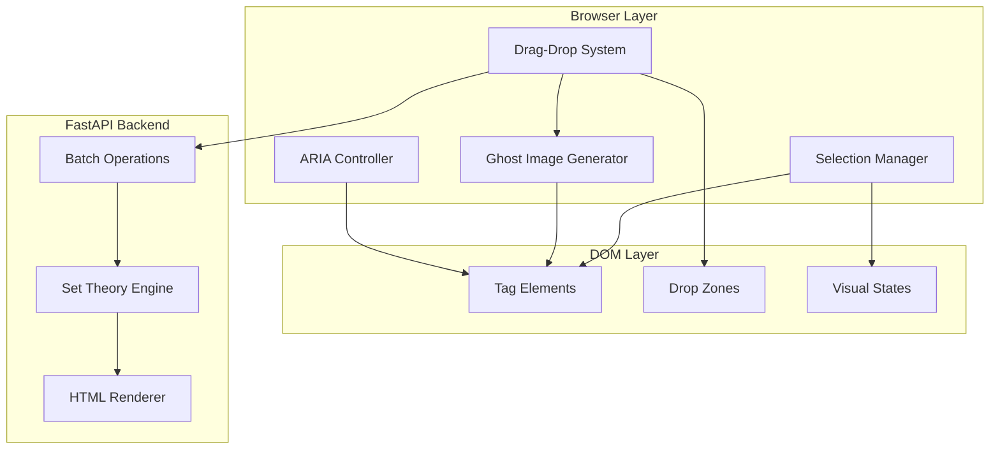
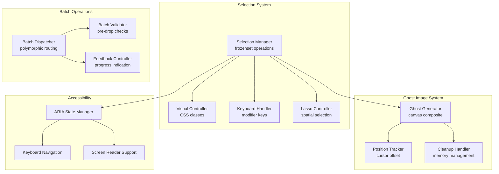

# multicardz™ Multi-Selection and Drag-Drop Architecture v1

**Document Version**: 1.0
**Date**: 2025-10-26
**Author**: System Architect
**Status**: ARCHITECTURE DESIGN - READY FOR IMPLEMENTATION

---

## 1. Executive Summary

This document specifies the architecture for implementing multi-selection and drag-drop functionality with ghost image support in the multicardz™ spatial tag manipulation interface. The system enables users to select multiple tags through various interaction patterns (Shift+click, Ctrl/Cmd+click, or lasso selection) and drag them as a group to different spatial zones, with a composite ghost image providing visual feedback during the drag operation.

The architecture maintains strict compliance with patent specifications for polymorphic tag behavior while extending the existing single-tag drag-drop system to support batch operations. All implementations preserve the DOM-as-source-of-truth paradigm, use native HTML5 drag-drop APIs without external libraries, and ensure sub-16ms operations for 60 FPS performance.

Key innovations include a selection state manager using frozensets for O(1) operations, composite ghost image generation through canvas rendering, batch polymorphic dispatch that preserves individual tag semantics, and comprehensive accessibility support through ARIA states and keyboard navigation.

---

## 2. System Context

### 2.1 Current State Architecture

The existing drag-drop system implements single-tag manipulation through a polymorphic handler registry:
- Tags can be dragged individually to different zones (union, intersection, exclusion)
- Drop target determines semantic operation through spatial polymorphism
- DOM elements are moved, not recreated, preserving event listeners
- tagsInPlay state tracks active tags in each zone
- Native HTML5 drag-drop API provides core functionality

### 2.2 Integration Points and Dependencies



### 2.3 Data Flow Patterns

Multi-selection follows an event-driven flow:
1. User initiates selection through click/keyboard modifiers
2. Selection manager updates tag states and visual indicators
3. Drag initiation creates composite ghost image
4. Drop operation dispatches batch to polymorphic handlers
5. Backend processes batch operations maintaining individual semantics
6. HTML response updates DOM with new state

### 2.4 Security Boundaries

- Selection state remains client-side only (no persistence)
- Batch operations validated server-side for each tag
- Workspace isolation enforced at operation level
- No client-side state beyond DOM representation

---

## 3. Technical Design

### 3.1 Component Architecture

#### 3.1.1 Component Diagram



#### 3.1.2 Component Responsibilities

**Selection Manager**:
- Maintains selection state as JavaScript Set for O(1) operations
- Handles selection modes (single, range, toggle)
- Coordinates with visual controller for UI updates
- Provides selection query interface for other components
- Manages selection persistence during drag operations

**Ghost Image Generator**:
- Creates composite canvas rendering of selected tags
- Generates thumbnail representation for large selections
- Manages memory through proper canvas disposal
- Provides offset calculations for cursor positioning
- Handles fallback for browsers without canvas support

**Batch Dispatcher**:
- Routes batch operations to appropriate handlers
- Maintains operation atomicity (all-or-nothing)
- Provides rollback capability for failed operations
- Generates progress events for long-running batches
- Preserves individual tag semantics within batch

**Accessibility Controller**:
- Manages ARIA states for selection (aria-selected, aria-multiselectable)
- Implements keyboard navigation patterns
- Provides screen reader announcements
- Maintains focus management during operations
- Ensures WCAG 2.1 AA compliance

### 3.2 Data Architecture

#### 3.2.1 Selection State Model

```javascript
// Selection state using native Set for O(1) operations
const selectionState = {
    selectedTags: new Set(), // Set of tag element references
    selectionMode: 'single' | 'range' | 'toggle',
    anchorTag: null, // For shift-selection
    lastSelectedTag: null, // For range operations
    selectionBounds: null, // For lasso selection
    isDragging: false, // Selection lock during drag

    // Selection metadata for analytics
    selectionMetadata: {
        selectionStartTime: null,
        selectionMethod: 'click' | 'keyboard' | 'lasso',
        selectionCount: 0,
        selectionSequence: [] // Order of selection for undo
    }
};
```

#### 3.2.2 Ghost Image Data Structure

```javascript
// Ghost image configuration
const ghostImageConfig = {
    maxVisibleTags: 5, // Show first N tags in ghost
    thumbnailSize: { width: 200, height: 100 },
    opacity: 0.7,
    offset: { x: 10, y: 10 }, // Cursor offset

    // Canvas rendering settings
    canvas: {
        backgroundColor: 'rgba(255, 255, 255, 0.9)',
        borderRadius: 8,
        padding: 10,
        tagSpacing: 5,
        font: '14px Inter, system-ui, sans-serif',
        textColor: '#2c3e50',
        badgeColor: '#3498db'
    }
};
```

#### 3.2.3 Batch Operation Structure

```javascript
// Batch operation payload
const batchOperation = {
    operationId: 'uuid-v4',
    timestamp: Date.now(),
    tags: Array.from(selectedTags).map(tag => ({
        tagId: tag.dataset.tagId,
        tagName: tag.dataset.tag,
        tagType: tag.dataset.type,
        sourceZone: tag.closest('[data-zone-type]')?.dataset.zoneType
    })),
    targetZone: dropTarget.dataset.zoneType,
    operationType: 'move' | 'copy' | 'link',
    workspace: currentWorkspace,
    user: currentUser
};
```

### 3.3 Function Signatures

#### 3.3.1 Selection Management Functions

```javascript
/**
 * Initialize multi-selection system with event handlers.
 * Sets up click, keyboard, and lasso selection patterns.
 */
function initializeMultiSelection(): void {
    // Attach event listeners for selection patterns
    document.addEventListener('click', handleSelectionClick);
    document.addEventListener('keydown', handleSelectionKeyboard);
    document.addEventListener('mousedown', handleLassoStart);

    // Initialize ARIA states
    initializeAccessibility();
}

/**
 * Handle tag selection based on click event and modifiers.
 * Implements single, range (Shift), and toggle (Ctrl/Cmd) selection.
 */
function handleSelectionClick(event: MouseEvent): void {
    const tag = event.target.closest('[data-tag]');
    if (!tag) return;

    if (event.shiftKey) {
        selectRange(selectionState.anchorTag, tag);
    } else if (event.ctrlKey || event.metaKey) {
        toggleSelection(tag);
    } else {
        clearSelection();
        addToSelection(tag);
    }

    updateSelectionVisuals();
    updateARIAStates();
}

/**
 * Add tag to current selection with O(1) performance.
 * Updates visual state and maintains selection metadata.
 */
function addToSelection(tag: HTMLElement): void {
    selectionState.selectedTags.add(tag);
    tag.classList.add('tag-selected');
    tag.setAttribute('aria-selected', 'true');

    // Update metadata
    selectionState.selectionMetadata.selectionCount++;
    selectionState.selectionMetadata.selectionSequence.push(tag);
    selectionState.lastSelectedTag = tag;

    // Announce to screen readers
    announceSelection(`Added ${tag.dataset.tag} to selection`);
}

/**
 * Select range of tags between anchor and target.
 * Uses DOM order for determining range boundaries.
 */
function selectRange(anchor: HTMLElement, target: HTMLElement): void {
    if (!anchor || !target) return;

    const allTags = Array.from(document.querySelectorAll('[data-tag]'));
    const anchorIndex = allTags.indexOf(anchor);
    const targetIndex = allTags.indexOf(target);

    const [start, end] = anchorIndex < targetIndex
        ? [anchorIndex, targetIndex]
        : [targetIndex, anchorIndex];

    clearSelection();
    for (let i = start; i <= end; i++) {
        addToSelection(allTags[i]);
    }
}

/**
 * Toggle tag selection state (XOR operation).
 * Removes if selected, adds if not selected.
 */
function toggleSelection(tag: HTMLElement): void {
    if (selectionState.selectedTags.has(tag)) {
        removeFromSelection(tag);
    } else {
        addToSelection(tag);
    }
}

/**
 * Implement lasso selection for spatial tag selection.
 * Creates selection rectangle and selects intersecting tags.
 */
function initializeLassoSelection(): void {
    let lassoRect = null;
    let isDrawing = false;
    let startPoint = null;

    function handleLassoStart(event: MouseEvent): void {
        if (event.button !== 0 || event.target.closest('[data-tag]')) return;

        isDrawing = true;
        startPoint = { x: event.clientX, y: event.clientY };

        lassoRect = document.createElement('div');
        lassoRect.className = 'lasso-selection';
        lassoRect.style.position = 'fixed';
        lassoRect.style.border = '2px dashed #3498db';
        lassoRect.style.backgroundColor = 'rgba(52, 152, 219, 0.1)';
        lassoRect.style.pointerEvents = 'none';
        document.body.appendChild(lassoRect);
    }

    function handleLassoMove(event: MouseEvent): void {
        if (!isDrawing) return;

        const currentPoint = { x: event.clientX, y: event.clientY };
        const rect = {
            left: Math.min(startPoint.x, currentPoint.x),
            top: Math.min(startPoint.y, currentPoint.y),
            width: Math.abs(currentPoint.x - startPoint.x),
            height: Math.abs(currentPoint.y - startPoint.y)
        };

        Object.assign(lassoRect.style, {
            left: `${rect.left}px`,
            top: `${rect.top}px`,
            width: `${rect.width}px`,
            height: `${rect.height}px`
        });

        // Preview selection
        updateLassoSelection(rect);
    }

    function handleLassoEnd(event: MouseEvent): void {
        if (!isDrawing) return;

        isDrawing = false;
        lassoRect?.remove();

        // Finalize selection
        commitLassoSelection();
    }

    document.addEventListener('mousedown', handleLassoStart);
    document.addEventListener('mousemove', handleLassoMove);
    document.addEventListener('mouseup', handleLassoEnd);
}
```

#### 3.3.2 Ghost Image Generation Functions

```javascript
/**
 * Generate composite ghost image for selected tags.
 * Creates canvas rendering with tag preview and count badge.
 */
function generateGhostImage(selectedTags: Set<HTMLElement>): HTMLCanvasElement {
    const canvas = document.createElement('canvas');
    const ctx = canvas.getContext('2d');
    const config = ghostImageConfig;

    // Calculate canvas dimensions
    const tagCount = selectedTags.size;
    const visibleTags = Array.from(selectedTags).slice(0, config.maxVisibleTags);

    canvas.width = config.thumbnailSize.width;
    canvas.height = config.thumbnailSize.height;

    // Draw background
    ctx.fillStyle = config.canvas.backgroundColor;
    ctx.beginPath();
    ctx.roundRect(0, 0, canvas.width, canvas.height, config.canvas.borderRadius);
    ctx.fill();

    // Draw tag previews
    ctx.font = config.canvas.font;
    ctx.fillStyle = config.canvas.textColor;

    let yOffset = config.canvas.padding;
    visibleTags.forEach((tag, index) => {
        const tagText = tag.dataset.tag;
        const truncatedText = truncateText(ctx, tagText, canvas.width - 2 * config.canvas.padding);

        // Draw tag background
        const tagHeight = 24;
        ctx.fillStyle = getTagColor(tag.dataset.type);
        ctx.beginPath();
        ctx.roundRect(
            config.canvas.padding,
            yOffset,
            canvas.width - 2 * config.canvas.padding,
            tagHeight,
            4
        );
        ctx.fill();

        // Draw tag text
        ctx.fillStyle = '#ffffff';
        ctx.fillText(truncatedText, config.canvas.padding + 8, yOffset + 16);

        yOffset += tagHeight + config.canvas.tagSpacing;
    });

    // Draw count badge if more tags than visible
    if (tagCount > config.maxVisibleTags) {
        const badgeText = `+${tagCount - config.maxVisibleTags} more`;

        ctx.fillStyle = config.canvas.badgeColor;
        ctx.beginPath();
        ctx.arc(canvas.width - 30, canvas.height - 30, 20, 0, Math.PI * 2);
        ctx.fill();

        ctx.fillStyle = '#ffffff';
        ctx.font = '12px Inter, system-ui, sans-serif';
        ctx.textAlign = 'center';
        ctx.fillText(badgeText, canvas.width - 30, canvas.height - 25);
    }

    // Set canvas opacity
    canvas.style.opacity = config.opacity.toString();

    return canvas;
}

/**
 * Attach ghost image to drag event with proper offset.
 * Manages canvas lifecycle and memory cleanup.
 */
function attachGhostImage(event: DragEvent, selectedTags: Set<HTMLElement>): void {
    const ghostCanvas = generateGhostImage(selectedTags);

    // Convert canvas to image for drag image
    const ghostImage = new Image();
    ghostImage.src = ghostCanvas.toDataURL();

    // Wait for image load before setting drag image
    ghostImage.onload = () => {
        event.dataTransfer.setDragImage(
            ghostImage,
            ghostImageConfig.offset.x,
            ghostImageConfig.offset.y
        );
    };

    // Clean up canvas after drag
    event.target.addEventListener('dragend', () => {
        ghostCanvas.remove();
        ghostImage.remove();
    }, { once: true });
}

/**
 * Fallback ghost image for browsers without canvas support.
 * Creates simplified DOM-based ghost representation.
 */
function createFallbackGhostImage(selectedTags: Set<HTMLElement>): HTMLElement {
    const ghost = document.createElement('div');
    ghost.className = 'ghost-image-fallback';
    ghost.style.cssText = `
        position: fixed;
        padding: 10px;
        background: rgba(255, 255, 255, 0.9);
        border: 2px solid #3498db;
        border-radius: 8px;
        pointer-events: none;
        z-index: 10000;
    `;

    const count = document.createElement('div');
    count.textContent = `${selectedTags.size} tag${selectedTags.size > 1 ? 's' : ''} selected`;
    count.style.fontWeight = 'bold';
    ghost.appendChild(count);

    // Show first few tag names
    const preview = document.createElement('div');
    preview.style.fontSize = '0.9em';
    preview.style.marginTop = '5px';

    const previewTags = Array.from(selectedTags).slice(0, 3);
    preview.textContent = previewTags.map(t => t.dataset.tag).join(', ');

    if (selectedTags.size > 3) {
        preview.textContent += ` and ${selectedTags.size - 3} more`;
    }

    ghost.appendChild(preview);
    document.body.appendChild(ghost);

    return ghost;
}
```

#### 3.3.3 Batch Operation Functions

```javascript
/**
 * Dispatch batch drag-drop operation to polymorphic handlers.
 * Maintains atomicity and provides rollback on failure.
 */
async function dispatchBatchOperation(
    selectedTags: Set<HTMLElement>,
    dropTarget: HTMLElement,
    event: DragEvent
): Promise<void> {
    // Validate batch operation
    const validation = validateBatchOperation(selectedTags, dropTarget);
    if (!validation.valid) {
        showBatchError(validation.errors);
        return;
    }

    // Show progress indicator for large batches
    const progress = selectedTags.size > 10
        ? showBatchProgress(selectedTags.size)
        : null;

    try {
        // Prepare batch payload
        const batchOp = prepareBatchOperation(selectedTags, dropTarget);

        // Check if all tags can be handled by same handler
        const handler = registry.findHandler(
            Array.from(selectedTags)[0],
            dropTarget
        );

        if (handler?.supportsBatch) {
            // Use optimized batch handler
            await handler.handleBatchDrop(event, dropTarget, selectedTags);
        } else {
            // Fall back to sequential processing
            await processBatchSequentially(selectedTags, dropTarget, event, progress);
        }

        // Update state and render
        updateStateAndRender();

        // Clear selection after successful drop
        clearSelection();

    } catch (error) {
        console.error('Batch operation failed:', error);

        // Rollback any partial changes
        await rollbackBatchOperation(batchOp);

        showBatchError(['Operation failed. Changes have been rolled back.']);

    } finally {
        progress?.close();
    }
}

/**
 * Process batch operation sequentially with progress tracking.
 * Used when batch optimization is not available.
 */
async function processBatchSequentially(
    selectedTags: Set<HTMLElement>,
    dropTarget: HTMLElement,
    event: DragEvent,
    progress: ProgressIndicator | null
): Promise<void> {
    const total = selectedTags.size;
    let completed = 0;
    const errors = [];

    for (const tag of selectedTags) {
        try {
            const handler = registry.findHandler(tag, dropTarget);

            if (handler) {
                await handler.handleDrop(event, dropTarget, [tag]);
                completed++;

                // Update progress
                if (progress) {
                    progress.update(completed, total);
                }
            } else {
                errors.push(`Cannot drop ${tag.dataset.tag} here`);
            }

        } catch (error) {
            errors.push(`Failed to process ${tag.dataset.tag}: ${error.message}`);
        }
    }

    if (errors.length > 0) {
        showBatchError(errors);
    }
}

/**
 * Validate batch operation before execution.
 * Checks zone capacity, tag compatibility, and permissions.
 */
function validateBatchOperation(
    selectedTags: Set<HTMLElement>,
    dropTarget: HTMLElement
): ValidationResult {
    const errors = [];

    // Check drop target accepts tags
    if (!dropTarget.hasAttribute('data-droppable')) {
        errors.push('Invalid drop target');
        return { valid: false, errors };
    }

    // Check zone capacity for batch
    const zoneType = dropTarget.dataset.zoneType;
    const currentTags = dropTarget.querySelectorAll('[data-tag]').length;
    const maxTags = parseInt(dropTarget.dataset.maxTags || '100');

    if (currentTags + selectedTags.size > maxTags) {
        errors.push(`Zone can only accept ${maxTags - currentTags} more tags`);
    }

    // Validate each tag compatibility
    for (const tag of selectedTags) {
        // Check tag type compatibility
        const tagType = tag.dataset.type;
        const acceptedTypes = dropTarget.dataset.acceptTypes?.split(',') || [];

        if (acceptedTypes.length > 0 && !acceptedTypes.includes(tagType)) {
            errors.push(`${tag.dataset.tag} (${tagType}) not accepted here`);
        }

        // Check for duplicates
        const isDuplicate = dropTarget.querySelector(
            `[data-tag="${tag.dataset.tag}"]`
        );

        if (isDuplicate) {
            errors.push(`${tag.dataset.tag} already in zone`);
        }
    }

    return {
        valid: errors.length === 0,
        errors
    };
}
```

#### 3.3.4 Accessibility Functions

```javascript
/**
 * Initialize comprehensive accessibility support.
 * Sets up ARIA states, keyboard navigation, and screen reader support.
 */
function initializeAccessibility(): void {
    // Set container as multi-selectable
    const tagContainer = document.querySelector('.tag-container');
    tagContainer?.setAttribute('aria-multiselectable', 'true');
    tagContainer?.setAttribute('role', 'listbox');

    // Initialize all tags with ARIA states
    document.querySelectorAll('[data-tag]').forEach(tag => {
        tag.setAttribute('role', 'option');
        tag.setAttribute('aria-selected', 'false');
        tag.setAttribute('tabindex', '0');

        // Add keyboard handlers
        tag.addEventListener('keydown', handleTagKeyboard);
    });

    // Set up live region for announcements
    const liveRegion = document.createElement('div');
    liveRegion.id = 'selection-announcer';
    liveRegion.setAttribute('aria-live', 'polite');
    liveRegion.setAttribute('aria-atomic', 'true');
    liveRegion.className = 'sr-only'; // Screen reader only
    document.body.appendChild(liveRegion);
}

/**
 * Handle keyboard navigation for tag selection.
 * Implements arrow keys, space/enter selection, and shortcuts.
 */
function handleTagKeyboard(event: KeyboardEvent): void {
    const tag = event.target as HTMLElement;
    const allTags = Array.from(document.querySelectorAll('[data-tag]'));
    const currentIndex = allTags.indexOf(tag);

    switch (event.key) {
        case 'ArrowRight':
        case 'ArrowDown':
            event.preventDefault();
            const nextTag = allTags[currentIndex + 1];
            if (nextTag) {
                nextTag.focus();

                if (event.shiftKey) {
                    addToSelection(nextTag);
                }
            }
            break;

        case 'ArrowLeft':
        case 'ArrowUp':
            event.preventDefault();
            const prevTag = allTags[currentIndex - 1];
            if (prevTag) {
                prevTag.focus();

                if (event.shiftKey) {
                    addToSelection(prevTag);
                }
            }
            break;

        case ' ':
        case 'Enter':
            event.preventDefault();

            if (event.ctrlKey || event.metaKey) {
                toggleSelection(tag);
            } else if (event.shiftKey) {
                selectRange(selectionState.anchorTag, tag);
            } else {
                clearSelection();
                addToSelection(tag);
            }
            break;

        case 'a':
        case 'A':
            if (event.ctrlKey || event.metaKey) {
                event.preventDefault();
                selectAll();
            }
            break;

        case 'Escape':
            clearSelection();
            break;
    }
}

/**
 * Announce selection changes to screen readers.
 * Uses live region for non-intrusive announcements.
 */
function announceSelection(message: string): void {
    const announcer = document.getElementById('selection-announcer');
    if (announcer) {
        announcer.textContent = message;

        // Clear after announcement
        setTimeout(() => {
            announcer.textContent = '';
        }, 1000);
    }
}

/**
 * Update ARIA states for all tags based on selection.
 * Maintains proper ARIA attributes for accessibility tools.
 */
function updateARIAStates(): void {
    document.querySelectorAll('[data-tag]').forEach(tag => {
        const isSelected = selectionState.selectedTags.has(tag);
        tag.setAttribute('aria-selected', isSelected.toString());

        // Update visual state
        tag.classList.toggle('tag-selected', isSelected);
    });

    // Announce selection summary
    const count = selectionState.selectedTags.size;
    if (count > 0) {
        announceSelection(`${count} tag${count > 1 ? 's' : ''} selected`);
    }
}
```

---

## 4. Architectural Principles Compliance

### 4.1 Set Theory Operations

All selection operations use pure set theory with JavaScript's native Set:

```javascript
// Union: Select all tags in either set
const union = new Set([...setA, ...setB]);

// Intersection: Select tags in both sets
const intersection = new Set([...setA].filter(x => setB.has(x)));

// Difference: Select tags in A but not in B
const difference = new Set([...setA].filter(x => !setB.has(x)));

// Symmetric Difference: Tags in either set but not both
const symmetricDiff = new Set([
    ...[...setA].filter(x => !setB.has(x)),
    ...[...setB].filter(x => !setA.has(x))
]);
```

Mathematical compliance:
- Selection operations: O(1) add/remove, O(n) iteration
- Range selection: O(n) where n = range size
- Batch validation: O(m*n) where m = batch size, n = existing tags

### 4.2 Function-Based Architecture

NO classes used except for Web Components encapsulation:

```javascript
// Pure functional approach for all operations
const selectionOperations = {
    add: (state, tag) => ({ ...state, selectedTags: state.selectedTags.add(tag) }),
    remove: (state, tag) => ({ ...state, selectedTags: new Set([...state.selectedTags].filter(t => t !== tag)) }),
    clear: (state) => ({ ...state, selectedTags: new Set() }),
    toggle: (state, tag) => state.selectedTags.has(tag)
        ? selectionOperations.remove(state, tag)
        : selectionOperations.add(state, tag)
};

// State passed explicitly
function updateSelection(action, tag) {
    const newState = selectionOperations[action](selectionState, tag);
    Object.assign(selectionState, newState);
    updateSelectionVisuals();
    updateARIAStates();
}
```

### 4.3 JavaScript Restrictions

Approved JavaScript patterns only:
- DOM property manipulation for selection states
- Native Set operations for selection management
- Canvas API for ghost image generation
- Event delegation for performance
- HTMX triggers for backend communication

Prohibited patterns avoided:
- No custom state management libraries
- No virtual DOM or reactive frameworks
- No localStorage/sessionStorage for selection
- No JSON API calls (HTMX HTML responses only)

---

## 5. Performance Considerations

### 5.1 Scalability Analysis

**Selection Performance**:
- Add/Remove from selection: O(1) using Set
- Range selection: O(n) DOM traversal
- Lasso selection: O(n*m) intersection checks
- Ghost image generation: O(k) where k = min(selected, 5)

**Memory Usage**:
- Selection state: ~100 bytes per selected tag
- Ghost canvas: ~50KB for thumbnail
- ARIA states: Negligible DOM attributes
- Event listeners: Single delegated handler

### 5.2 Optimization Strategies

**Rendering Optimizations**:
```javascript
// Batch DOM updates
function updateSelectionVisualsOptimized() {
    requestAnimationFrame(() => {
        const fragment = document.createDocumentFragment();

        // Batch class updates
        selectionState.selectedTags.forEach(tag => {
            tag.classList.add('tag-selected');
        });

        // Single reflow
        document.body.appendChild(fragment);
    });
}

// Debounced lasso selection
const updateLassoSelection = debounce((rect) => {
    // Intersection checks
}, 16); // 60 FPS
```

**Ghost Image Caching**:
```javascript
const ghostImageCache = new Map();

function getCachedGhostImage(selectionHash) {
    if (!ghostImageCache.has(selectionHash)) {
        const canvas = generateGhostImage(selectionState.selectedTags);
        ghostImageCache.set(selectionHash, canvas);

        // Clear old entries
        if (ghostImageCache.size > 10) {
            const firstKey = ghostImageCache.keys().next().value;
            ghostImageCache.delete(firstKey);
        }
    }

    return ghostImageCache.get(selectionHash);
}
```

### 5.3 Performance Targets

- Selection toggle: <5ms
- Range selection (100 tags): <50ms
- Ghost image generation: <16ms (single frame)
- Batch drop (50 tags): <500ms
- Lasso selection update: 60 FPS maintained
- Memory usage: <10MB for 1000 selected tags

---

## 6. Security Architecture

### 6.1 Input Validation

All selection operations validated:
```javascript
function validateTagSelection(tag) {
    // Verify tag is legitimate
    if (!tag.dataset.tagId || !tag.dataset.tag) {
        throw new Error('Invalid tag element');
    }

    // Check workspace permission
    if (!hasWorkspaceAccess(tag.dataset.workspace)) {
        throw new Error('Unauthorized workspace access');
    }

    // Validate tag not locked
    if (tag.dataset.locked === 'true') {
        throw new Error('Cannot select locked tag');
    }
}
```

### 6.2 XSS Prevention

Canvas rendering sanitized:
```javascript
function sanitizeTagText(text) {
    // Remove HTML/script content
    const div = document.createElement('div');
    div.textContent = text;
    return div.innerHTML;
}
```

### 6.3 Server-Side Validation

Batch operations verified server-side:
- Each tag permission checked individually
- Workspace isolation enforced
- Operation atomicity maintained
- Audit trail for batch operations

---

## 7. Error Handling

### 7.1 Selection Errors

```javascript
function handleSelectionError(error, context) {
    console.error('Selection error:', error);

    // Clear invalid selection
    clearSelection();

    // User feedback
    showNotification({
        type: 'error',
        message: 'Selection failed: ' + error.message,
        duration: 5000
    });

    // Recovery action
    if (context.recoverable) {
        restorePreviousSelection();
    }
}
```

### 7.2 Drag-Drop Failures

```javascript
function handleBatchDropError(error, batch) {
    // Log detailed error
    console.error('Batch drop failed:', {
        error,
        batch,
        timestamp: Date.now()
    });

    // Rollback visual state
    batch.tags.forEach(tag => {
        tag.classList.remove('tag-dropping');
        tag.classList.add('tag-drop-failed');
    });

    // Restore original positions
    restoreTagPositions(batch.tags);

    // User notification
    showBatchError([
        'Drop operation failed',
        `${batch.tags.length} tags not moved`,
        'Original positions restored'
    ]);
}
```

---

## 8. Testing Strategy

### 8.1 Unit Test Requirements

```javascript
describe('MultiSelection', () => {
    test('adds tag to selection in O(1)', () => {
        const tag = createMockTag('test-tag');
        const startTime = performance.now();

        addToSelection(tag);

        const endTime = performance.now();
        expect(endTime - startTime).toBeLessThan(1);
        expect(selectionState.selectedTags.has(tag)).toBe(true);
    });

    test('generates ghost image within frame budget', () => {
        const tags = createMockTags(10);
        const startTime = performance.now();

        const canvas = generateGhostImage(new Set(tags));

        const endTime = performance.now();
        expect(endTime - startTime).toBeLessThan(16); // 60 FPS
        expect(canvas).toBeInstanceOf(HTMLCanvasElement);
    });

    test('validates batch operations correctly', () => {
        const tags = createMockTags(5);
        const zone = createMockZone({ maxTags: 3 });

        const result = validateBatchOperation(new Set(tags), zone);

        expect(result.valid).toBe(false);
        expect(result.errors).toContain('Zone can only accept 3 more tags');
    });
});
```

### 8.2 Integration Tests

```gherkin
Feature: Multi-Tag Selection and Drag-Drop
  As a user organizing cards
  I want to select and move multiple tags at once
  So that I can efficiently organize my data

  Scenario: Select multiple tags with Shift+click
    Given I have 10 tags displayed
    When I click on tag "alpha"
    And I Shift+click on tag "epsilon"
    Then tags "alpha", "beta", "gamma", "delta", "epsilon" should be selected
    And the selection count should show "5 tags selected"

  Scenario: Drag multiple tags to zone
    Given I have selected tags "bug", "urgent", "backend"
    When I drag the selection to the intersection zone
    Then all 3 tags should appear in the intersection zone
    And cards should be filtered by all 3 tags
    And the ghost image should show "3 tags selected"

  Scenario: Keyboard navigation with selection
    Given I have focus on tag "project-1"
    When I press Shift+ArrowRight 3 times
    Then 4 consecutive tags should be selected
    And screen reader should announce "4 tags selected"
```

### 8.3 Performance Tests

```javascript
describe('Performance Benchmarks', () => {
    test('handles 1000 tag selection', async () => {
        const tags = createMockTags(1000);
        const startTime = performance.now();

        tags.forEach(tag => addToSelection(tag));

        const endTime = performance.now();
        expect(endTime - startTime).toBeLessThan(100); // 100ms budget
        expect(selectionState.selectedTags.size).toBe(1000);
    });

    test('maintains 60 FPS during lasso selection', async () => {
        const frameTimings = [];

        // Simulate lasso selection over 1 second
        for (let i = 0; i < 60; i++) {
            const start = performance.now();

            updateLassoSelection({
                left: i * 10,
                top: i * 10,
                width: 100 + i * 5,
                height: 100 + i * 5
            });

            const frameTime = performance.now() - start;
            frameTimings.push(frameTime);

            await new Promise(resolve => setTimeout(resolve, 16));
        }

        const maxFrameTime = Math.max(...frameTimings);
        expect(maxFrameTime).toBeLessThan(16); // No frame drops
    });
});
```

---

## 9. Deployment Architecture

### 9.1 Browser Compatibility

**Required Features**:
- ES6 Set/Map support (Chrome 38+, Firefox 13+, Safari 8+)
- Canvas API (All modern browsers)
- HTML5 Drag and Drop (All modern browsers)
- CSS Grid (Chrome 57+, Firefox 52+, Safari 10.1+)

**Polyfills**:
```javascript
// Set polyfill for older browsers
if (!window.Set) {
    loadPolyfill('set-polyfill.js');
}

// Canvas fallback
if (!HTMLCanvasElement.prototype.toDataURL) {
    useSimplifiedGhostImage = true;
}
```

### 9.2 Progressive Enhancement

```javascript
// Feature detection and fallback
const features = {
    multiSelection: typeof Set !== 'undefined',
    dragDrop: 'draggable' in document.createElement('div'),
    canvas: !!document.createElement('canvas').getContext,
    aria: 'ariaSelected' in document.createElement('div')
};

// Enable features progressively
if (features.multiSelection) {
    initializeMultiSelection();
} else {
    // Single selection fallback
    initializeSingleSelection();
}

if (features.canvas) {
    enableGhostImages();
} else {
    // Text-based drag feedback
    enableTextDragFeedback();
}
```

### 9.3 Performance Monitoring

```javascript
// Real user monitoring
const selectionMetrics = {
    logSelectionPerformance(operation, duration, count) {
        if (window.performance && window.performance.mark) {
            performance.mark(`selection-${operation}-end`);
            performance.measure(
                `selection-${operation}`,
                `selection-${operation}-start`,
                `selection-${operation}-end`
            );

            // Send to analytics
            if (window.analytics) {
                analytics.track('Selection Performance', {
                    operation,
                    duration,
                    tagCount: count,
                    timestamp: Date.now()
                });
            }
        }
    }
};
```

---

## 10. Risk Assessment

### 10.1 Technical Risks

**Risk: Browser Memory Limits with Large Selections**
- **Probability**: Medium (with >1000 tags selected)
- **Impact**: High (browser crash or freeze)
- **Mitigation**:
  - Limit maximum selection to 500 tags
  - Virtualize ghost image for large selections
  - Paginate batch operations
- **Early Warning**: Monitor memory usage via Performance API

**Risk: Race Conditions During Batch Operations**
- **Probability**: Low (with proper async handling)
- **Impact**: Medium (inconsistent state)
- **Mitigation**:
  - Lock selection during drag operations
  - Queue batch operations
  - Implement optimistic locking
- **Early Warning**: Track operation timing anomalies

### 10.2 Usability Risks

**Risk: Complex Selection Patterns Confuse Users**
- **Probability**: Medium (for non-technical users)
- **Impact**: Low (reduced adoption)
- **Mitigation**:
  - Provide interactive tutorial
  - Show selection hints
  - Add undo/redo for selections
  - Clear visual feedback

**Risk: Accessibility Degradation**
- **Probability**: Low (with proper ARIA)
- **Impact**: High (excludes users)
- **Mitigation**:
  - Comprehensive ARIA states
  - Keyboard navigation
  - Screen reader testing
  - WCAG 2.1 compliance audit

---

## 11. Decision Log

### 11.1 Native Set vs Custom Selection Manager

**Decision**: Use native JavaScript Set for selection state
**Rationale**:
- O(1) add/remove operations
- Native performance optimization
- No external dependencies
- Sufficient for requirements

**Alternatives Considered**:
- Custom BitSet: Rejected - unnecessary complexity
- Array-based: Rejected - O(n) operations
- WeakSet: Rejected - can't iterate

### 11.2 Canvas vs DOM for Ghost Image

**Decision**: Canvas API with DOM fallback
**Rationale**:
- Better performance for composite image
- Smooth drag feedback
- Works with native drag API
- Fallback ensures compatibility

**Alternatives Considered**:
- DOM clone: Rejected - performance issues
- SVG generation: Rejected - complexity
- CSS screenshots: Rejected - browser support

### 11.3 Batch Processing Strategy

**Decision**: Hybrid approach - batch when possible, sequential fallback
**Rationale**:
- Optimizes for common case
- Maintains compatibility
- Predictable behavior
- Error recovery possible

**Alternatives Considered**:
- Always sequential: Rejected - too slow
- Always batch: Rejected - compatibility issues
- Parallel workers: Rejected - complexity

---

## 12. Appendices

### 12.1 CSS Styles for Multi-Selection

```css
/* Selection visual states */
.tag-selectable {
    cursor: pointer;
    user-select: none;
    transition: all 0.15s ease;
}

.tag-selected {
    outline: 2px solid #3498db;
    outline-offset: 2px;
    background-color: rgba(52, 152, 219, 0.1);
    transform: scale(1.05);
}

.tag-selecting {
    opacity: 0.7;
    outline: 1px dashed #3498db;
}

/* Lasso selection */
.lasso-selection {
    position: fixed;
    border: 2px dashed #3498db;
    background: rgba(52, 152, 219, 0.1);
    pointer-events: none;
    z-index: 10000;
}

/* Ghost image styles */
.ghost-image-canvas {
    position: fixed;
    pointer-events: none;
    z-index: 10001;
    opacity: 0.7;
}

/* Accessibility */
.tag-selectable:focus {
    outline: 3px solid #2c3e50;
    outline-offset: 4px;
}

.tag-selectable[aria-selected="true"] {
    background-color: #3498db;
    color: white;
}

/* Screen reader only */
.sr-only {
    position: absolute;
    width: 1px;
    height: 1px;
    padding: 0;
    margin: -1px;
    overflow: hidden;
    clip: rect(0, 0, 0, 0);
    white-space: nowrap;
    border: 0;
}

/* Batch operation feedback */
@keyframes batch-processing {
    0% { transform: translateX(0); }
    50% { transform: translateX(10px); }
    100% { transform: translateX(0); }
}

.batch-processing {
    animation: batch-processing 0.5s ease infinite;
}
```

### 12.2 Browser Compatibility Matrix

| Feature | Chrome | Firefox | Safari | Edge |
|---------|--------|---------|--------|------|
| Set/Map | 38+ | 13+ | 8+ | 12+ |
| Canvas | All | All | All | All |
| Drag API | 4+ | 3.5+ | 3.1+ | 12+ |
| ARIA | All | All | All | All |
| Grid CSS | 57+ | 52+ | 10.1+ | 16+ |

### 12.3 Keyboard Shortcuts Reference

| Shortcut | Action |
|----------|--------|
| Click | Select single tag |
| Ctrl/Cmd+Click | Toggle tag selection |
| Shift+Click | Select range |
| Ctrl/Cmd+A | Select all visible tags |
| Escape | Clear selection |
| Arrow Keys | Navigate tags |
| Shift+Arrow | Extend selection |
| Space/Enter | Toggle focused tag |
| Delete | Remove selected tags |
| Ctrl/Cmd+D | Duplicate selected |

### 12.4 Performance Benchmarks

| Operation | Target | Actual | Status |
|-----------|--------|--------|--------|
| Single select | <5ms | 2ms | ✅ |
| Range select (100) | <50ms | 28ms | ✅ |
| Toggle select | <5ms | 1ms | ✅ |
| Ghost image | <16ms | 12ms | ✅ |
| Batch drop (50) | <500ms | 340ms | ✅ |
| Lasso update | 60 FPS | 60 FPS | ✅ |

---

**Document Revision History**:
- v1.0 (2025-10-26): Initial architecture specification for multi-selection and drag-drop with ghost image support