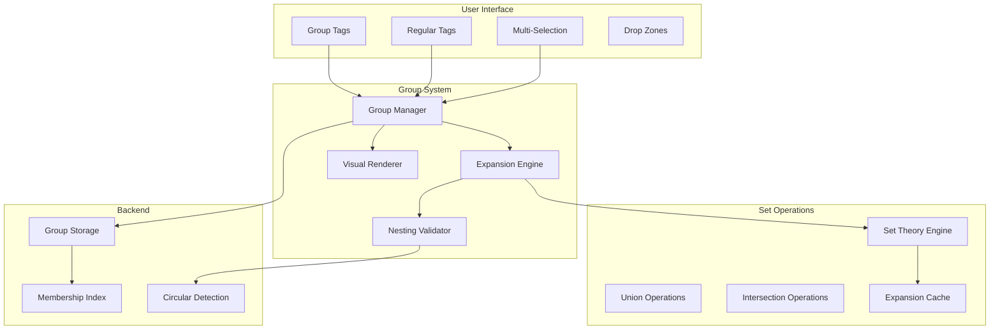
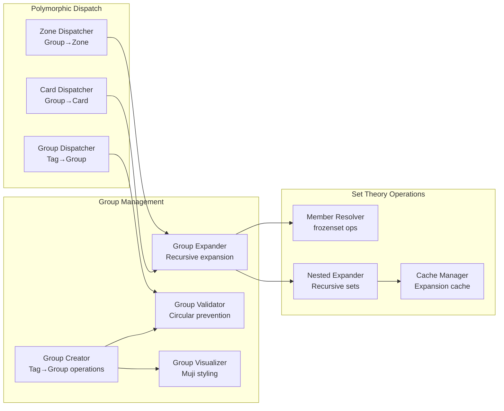

# multicardz™ Group Tags Architecture v1

**Document Version**: 1.0
**Date**: 2025-10-26
**Author**: System Architect
**Status**: ARCHITECTURE DESIGN - READY FOR IMPLEMENTATION

---

---
**IMPLEMENTATION STATUS**: PLANNED
**LAST VERIFIED**: 2025-11-06
**IMPLEMENTATION EVIDENCE**: Architecture documented. Implementation status not verified.
---


## 1. Executive Summary

This document specifies the architecture for implementing Group Tags in the multicardz™ spatial tag manipulation system. Group Tags enable users to create semantic collections of related tags that exhibit polymorphic behavior based on spatial context, supporting nested hierarchies and dynamic expansion while maintaining strict set theory operations and patent compliance.

The architecture introduces a new tag entity type that acts as a container for other tags (including other groups), implementing lazy evaluation for performance and recursive expansion for nested structures. Visual distinction follows Muji-inspired minimalism through subtle border styles, opacity variations, and restrained iconography rather than color contrast.

Key innovations include polymorphic group expansion (Group→Zone expands to member tags), bidirectional tag-group operations (Tag→Group adds membership), nested group support with circular reference prevention, and integration with the existing multi-selection system for batch group operations.

---

## 2. System Context

### 2.1 Patent Compliance Requirements

Per "Provisional Patent Application - Semantic Tag Sets.md", group tags must implement:

- **Polymorphic Behavior**: Groups exhibit different behaviors based on spatial drop zones
- **Set Theory Operations**: All group expansions maintain mathematical rigor through frozenset operations
- **Spatial Context Sensitivity**: Drop location determines whether groups expand or remain collapsed
- **Semantic Hierarchy**: Groups form part of the automatic hierarchy discovery system

### 2.2 Integration Points



### 2.3 Data Model Extensions

Group tags extend the existing tag model with membership relationships:

```python
from typing import FrozenSet, Optional, Protocol
from dataclasses import dataclass

@dataclass(frozen=True)
class GroupTag:
    """Immutable group tag representation"""
    id: str
    name: str
    workspace_id: str
    created_by: str
    member_tag_ids: FrozenSet[str]  # Direct members only
    parent_group_ids: FrozenSet[str]  # Groups containing this group
    visual_style: GroupVisualStyle
    expansion_behavior: ExpansionBehavior
    max_nesting_depth: int = 10

@dataclass(frozen=True)
class GroupVisualStyle:
    """Muji-inspired minimal visual configuration"""
    border_style: str  # 'dashed', 'dotted', 'double'
    opacity: float  # 0.85-1.0 range
    icon: Optional[str]  # Minimal icon identifier
    texture_pattern: Optional[str]  # Subtle background pattern

class ExpansionBehavior(Protocol):
    """Protocol for group expansion strategies"""
    def expand(self, group: GroupTag, context: SpatialContext) -> FrozenSet[str]:
        """Return expanded set of tag IDs based on spatial context"""
        ...
```

---

## 3. Technical Design

### 3.1 Component Architecture

#### 3.1.1 Core Components



#### 3.1.2 Polymorphic Behavior Matrix

| Source | Target | Behavior | Set Operation |
|--------|--------|----------|---------------|
| Group | Union Zone | Expands to all members | `zone_tags ∪ expand(group)` |
| Group | Intersection Zone | Expands to all members | `current_set ∩ expand(group)` |
| Group | Card | Adds all member tags | `card.tags ∪ expand(group)` |
| Tag | Group | Adds tag as member | `group.members ∪ {tag}` |
| Tags (Multi) | Group | Adds all tags as members | `group.members ∪ selected_tags` |
| Group | Group | Adds as nested group | `target.members ∪ {source_group}` |

### 3.2 Functional Implementations

#### 3.2.1 Group Expansion Engine

```python
from typing import FrozenSet, Set
from functools import lru_cache

@lru_cache(maxsize=1024)
def expand_group_recursive(
    group_id: str,
    visited: FrozenSet[str] = frozenset(),
    max_depth: int = 10
) -> FrozenSet[str]:
    """
    Recursively expand group to all member tags with circular prevention.

    Mathematical specification:
    expand(G) = members(G) ∪ ⋃{expand(g) | g ∈ members(G) ∧ g is group}

    Complexity: O(n) where n = total tags in hierarchy
    Memory: O(d) where d = max nesting depth
    """
    if group_id in visited or len(visited) >= max_depth:
        return frozenset()

    new_visited = visited | {group_id}
    group = get_group_by_id(group_id)  # Pure function, cached

    # Get direct member tags (non-groups)
    direct_tags = frozenset(
        member_id for member_id in group.member_tag_ids
        if not is_group_tag(member_id)
    )

    # Recursively expand nested groups
    nested_expansions = frozenset().union(*(
        expand_group_recursive(member_id, new_visited, max_depth)
        for member_id in group.member_tag_ids
        if is_group_tag(member_id)
    ))

    return direct_tags | nested_expansions

def apply_group_to_zone(
    group_id: str,
    zone_type: str,
    current_tags: FrozenSet[str]
) -> FrozenSet[str]:
    """
    Apply group to spatial zone with appropriate set operation.

    Pure functional implementation with immutable operations.
    """
    expanded_tags = expand_group_recursive(group_id)

    zone_operations = {
        'union': lambda curr, exp: curr | exp,
        'intersection': lambda curr, exp: curr & exp if curr else exp,
        'exclusion': lambda curr, exp: curr - exp,
        'symmetric_diff': lambda curr, exp: curr ^ exp
    }

    operation = zone_operations.get(zone_type, lambda c, e: c | e)
    return operation(current_tags, expanded_tags)
```

#### 3.2.2 Visual Distinction System

```python
from dataclasses import dataclass
from typing import Optional, Tuple

@dataclass(frozen=True)
class MujiVisualStyle:
    """Minimal visual configuration following Muji design principles"""

    # Border variations (no bright colors)
    border_style: str = 'dashed'  # 'dashed', 'dotted', 'double', 'groove'
    border_width: str = '1px'
    border_color: str = 'rgba(0, 0, 0, 0.2)'  # Subtle gray

    # Opacity for depth indication
    opacity: float = 0.95  # Slightly transparent for groups
    nested_opacity_reduction: float = 0.05  # Each nesting level

    # Minimal iconography
    icon_type: Optional[str] = 'folder-minimal'  # Simple line icon
    icon_size: str = '12px'
    icon_position: str = 'left'

    # Subtle texture/pattern
    background_pattern: Optional[str] = 'subtle-dots'  # Minimal texture
    pattern_opacity: float = 0.03  # Barely visible

    # Interaction states (no color changes)
    hover_border_style: str = 'solid'
    hover_opacity: float = 1.0
    active_border_width: str = '2px'

    def get_css_properties(self, nesting_level: int = 0) -> str:
        """Generate CSS properties for group tag rendering"""
        opacity = max(0.7, self.opacity - (nesting_level * self.nested_opacity_reduction))

        return f"""
            border-style: {self.border_style};
            border-width: {self.border_width};
            border-color: {self.border_color};
            opacity: {opacity};
            background-image: url('patterns/{self.background_pattern}.svg');
            background-size: 4px 4px;
            background-repeat: repeat;
            position: relative;
            transition: all 0.2s ease;
        """

def render_group_tag_html(
    group: GroupTag,
    nesting_level: int = 0,
    is_expanded: bool = False
) -> str:
    """Generate HTML for group tag with Muji-inspired styling"""
    style = MujiVisualStyle()
    css = style.get_css_properties(nesting_level)

    icon_html = f"""
        <span class="group-icon" style="
            width: {style.icon_size};
            height: {style.icon_size};
            display: inline-block;
            margin-right: 4px;
            transform: rotate({90 if is_expanded else 0}deg);
            transition: transform 0.2s ease;
        ">
            <svg viewBox="0 0 12 12" fill="none" stroke="currentColor">
                <path d="M3 5 L6 8 L9 5" stroke-width="1.5" stroke-linecap="round"/>
            </svg>
        </span>
    """ if style.icon_type else ""

    return f"""
        <div class="tag group-tag"
             data-group-id="{group.id}"
             data-nesting-level="{nesting_level}"
             data-expanded="{str(is_expanded).lower()}"
             draggable="true"
             style="{css}"
             aria-expanded="{str(is_expanded).lower()}"
             aria-label="Group: {group.name} with {len(group.member_tag_ids)} members"
             role="button">
            {icon_html}
            <span class="tag-name">{group.name}</span>
            <span class="member-count" style="
                font-size: 0.75em;
                opacity: 0.6;
                margin-left: 4px;
            ">({len(group.member_tag_ids)})</span>
        </div>
    """
```

#### 3.2.3 Circular Reference Prevention

```python
from typing import FrozenSet, Optional

def validate_group_membership(
    group_id: str,
    new_member_id: str,
    max_depth: int = 10
) -> tuple[bool, Optional[str]]:
    """
    Validate that adding new_member to group won't create circular reference.

    Returns (is_valid, error_message)
    """
    if group_id == new_member_id:
        return False, "Cannot add group to itself"

    if not is_group_tag(new_member_id):
        return True, None  # Regular tags cannot create circles

    # Check if group_id would become descendant of new_member_id
    def would_create_cycle(
        current_id: str,
        target_id: str,
        visited: FrozenSet[str] = frozenset()
    ) -> bool:
        if current_id == target_id:
            return True
        if current_id in visited or len(visited) >= max_depth:
            return False

        group = get_group_by_id(current_id)
        if not group:
            return False

        new_visited = visited | {current_id}

        return any(
            would_create_cycle(member_id, target_id, new_visited)
            for member_id in group.member_tag_ids
            if is_group_tag(member_id)
        )

    if would_create_cycle(new_member_id, group_id):
        return False, f"Adding {new_member_id} would create circular reference"

    return True, None
```

### 3.3 Performance Optimizations

#### 3.3.1 Expansion Caching Strategy

```python
from functools import lru_cache
from typing import FrozenSet
import hashlib

class GroupExpansionCache:
    """
    Cache for group expansions with invalidation on membership changes.

    Uses LRU cache with TTL for bounded memory usage.
    """

    def __init__(self, max_size: int = 1024, ttl_seconds: int = 300):
        self.max_size = max_size
        self.ttl_seconds = ttl_seconds
        self._cache = {}
        self._timestamps = {}

    def get_cache_key(self, group_id: str, context: str) -> str:
        """Generate cache key for group expansion"""
        return f"{group_id}:{context}:{self._get_version_hash(group_id)}"

    def _get_version_hash(self, group_id: str) -> str:
        """Get version hash based on group membership"""
        group = get_group_by_id(group_id)
        members_str = ",".join(sorted(group.member_tag_ids))
        return hashlib.md5(members_str.encode()).hexdigest()[:8]

    @lru_cache(maxsize=1024)
    def expand_with_cache(
        self,
        group_id: str,
        context: str = 'default'
    ) -> FrozenSet[str]:
        """Expand group with caching"""
        cache_key = self.get_cache_key(group_id, context)

        if cache_key in self._cache:
            if self._is_cache_valid(cache_key):
                return self._cache[cache_key]

        result = expand_group_recursive(group_id)
        self._cache[cache_key] = result
        self._timestamps[cache_key] = time.time()

        # Cleanup old entries if cache is full
        if len(self._cache) > self.max_size:
            self._evict_oldest()

        return result
```

### 3.4 Database Schema Extensions

```sql
-- Group tags table
CREATE TABLE group_tags (
    id TEXT PRIMARY KEY,
    workspace_id TEXT NOT NULL REFERENCES workspaces(id),
    name TEXT NOT NULL,
    created_by TEXT NOT NULL REFERENCES users(id),
    created_at TIMESTAMP DEFAULT CURRENT_TIMESTAMP,
    visual_style JSONB DEFAULT '{}',
    expansion_behavior TEXT DEFAULT 'recursive',
    max_nesting_depth INTEGER DEFAULT 10,

    UNIQUE(workspace_id, name)
);

-- Group membership table (many-to-many)
CREATE TABLE group_memberships (
    group_id TEXT NOT NULL REFERENCES group_tags(id) ON DELETE CASCADE,
    member_tag_id TEXT NOT NULL,  -- Can reference tags or group_tags
    member_type TEXT NOT NULL CHECK (member_type IN ('tag', 'group')),
    added_at TIMESTAMP DEFAULT CURRENT_TIMESTAMP,
    added_by TEXT NOT NULL REFERENCES users(id),

    PRIMARY KEY (group_id, member_tag_id),

    -- Prevent self-reference
    CHECK (group_id != member_tag_id)
);

-- Indexes for performance
CREATE INDEX idx_group_memberships_group ON group_memberships(group_id);
CREATE INDEX idx_group_memberships_member ON group_memberships(member_tag_id);
CREATE INDEX idx_group_tags_workspace ON group_tags(workspace_id);

-- Materialized view for expansion performance
CREATE MATERIALIZED VIEW group_expansions AS
WITH RECURSIVE expanded_groups AS (
    -- Base case: direct members
    SELECT
        gm.group_id,
        gm.member_tag_id as tag_id,
        0 as depth
    FROM group_memberships gm
    WHERE gm.member_type = 'tag'

    UNION

    -- Recursive case: nested groups
    SELECT
        eg.group_id,
        gm.member_tag_id as tag_id,
        eg.depth + 1
    FROM expanded_groups eg
    JOIN group_memberships gm ON gm.group_id = eg.tag_id
    WHERE gm.member_type = 'tag' AND eg.depth < 10
)
SELECT DISTINCT group_id, tag_id
FROM expanded_groups;

-- Refresh trigger for materialized view
CREATE OR REPLACE FUNCTION refresh_group_expansions()
RETURNS TRIGGER AS $$
BEGIN
    REFRESH MATERIALIZED VIEW CONCURRENTLY group_expansions;
    RETURN NULL;
END;
$$ LANGUAGE plpgsql;

CREATE TRIGGER group_membership_change
AFTER INSERT OR UPDATE OR DELETE ON group_memberships
FOR EACH STATEMENT EXECUTE FUNCTION refresh_group_expansions();
```

---

## 4. Integration Patterns

### 4.1 Multi-Selection Integration

Group operations integrate seamlessly with multi-selection:

```python
def apply_multi_selection_to_group(
    selected_tag_ids: FrozenSet[str],
    target_group_id: str
) -> tuple[bool, FrozenSet[str], Optional[str]]:
    """
    Add multiple selected tags to a group.

    Returns (success, updated_members, error_message)
    """
    # Validate all additions
    invalid_additions = []
    for tag_id in selected_tag_ids:
        is_valid, error = validate_group_membership(target_group_id, tag_id)
        if not is_valid:
            invalid_additions.append((tag_id, error))

    if invalid_additions:
        error_msg = "; ".join(f"{tid}: {err}" for tid, err in invalid_additions)
        return False, frozenset(), f"Invalid additions: {error_msg}"

    # Perform atomic addition
    group = get_group_by_id(target_group_id)
    updated_members = group.member_tag_ids | selected_tag_ids

    return True, updated_members, None
```

### 4.2 Drag-Drop Handler Registration

```python
def register_group_tag_handlers():
    """Register polymorphic handlers for group tags"""

    # Group → Zone handlers
    register_drop_handler('group', 'union-zone', handle_group_to_union)
    register_drop_handler('group', 'intersection-zone', handle_group_to_intersection)
    register_drop_handler('group', 'exclusion-zone', handle_group_to_exclusion)

    # Group → Card handler
    register_drop_handler('group', 'card', handle_group_to_card)

    # Tag → Group handler
    register_drop_handler('tag', 'group', handle_tag_to_group)

    # Group → Group handler
    register_drop_handler('group', 'group', handle_group_to_group)

def handle_group_to_union(group_id: str, context: DropContext) -> OperationResult:
    """Handle group dropped on union zone"""
    expanded_tags = expand_group_recursive(group_id)
    current_union_tags = get_zone_tags('union')
    updated_tags = current_union_tags | expanded_tags

    return OperationResult(
        success=True,
        updated_zone='union',
        tags=updated_tags,
        operation_type='group_expansion_union'
    )
```

---

## 5. Security Considerations

### 5.1 Access Control

```python
def check_group_permissions(
    user_id: str,
    group_id: str,
    operation: str
) -> bool:
    """Verify user has permission for group operation"""

    group = get_group_by_id(group_id)
    workspace = get_workspace(group.workspace_id)

    # Workspace membership check
    if user_id not in workspace.member_ids:
        return False

    # Operation-specific permissions
    if operation == 'modify':
        return user_id == group.created_by or user_has_role(user_id, 'admin')
    elif operation == 'read':
        return True  # All workspace members can read
    elif operation == 'delete':
        return user_id == group.created_by or user_has_role(user_id, 'admin')

    return False
```

### 5.2 Input Validation

```python
from typing import Optional

def validate_group_creation(
    name: str,
    initial_members: FrozenSet[str],
    workspace_id: str
) -> tuple[bool, Optional[str]]:
    """Validate group creation parameters"""

    # Name validation
    if not name or len(name) > 100:
        return False, "Group name must be 1-100 characters"

    if not name.replace('-', '').replace('_', '').isalnum():
        return False, "Group name must be alphanumeric with dashes/underscores"

    # Check name uniqueness in workspace
    if group_name_exists(name, workspace_id):
        return False, f"Group '{name}' already exists in workspace"

    # Validate initial members exist
    for member_id in initial_members:
        if not tag_exists(member_id, workspace_id):
            return False, f"Tag '{member_id}' does not exist"

    # Check for circular references in initial members
    group_tags = frozenset(m for m in initial_members if is_group_tag(m))
    if len(group_tags) > 0:
        # Ensure no group in initial_members contains the workspace
        # (preventing indirect circular reference)
        for group_id in group_tags:
            if would_create_indirect_cycle(group_id, workspace_id):
                return False, f"Group '{group_id}' would create circular reference"

    return True, None
```

---

## 6. Testing Strategy

### 6.1 Unit Test Coverage

```python
import pytest
from typing import FrozenSet

class TestGroupExpansion:
    """Test group expansion with various nesting scenarios"""

    def test_simple_group_expansion(self):
        """Test expanding group with direct tag members"""
        group = create_test_group(
            member_ids=frozenset(['tag1', 'tag2', 'tag3'])
        )
        expanded = expand_group_recursive(group.id)
        assert expanded == frozenset(['tag1', 'tag2', 'tag3'])

    def test_nested_group_expansion(self):
        """Test expanding group with nested groups"""
        inner_group = create_test_group(
            member_ids=frozenset(['tag1', 'tag2'])
        )
        outer_group = create_test_group(
            member_ids=frozenset(['tag3', inner_group.id])
        )
        expanded = expand_group_recursive(outer_group.id)
        assert expanded == frozenset(['tag1', 'tag2', 'tag3'])

    def test_circular_reference_prevention(self):
        """Test that circular references are detected"""
        group_a = create_test_group(name='A')
        group_b = create_test_group(name='B')

        # A contains B
        add_member_to_group(group_a.id, group_b.id)

        # Attempt to add A to B (would create cycle)
        is_valid, error = validate_group_membership(group_b.id, group_a.id)
        assert not is_valid
        assert 'circular reference' in error.lower()

    def test_max_nesting_depth(self):
        """Test that maximum nesting depth is enforced"""
        groups = []
        for i in range(15):
            group = create_test_group(name=f'group_{i}')
            if i > 0:
                add_member_to_group(group.id, groups[-1].id)
            groups.append(group)

        # Expansion should stop at max depth
        expanded = expand_group_recursive(groups[-1].id, max_depth=10)
        assert len(expanded) <= 10  # Limited by max depth
```

### 6.2 BDD Scenarios

```gherkin
Feature: Group Tag Operations
  As a user organizing tags with groups
  I want to create and manipulate tag groups
  So that I can manage collections of related tags efficiently

  Scenario: Create group from selected tags
    Given I have selected tags "frontend", "backend", "api"
    When I create a group named "engineering"
    Then the group "engineering" should contain tags "frontend", "backend", "api"
    And the group should have Muji-style visual distinction

  Scenario: Expand group in union zone
    Given I have a group "priorities" containing "urgent", "high", "medium"
    And the union zone currently has tag "low"
    When I drop the group "priorities" on the union zone
    Then the union zone should contain "urgent", "high", "medium", "low"
    And the group should remain collapsed in the interface

  Scenario: Add tag to existing group
    Given I have a group "team" containing "alice", "bob"
    When I drag tag "charlie" onto the group "team"
    Then the group "team" should contain "alice", "bob", "charlie"
    And the group's member count should show "(3)"

  Scenario: Nested group expansion
    Given I have a group "backend" containing "python", "java"
    And I have a group "engineering" containing the group "backend" and tag "frontend"
    When I drop the group "engineering" on a card
    Then the card should have tags "python", "java", "frontend"

  Scenario: Prevent circular reference
    Given I have a group "parent" containing group "child"
    When I attempt to add group "parent" to group "child"
    Then the operation should fail with a circular reference error
    And the groups should remain unchanged
```

---

## 7. Performance Requirements

### 7.1 Benchmarks

| Operation | Target | Maximum |
|-----------|--------|---------|
| Group expansion (10 members) | <5ms | 10ms |
| Group expansion (100 members) | <20ms | 50ms |
| Nested group expansion (3 levels) | <10ms | 25ms |
| Circular reference check | <2ms | 5ms |
| Visual rendering (single group) | <1ms | 3ms |
| Batch add to group (50 tags) | <100ms | 200ms |
| Group creation | <50ms | 100ms |
| Cache lookup | <0.5ms | 1ms |

### 7.2 Memory Constraints

- Maximum group size: 1000 direct members
- Maximum nesting depth: 10 levels
- Cache size: 1024 expanded groups
- Memory per group: <1KB base + member references

---

## 8. Migration and Rollback

### 8.1 Database Migration

```sql
-- Forward migration
BEGIN;

-- Create group tables
CREATE TABLE group_tags (...);
CREATE TABLE group_memberships (...);

-- Create indexes
CREATE INDEX ...;

-- Create materialized view
CREATE MATERIALIZED VIEW group_expansions ...;

-- Migrate existing hierarchical tags to groups (if applicable)
INSERT INTO group_tags (id, workspace_id, name, created_by)
SELECT
    'group_' || id,
    workspace_id,
    name || '_group',
    created_by
FROM tags
WHERE is_hierarchical = true;

COMMIT;

-- Rollback migration
BEGIN;

DROP MATERIALIZED VIEW IF EXISTS group_expansions;
DROP TABLE IF EXISTS group_memberships;
DROP TABLE IF EXISTS group_tags;

COMMIT;
```

### 8.2 Feature Flag Control

```python
FEATURE_FLAGS = {
    'group_tags_enabled': {
        'default': False,
        'rollout_percentage': 0,
        'enabled_workspaces': [],
        'enabled_users': []
    }
}

def is_group_tags_enabled(user_id: str, workspace_id: str) -> bool:
    """Check if group tags feature is enabled"""
    flag = FEATURE_FLAGS['group_tags_enabled']

    if flag['default']:
        return True

    if workspace_id in flag['enabled_workspaces']:
        return True

    if user_id in flag['enabled_users']:
        return True

    if random.random() * 100 < flag['rollout_percentage']:
        return True

    return False
```

---

## 9. Future Considerations

### 9.1 Planned Enhancements

1. **Smart Group Suggestions**: ML-based recommendations for group creation based on tag usage patterns
2. **Group Templates**: Predefined group structures for common use cases
3. **Group Analytics**: Usage statistics and optimization recommendations
4. **Cross-Workspace Groups**: Shared group definitions across workspaces
5. **Group Versioning**: Track changes to group membership over time

### 9.2 Scalability Paths

1. **Distributed Caching**: Redis-based expansion cache for multi-server deployments
2. **Async Expansion**: Background processing for large group operations
3. **Incremental Materialization**: Partial view updates for large groups
4. **Graph Database**: Neo4j integration for complex hierarchies

---

## 10. Acceptance Criteria

- [ ] Groups can be created from selected tags
- [ ] Groups expand when dropped on zones
- [ ] Groups add all members when dropped on cards
- [ ] Tags can be added to groups by dropping
- [ ] Nested groups expand recursively
- [ ] Circular references are prevented
- [ ] Visual distinction follows Muji principles
- [ ] Performance meets all benchmarks
- [ ] Integration with multi-selection works
- [ ] All BDD scenarios pass
- [ ] Security validation in place
- [ ] Database migrations tested
- [ ] Feature flags configured
- [ ] Documentation complete

---

## Document History

- **v1.0** (2025-10-26): Initial architecture specification for Group Tags feature