# Playwright User Action Testing Strategy

**Document**: 041-2025-11-11-Playwright-User-Action-Testing-Strategy-v1.md
**Status**: ACTIVE
**Date**: 2025-11-11
**Author**: System Architect
**Revision**: 1.0

## 1. Executive Summary

This document establishes the comprehensive testing strategy for multicardz using Playwright with a strict focus on real user actions rather than JavaScript emulation. The strategy ensures our tests validate actual user experiences through genuine browser interactions, providing confidence that our spatial tag manipulation system functions correctly in production environments.

The core philosophy centers on testing "what users actually do" rather than "what the code does internally." This approach catches real-world issues including event propagation problems, timing issues, accessibility failures, and browser-specific quirks that JavaScript-emulated tests miss entirely.

Key benefits include detection of actual browser behavior differences, validation of accessibility features, accurate performance measurement, and comprehensive event chain verification.

## 2. Philosophy: User Actions vs JavaScript Emulation

### 2.1 Why Real User Actions Are Superior

```mermaid
graph TB
    subgraph "Real User Actions"
        UA[User Action] --> BE[Browser Events]
        BE --> EP[Event Propagation]
        EP --> DU[DOM Updates]
        DU --> VF[Visual Feedback]
        VF --> AC[Accessibility Updates]
        AC --> API[API Calls]
        API --> SR[Server Response]
        SR --> FU[Final UI State]
    end

    subgraph "JavaScript Emulation - FORBIDDEN"
        JS[JS Function Call] -.-> DU2[Direct DOM Manipulation]
        DU2 -.-> FU2[Final State]
    end

    style JS fill:#f44,stroke:#333,stroke-width:2px
    style DU2 fill:#f44,stroke:#333,stroke-width:2px
    style FU2 fill:#f44,stroke:#333,stroke-width:2px
```



#### Real Browser Behavior Validation

**REAL USER ACTIONS** trigger the complete browser event chain:
```python
# CORRECT: Real mouse drag operation
async def test_real_drag_drop():
    source = await page.wait_for_selector(".tag[data-tag='python']")
    target = await page.wait_for_selector(".union-zone")

    # Real mouse events: mousedown, mousemove, mouseup
    source_box = await source.bounding_box()
    target_box = await target.bounding_box()

    # Actual mouse movement across screen
    await page.mouse.move(source_box['x'] + source_box['width']/2,
                          source_box['y'] + source_box['height']/2)
    await page.mouse.down()

    # Gradual drag with intermediate points (real user behavior)
    for i in range(10):
        progress = (i + 1) / 10
        x = source_box['x'] + (target_box['x'] - source_box['x']) * progress
        y = source_box['y'] + (target_box['y'] - source_box['y']) * progress
        await page.mouse.move(x, y)
        await asyncio.sleep(0.01)  # Human-like timing

    await page.mouse.up()
```

**FORBIDDEN: JavaScript Emulation** bypasses critical browser mechanisms:
```python
# WRONG: JavaScript manipulation - DO NOT USE
async def test_fake_drag_drop():  # FORBIDDEN PATTERN
    await page.evaluate("""
        const source = document.querySelector('.tag[data-tag="python"]');
        const target = document.querySelector('.union-zone');

        // This is NOT real user behavior - FORBIDDEN
        window.dragDropSystem.handleDrop(source, target);
        // or
        target.appendChild(source);
    """)
```

#### Event Propagation and Timing

Real user actions respect:
- **Event Bubbling**: Events properly bubble through DOM hierarchy
- **Event Capturing**: Capture phase handlers execute correctly
- **Default Actions**: Browser default behaviors occur naturally
- **Timing Constraints**: Natural delays between events
- **Focus Management**: Focus/blur events fire in correct sequence

#### Accessibility Validation

Real user actions trigger:
- Screen reader announcements
- ARIA live regions updates
- Focus indicator movement
- Keyboard navigation states
- Role and state changes

### 2.2 Critical Testing Principles

1. **Never Use page.evaluate() for Interactions**
   - page.evaluate is for assertions only, NEVER for simulating user actions
   - Direct DOM manipulation does not trigger event handlers
   - Bypasses browser security mechanisms

2. **Respect Browser Physics**
   - Real dragging has momentum and velocity
   - Clicks have duration and pressure
   - Scrolling has inertia and viewport constraints

3. **Validate Visual Feedback**
   - CSS transitions must complete
   - Animations must be visible
   - Loading states must appear and disappear

## 3. Playwright User Action APIs

### 3.1 Mouse Operations

#### Click Operations
```python
# Single click with exact positioning
await page.mouse.click(x, y, {
    'button': 'left',  # left, right, middle
    'click_count': 1,   # for double/triple click
    'delay': 50        # ms between down and up
})

# Double click on element
element = await page.locator('.card')
await element.dblclick()

# Right-click context menu
await element.click(button='right')

# Click with modifiers
await page.keyboard.down('Shift')
await element.click()
await page.keyboard.up('Shift')
```

#### Hover Operations
```python
# Hover to trigger tooltips/menus
await element.hover()

# Hover with specific position
box = await element.bounding_box()
await page.mouse.move(box['x'] + 10, box['y'] + 10)
```

#### Drag and Drop Operations
```python
# Method 1: Using locator drag_to
source = page.locator('.tag[data-tag="javascript"]')
target = page.locator('.union-zone')
await source.drag_to(target)

# Method 2: Manual mouse control for complex paths
async def complex_drag_with_obstacles(page, source_sel, target_sel, avoid_sels):
    """Drag around obstacles like a real user would."""
    source = await page.wait_for_selector(source_sel)
    target = await page.wait_for_selector(target_sel)
    obstacles = [await page.wait_for_selector(sel) for sel in avoid_sels]

    source_pos = await get_center(source)
    target_pos = await get_center(target)

    # Calculate path avoiding obstacles
    path = calculate_bezier_curve(source_pos, target_pos, obstacles)

    # Execute drag along path
    await page.mouse.move(source_pos.x, source_pos.y)
    await page.mouse.down()

    for point in path:
        await page.mouse.move(point.x, point.y)
        await asyncio.sleep(0.005)  # Smooth movement

    await page.mouse.up()
```

### 3.2 Keyboard Operations

#### Text Input
```python
# Type with realistic speed
await element.type("multicardz tags", delay=50)  # 50ms between keystrokes

# Press special keys
await page.keyboard.press('Enter')
await page.keyboard.press('Tab')
await page.keyboard.press('Escape')

# Key combinations
await page.keyboard.press('Control+A')  # Select all
await page.keyboard.press('Control+C')  # Copy
await page.keyboard.press('Control+V')  # Paste

# Hold keys for continuous action
await page.keyboard.down('Shift')
await page.keyboard.press('ArrowDown')  # Shift+Down
await page.keyboard.press('ArrowDown')  # Extend selection
await page.keyboard.up('Shift')
```

#### Keyboard Navigation
```python
async def test_keyboard_navigation():
    """Test full keyboard accessibility."""
    # Tab through interface
    for i in range(10):
        await page.keyboard.press('Tab')
        focused = await page.evaluate('document.activeElement.className')
        print(f"Focus on: {focused}")

    # Activate with Space/Enter
    await page.keyboard.press('Space')  # Toggle checkbox
    await page.keyboard.press('Enter')  # Activate button

    # Arrow key navigation
    await page.keyboard.press('ArrowDown')  # Navigate list
    await page.keyboard.press('ArrowRight')  # Expand tree
```

### 3.3 Touch Operations (Mobile Testing)

```python
# Tap
await page.tap('.tag')

# Long press
await page.touchscreen.touch_and_hold('.tag', duration=1000)

# Swipe
await page.touchscreen.swipe(
    start={'x': 100, 'y': 100},
    end={'x': 100, 'y': 500},
    duration=300
)

# Pinch zoom
await page.touchscreen.pinch(
    center={'x': 200, 'y': 200},
    scale=2.0
)
```

### 3.4 Focus and Blur Events

```python
# Focus management
await element.focus()
await page.keyboard.press('Tab')  # Natural focus movement
await element.blur()

# Validate focus state
is_focused = await element.evaluate('el => el === document.activeElement')
```

### 3.5 What NOT to Do

```python
# FORBIDDEN: Using page.evaluate for interactions
await page.evaluate("""
    document.querySelector('.tag').click();  # WRONG
    window.dragDropSystem.handleDrop();      # WRONG
    document.forms[0].submit();              # WRONG
""")

# FORBIDDEN: Direct state manipulation
await page.evaluate("""
    window.appState.tags = ['new', 'tags'];  # WRONG
    localStorage.setItem('filter', 'value');  # WRONG for testing
""")

# FORBIDDEN: Skipping visual states
await page.goto(url)
await page.evaluate("window.skipAnimations = true")  # WRONG
```

## 4. Testing Patterns for multicardz

### 4.1 Drag-and-Drop Tag Operations

```python
class TagDragDropTester:
    """Real user drag-drop testing for multicardz."""

    async def test_tag_to_zone_drag(self):
        """Test dragging tag from cloud to filter zone."""
        # Setup
        tag = page.locator('.tag[data-tag="python"]')
        union_zone = page.locator('.union-zone')

        # Verify initial state
        assert await union_zone.locator('.tag').count() == 0

        # Perform real drag
        await tag.drag_to(union_zone, {
            'force': False,  # Respect visibility
            'trial': False,   # Actually perform the drag
            'timeout': 5000,  # Allow time for animations
            'source_position': {'x': 10, 'y': 10},  # Drag from specific point
            'target_position': {'x': 50, 'y': 50}   # Drop at specific point
        })

        # Wait for drop animation
        await page.wait_for_timeout(300)

        # Verify tag moved
        assert await union_zone.locator('.tag[data-tag="python"]').count() == 1

        # Verify API call was made
        await page.wait_for_response('**/api/v2/render/cards')

        # Verify cards updated
        cards = page.locator('#cardContainer .card')
        await expect(cards).to_have_count_greater_than(0)
```

### 4.2 Multi-Select with Modifiers

```python
async def test_multi_select_with_shift():
    """Test Shift+Click multi-selection pattern."""
    tags = page.locator('.tag')

    # Click first tag
    await tags.nth(0).click()
    assert await tags.nth(0).get_attribute('data-selected') == 'true'

    # Shift+Click third tag (should select 1,2,3)
    await page.keyboard.down('Shift')
    await tags.nth(2).click()
    await page.keyboard.up('Shift')

    # Verify range selection
    for i in range(3):
        assert await tags.nth(i).get_attribute('data-selected') == 'true'

async def test_multi_select_with_cmd():
    """Test Cmd/Ctrl+Click for individual selection."""
    modifier = 'Meta' if platform == 'darwin' else 'Control'

    # Select non-contiguous tags
    await page.keyboard.down(modifier)
    await page.click('.tag[data-tag="python"]')
    await page.click('.tag[data-tag="rust"]')
    await page.click('.tag[data-tag="go"]')
    await page.keyboard.up(modifier)

    # Verify individual selection
    selected = await page.locator('.tag[data-selected="true"]').all_text_contents()
    assert set(selected) == {'python', 'rust', 'go'}
```

### 4.3 Zone Interactions

```python
async def test_zone_hover_effects():
    """Test drop zone visual feedback on hover."""
    zone = page.locator('.union-zone')
    tag = page.locator('.tag[data-tag="javascript"]')

    # Start dragging
    await tag.hover()
    await page.mouse.down()

    # Move over zone (should show hover state)
    await zone.hover()

    # Verify visual feedback
    assert await zone.get_attribute('data-drag-over') == 'true'
    classes = await zone.get_attribute('class')
    assert 'drop-zone-active' in classes

    # Move away from zone
    await page.mouse.move(0, 0)
    assert await zone.get_attribute('data-drag-over') == 'false'

    # Complete drag
    await page.mouse.up()

async def test_invalid_drop_rejection():
    """Test that invalid drops are properly rejected."""
    tag = page.locator('.tag[data-tag="COUNT"]')  # System tag
    zone = page.locator('.intersection-zone')

    # Attempt invalid drag
    initial_count = await zone.locator('.tag').count()
    await tag.drag_to(zone)

    # Verify rejection
    assert await zone.locator('.tag').count() == initial_count

    # Verify error feedback
    error_toast = page.locator('.error-toast')
    await expect(error_toast).to_be_visible()
    await expect(error_toast).to_contain_text('System tags cannot be moved')
```

### 4.4 Card Filtering Validation

```python
async def test_card_filtering_through_drag():
    """Test that dragging tags actually filters cards."""
    # Get initial card count
    initial_cards = await page.locator('#cardContainer .card').count()

    # Drag filter tags
    await page.drag_and_drop(
        '.tag[data-tag="bug"]',
        '.intersection-zone'
    )

    # Wait for API response
    response = await page.wait_for_response(
        lambda r: '/api/v2/render/cards' in r.url,
        timeout=5000
    )
    assert response.status == 200

    # Verify cards updated
    await page.wait_for_function(
        'document.querySelectorAll("#cardContainer .card").length > 0',
        timeout=3000
    )

    filtered_cards = await page.locator('#cardContainer .card').count()
    assert filtered_cards != initial_cards

    # Verify all visible cards have the bug tag
    for card in await page.locator('#cardContainer .card').all():
        tags = await card.get_attribute('data-tags')
        assert 'bug' in tags

async def test_progressive_filtering():
    """Test adding multiple filter tags progressively."""
    container = page.locator('#cardContainer')

    # Step 1: Add first filter
    await page.drag_and_drop('.tag[data-tag="python"]', '.union-zone')
    await page.wait_for_response('**/api/v2/render/cards')
    count1 = await container.locator('.card').count()

    # Step 2: Add second filter (OR operation)
    await page.drag_and_drop('.tag[data-tag="javascript"]', '.union-zone')
    await page.wait_for_response('**/api/v2/render/cards')
    count2 = await container.locator('.card').count()
    assert count2 >= count1  # Union should increase or maintain count

    # Step 3: Add intersection filter
    await page.drag_and_drop('.tag[data-tag="bug"]', '.intersection-zone')
    await page.wait_for_response('**/api/v2/render/cards')
    count3 = await container.locator('.card').count()
    assert count3 <= count2  # Intersection should decrease or maintain count
```

## 5. BDD Integration

### 5.1 Feature File Structure

```gherkin
Feature: Spatial Tag Filtering
  As a multicardz user
  I want to filter cards by dragging tags to spatial zones
  So that I can explore data through spatial manipulation

  Background:
    Given I am on the multicardz workspace page
    And there are 100 cards with various tags
    And the drag-drop system is initialized

  Scenario: Filter cards by dragging single tag to union zone
    When I drag the "python" tag to the union zone using real mouse actions
    Then the union zone should contain the "python" tag
    And the card container should show only cards tagged with "python"
    And the API should have been called with union tags containing "python"

  Scenario: Multi-select tags with keyboard modifier
    When I click the "javascript" tag
    And I hold the "Shift" key
    And I click the "rust" tag
    And I release the "Shift" key
    Then tags "javascript", "python", and "rust" should be selected
    When I drag the selection to the intersection zone
    Then all three tags should appear in the intersection zone

  Scenario: Zone-to-zone tag movement
    Given the "bug" tag is in the union zone
    When I drag the "bug" tag from union zone to intersection zone
    Then the union zone should not contain the "bug" tag
    And the intersection zone should contain the "bug" tag
    And the cards should update to reflect the new filter
```

### 5.2 Step Definitions with Real Actions

```python
# steps/drag_drop_steps.py
from pytest_bdd import given, when, then, parsers
from playwright.async_api import Page, expect
import asyncio

@given('I am on the multicardz workspace page')
async def navigate_to_workspace(page: Page):
    """Navigate using real browser navigation."""
    await page.goto('http://localhost:8011/workspace')
    await page.wait_for_load_state('networkidle')

    # Verify drag-drop system initialized
    is_ready = await page.evaluate("""
        () => window.dragDropSystem &&
              window.dragDropSystem.initialized === true
    """)
    assert is_ready, "Drag-drop system not initialized"

@when(parsers.parse('I drag the "{tag}" tag to the {zone} zone using real mouse actions'))
async def drag_tag_to_zone(page: Page, tag: str, zone: str):
    """Perform real mouse drag - NO JavaScript simulation."""
    source = page.locator(f'.tag[data-tag="{tag}"]')
    target = page.locator(f'.{zone}-zone')

    # Ensure elements are visible
    await expect(source).to_be_visible()
    await expect(target).to_be_visible()

    # Perform actual drag with intermediate points
    await real_drag_drop(page, source, target)

async def real_drag_drop(page: Page, source, target):
    """Helper for realistic drag-drop with intermediate points."""
    source_box = await source.bounding_box()
    target_box = await target.bounding_box()

    # Start position (center of source)
    start_x = source_box['x'] + source_box['width'] / 2
    start_y = source_box['y'] + source_box['height'] / 2

    # End position (center of target)
    end_x = target_box['x'] + target_box['width'] / 2
    end_y = target_box['y'] + target_box['height'] / 2

    # Move to source and press
    await page.mouse.move(start_x, start_y)
    await page.mouse.down()

    # Drag with intermediate points (simulating real mouse movement)
    steps = 10
    for i in range(1, steps + 1):
        progress = i / steps
        x = start_x + (end_x - start_x) * progress
        y = start_y + (end_y - start_y) * progress
        await page.mouse.move(x, y)
        await asyncio.sleep(0.01)  # Human-like timing

    # Release at target
    await page.mouse.up()

    # Wait for drop processing
    await page.wait_for_timeout(100)

@when(parsers.parse('I hold the "{key}" key'))
async def hold_key(page: Page, key: str):
    """Hold a modifier key - real keyboard action."""
    await page.keyboard.down(key)

@when(parsers.parse('I release the "{key}" key'))
async def release_key(page: Page, key: str):
    """Release a modifier key - real keyboard action."""
    await page.keyboard.up(key)

@then(parsers.parse('the {zone} zone should contain the "{tag}" tag'))
async def verify_tag_in_zone(page: Page, zone: str, tag: str):
    """Verify tag presence in zone - DOM inspection only."""
    selector = f'.{zone}-zone .tag[data-tag="{tag}"]'
    tag_element = page.locator(selector)
    await expect(tag_element).to_be_visible()
    await expect(tag_element).to_have_count(1)

@then('the cards should update to reflect the new filter')
async def verify_cards_updated(page: Page):
    """Verify cards updated through API call and DOM changes."""
    # Wait for API response
    async with page.expect_response('**/api/v2/render/cards') as response_info:
        response = await response_info.value
        assert response.status == 200

    # Wait for DOM update
    await page.wait_for_function("""
        () => {
            const container = document.querySelector('#cardContainer');
            return container && container.children.length > 0;
        }
    """, timeout=3000)

    # Verify cards are visible
    cards = page.locator('#cardContainer .card')
    await expect(cards).to_have_count_greater_than(0)
```

### 5.3 Test Fixtures for Realistic Scenarios

```python
# conftest.py
import pytest
from playwright.async_api import async_playwright

@pytest.fixture
async def browser_context():
    """Create browser context with realistic settings."""
    async with async_playwright() as p:
        browser = await p.chromium.launch(
            headless=False,  # Show browser during development
            slow_mo=50,      # Slow down for visibility
            devtools=True    # Open devtools for debugging
        )

        context = await browser.new_context(
            viewport={'width': 1920, 'height': 1080},
            user_agent='Mozilla/5.0 (Macintosh; Intel Mac OS X 10_15_7)',
            locale='en-US',
            timezone_id='America/New_York',
            permissions=['clipboard-read', 'clipboard-write'],
            color_scheme='light',
            reduced_motion='no-preference'
        )

        # Add realistic browser setup
        await context.add_init_script("""
            // Add realistic window properties
            window.navigator.hardwareConcurrency = 8;
            window.navigator.deviceMemory = 8;
        """)

        yield context
        await context.close()
        await browser.close()

@pytest.fixture
async def authenticated_page(browser_context):
    """Create authenticated page with session."""
    page = await browser_context.new_page()

    # Perform real login flow
    await page.goto('http://localhost:8011/login')
    await page.fill('#username', 'test@multicardz.com')
    await page.fill('#password', 'test_password')
    await page.click('#login-button')

    # Wait for redirect to workspace
    await page.wait_for_url('**/workspace')

    yield page
    await page.close()
```

## 6. Validation Strategy

### 6.1 DOM State Changes

```python
class DOMValidator:
    """Validate DOM changes after user actions."""

    async def validate_tag_moved(self, page, tag_id, from_zone, to_zone):
        """Verify tag actually moved between zones."""
        # Tag should not be in source zone
        from_selector = f'.{from_zone} .tag[data-tag="{tag_id}"]'
        await expect(page.locator(from_selector)).to_have_count(0)

        # Tag should be in target zone
        to_selector = f'.{to_zone} .tag[data-tag="{tag_id}"]'
        await expect(page.locator(to_selector)).to_have_count(1)

        # Tag should maintain its properties
        moved_tag = page.locator(to_selector)
        assert await moved_tag.get_attribute('data-tag') == tag_id
        assert await moved_tag.get_attribute('data-draggable') == 'true'

    async def validate_cards_filtered(self, page, expected_tags):
        """Verify visible cards match filter criteria."""
        cards = await page.locator('#cardContainer .card').all()

        for card in cards:
            card_tags = await card.get_attribute('data-tags')
            card_tag_set = set(card_tags.split(','))

            # Verify at least one expected tag is present
            assert card_tag_set.intersection(expected_tags), \
                   f"Card {card} doesn't match filter {expected_tags}"
```

### 6.2 Visual Feedback

```python
async def validate_visual_feedback(page):
    """Validate visual states during interactions."""

    # Hover states
    tag = page.locator('.tag').first
    await tag.hover()
    assert 'hover' in await tag.get_attribute('class')

    # Drag states
    await page.mouse.down()
    assert await page.locator('body').get_attribute('data-dragging') == 'true'
    assert 'dragging' in await tag.get_attribute('class')

    # Drop zone feedback
    zone = page.locator('.union-zone')
    await zone.hover()
    assert 'drag-over' in await zone.get_attribute('class')

    # Release and verify cleanup
    await page.mouse.up()
    assert await page.locator('body').get_attribute('data-dragging') == 'false'
```

### 6.3 Accessibility States

```python
async def validate_accessibility(page):
    """Validate ARIA attributes and accessibility features."""

    # Verify ARIA attributes update
    tag = page.locator('.tag[data-tag="python"]')
    zone = page.locator('.union-zone')

    # Initial state
    assert await tag.get_attribute('aria-grabbed') == 'false'
    assert await zone.get_attribute('aria-dropeffect') == 'none'

    # During drag
    await tag.hover()
    await page.mouse.down()
    assert await tag.get_attribute('aria-grabbed') == 'true'

    # Over drop zone
    await zone.hover()
    assert await zone.get_attribute('aria-dropeffect') == 'move'

    # After drop
    await page.mouse.up()
    assert await tag.get_attribute('aria-grabbed') == 'false'

    # Verify screen reader announcement
    announcement = page.locator('[role="status"][aria-live="polite"]')
    await expect(announcement).to_contain_text('Tag moved to union zone')
```

### 6.4 API Call Verification

```python
async def validate_api_calls(page):
    """Verify correct API calls are triggered."""

    # Intercept API calls
    api_calls = []

    async def capture_request(request):
        if '/api/v2/render/cards' in request.url:
            api_calls.append({
                'url': request.url,
                'method': request.method,
                'body': await request.post_data() if request.method == 'POST' else None
            })

    page.on('request', capture_request)

    # Perform action
    await page.drag_and_drop('.tag[data-tag="bug"]', '.intersection-zone')

    # Wait for API call
    await page.wait_for_timeout(500)

    # Validate API call
    assert len(api_calls) == 1
    call = api_calls[0]
    assert call['method'] == 'POST'

    body = json.loads(call['body'])
    assert 'bug' in body['intersection_tags']
```

### 6.5 Performance Metrics

```python
async def measure_interaction_performance(page):
    """Measure real-world performance of user interactions."""

    # Setup performance observer
    await page.evaluate("""
        window.performanceMetrics = [];

        const observer = new PerformanceObserver((list) => {
            for (const entry of list.getEntries()) {
                window.performanceMetrics.push({
                    name: entry.name,
                    duration: entry.duration,
                    type: entry.entryType
                });
            }
        });

        observer.observe({ entryTypes: ['measure', 'navigation', 'resource'] });
    """)

    # Perform timed interaction
    start_time = await page.evaluate('performance.now()')

    await page.drag_and_drop('.tag[data-tag="javascript"]', '.union-zone')
    await page.wait_for_response('**/api/v2/render/cards')

    end_time = await page.evaluate('performance.now()')

    # Calculate metrics
    total_time = end_time - start_time
    metrics = await page.evaluate('window.performanceMetrics')

    # Assertions
    assert total_time < 1000, f"Interaction took {total_time}ms (limit: 1000ms)"

    # Find render time
    render_metrics = [m for m in metrics if 'render' in m['name'].lower()]
    if render_metrics:
        render_time = render_metrics[0]['duration']
        assert render_time < 100, f"Render took {render_time}ms (limit: 100ms)"
```

## 7. Common Pitfalls and Solutions

### 7.1 Using page.evaluate() for Interactions

**PITFALL**: Using JavaScript to simulate user actions
```python
# WRONG - This doesn't test real user experience
await page.evaluate("""
    document.querySelector('.tag').click();
    window.dragDropSystem.handleDrop(source, target);
""")
```

**SOLUTION**: Always use Playwright's action APIs
```python
# CORRECT - Real user action
await page.click('.tag')
await page.drag_and_drop('.tag', '.zone')
```

### 7.2 Directly Manipulating DOM

**PITFALL**: Changing DOM directly to set up test state
```python
# WRONG - Bypasses application logic
await page.evaluate("""
    document.querySelector('.zone').innerHTML = '<div class="tag">test</div>';
""")
```

**SOLUTION**: Use application's own mechanisms
```python
# CORRECT - Use the app's actual features
await page.drag_and_drop('.tag[data-tag="test"]', '.zone')
```

### 7.3 Skipping Wait Conditions

**PITFALL**: Not waiting for asynchronous operations
```python
# WRONG - May fail due to timing
await page.click('.filter-button')
cards = await page.locator('.card').count()  # May get old count
```

**SOLUTION**: Wait for specific conditions
```python
# CORRECT - Wait for update to complete
await page.click('.filter-button')
await page.wait_for_response('**/api/v2/render/cards')
await page.wait_for_selector('.card')
cards = await page.locator('.card').count()
```

### 7.4 Not Verifying Visual Feedback

**PITFALL**: Only checking final state
```python
# WRONG - Misses important UX issues
await page.drag_and_drop('.tag', '.zone')
assert await page.locator('.zone .tag').count() == 1
```

**SOLUTION**: Verify intermediate visual states
```python
# CORRECT - Verify complete interaction
tag = page.locator('.tag')
zone = page.locator('.zone')

# Verify hover feedback
await tag.hover()
await expect(tag).to_have_class(/hover/)

# Start drag
await page.mouse.down()
await expect(page.locator('body')).to_have_attribute('data-dragging', 'true')

# Verify drop zone feedback
await zone.hover()
await expect(zone).to_have_class(/drag-over/)

# Complete and verify
await page.mouse.up()
await expect(zone.locator('.tag')).to_have_count(1)
```

## 8. Complete Examples

### 8.1 Wrong Approach: JavaScript Emulation

```python
# test_wrong_approach.py - DO NOT USE THIS PATTERN
async def test_filter_cards_wrong():
    """WRONG: Using JavaScript to simulate filtering."""
    await page.goto('http://localhost:8011/workspace')

    # WRONG: Direct state manipulation
    await page.evaluate("""
        // Directly calling application functions
        window.dragDropSystem.updateZoneTags('union', ['python', 'javascript']);
        window.dragDropSystem.applyFilters();
    """)

    # WRONG: Directly checking internal state
    card_count = await page.evaluate("""
        window.appState.filteredCards.length
    """)

    assert card_count > 0  # This doesn't verify real user experience
```

### 8.2 Right Approach: Real User Actions

```python
# test_right_approach.py - USE THIS PATTERN
async def test_filter_cards_correct():
    """CORRECT: Using real user actions for filtering."""
    await page.goto('http://localhost:8011/workspace')
    await page.wait_for_load_state('networkidle')

    # Verify initial state through DOM
    initial_cards = await page.locator('#cardContainer .card').count()

    # Perform real drag-drop
    python_tag = page.locator('.tag[data-tag="python"]')
    union_zone = page.locator('.union-zone')

    # Verify elements are visible and ready
    await expect(python_tag).to_be_visible()
    await expect(union_zone).to_be_visible()

    # Real mouse drag with intermediate points
    await perform_realistic_drag(page, python_tag, union_zone)

    # Wait for and verify API call
    response = await page.wait_for_response(
        lambda r: '/api/v2/render/cards' in r.url
    )
    assert response.status == 200

    # Verify visual feedback completed
    await expect(union_zone.locator('.tag[data-tag="python"]')).to_be_visible()

    # Verify cards updated in DOM
    await page.wait_for_function("""
        () => {
            const cards = document.querySelectorAll('#cardContainer .card');
            return cards.length > 0 &&
                   Array.from(cards).every(c => c.dataset.tags.includes('python'));
        }
    """)

    filtered_cards = await page.locator('#cardContainer .card').count()
    assert filtered_cards != initial_cards

async def perform_realistic_drag(page, source, target):
    """Helper for human-like drag operations."""
    source_box = await source.bounding_box()
    target_box = await target.bounding_box()

    # Calculate positions
    start_x = source_box['x'] + source_box['width'] / 2
    start_y = source_box['y'] + source_box['height'] / 2
    end_x = target_box['x'] + target_box['width'] / 2
    end_y = target_box['y'] + target_box['height'] / 2

    # Move to source
    await page.mouse.move(start_x, start_y)
    await page.wait_for_timeout(50)  # Human reaction time

    # Press and hold
    await page.mouse.down()
    await page.wait_for_timeout(100)  # Grip time

    # Drag with acceleration curve
    steps = 20
    for i in range(1, steps + 1):
        # Ease-in-out curve for natural movement
        t = i / steps
        progress = t * t * (3 - 2 * t)  # Smooth step function

        x = start_x + (end_x - start_x) * progress
        y = start_y + (end_y - start_y) * progress

        await page.mouse.move(x, y)
        await page.wait_for_timeout(10)  # 10ms between moves

    # Hover briefly before drop
    await page.wait_for_timeout(50)

    # Release
    await page.mouse.up()
    await page.wait_for_timeout(100)  # Allow drop processing
```

### 8.3 Multi-Selection Example

```python
async def test_multi_select_drag():
    """Test selecting multiple tags and dragging as group."""
    await page.goto('http://localhost:8011/workspace')

    # Select multiple tags with Cmd/Ctrl+Click
    modifier = 'Meta' if sys.platform == 'darwin' else 'Control'

    # First tag - normal click
    await page.click('.tag[data-tag="python"]')
    await expect(page.locator('.tag[data-tag="python"]')).to_have_attribute(
        'data-selected', 'true'
    )

    # Additional tags with modifier
    await page.keyboard.down(modifier)
    await page.click('.tag[data-tag="javascript"]')
    await page.click('.tag[data-tag="rust"]')
    await page.keyboard.up(modifier)

    # Verify selection
    selected_tags = page.locator('.tag[data-selected="true"]')
    await expect(selected_tags).to_have_count(3)

    # Drag the group
    python_tag = page.locator('.tag[data-tag="python"]')
    intersection_zone = page.locator('.intersection-zone')

    await python_tag.drag_to(intersection_zone)

    # Verify all selected tags moved
    for tag_name in ['python', 'javascript', 'rust']:
        moved_tag = intersection_zone.locator(f'.tag[data-tag="{tag_name}"]')
        await expect(moved_tag).to_be_visible()

    # Verify API called with all tags
    await page.wait_for_response(
        lambda r: '/api/v2/render/cards' in r.url and
                  'python' in r.url and
                  'javascript' in r.url and
                  'rust' in r.url
    )
```

### 8.4 Keyboard Navigation Example

```python
async def test_keyboard_only_interaction():
    """Test complete interaction using only keyboard."""
    await page.goto('http://localhost:8011/workspace')

    # Tab to first tag
    await page.keyboard.press('Tab')  # Skip to main content
    await page.keyboard.press('Tab')  # Focus first tag

    # Verify focus
    focused = await page.evaluate('document.activeElement.dataset.tag')
    assert focused is not None

    # Select with Space
    await page.keyboard.press('Space')
    selected = await page.evaluate('document.activeElement.dataset.selected')
    assert selected == 'true'

    # Navigate to more tags with arrows
    await page.keyboard.press('ArrowRight')
    await page.keyboard.press('Space')  # Select second tag

    # Tab to union zone
    for _ in range(5):  # Adjust based on layout
        await page.keyboard.press('Tab')
        focused_class = await page.evaluate('document.activeElement.className')
        if 'union-zone' in focused_class:
            break

    # Drop with Enter
    await page.keyboard.press('Enter')

    # Verify tags moved to zone
    union_tags = await page.locator('.union-zone .tag').count()
    assert union_tags >= 2
```

## 9. Test Organization and Structure

### 9.1 Test Directory Structure

```
tests/
├── playwright/
│   ├── fixtures/
│   │   ├── auth.py           # Authentication fixtures
│   │   ├── browser.py        # Browser setup fixtures
│   │   └── data.py           # Test data fixtures
│   ├── pages/
│   │   ├── workspace.py      # Page object for workspace
│   │   ├── login.py          # Page object for login
│   │   └── base.py           # Base page object
│   ├── actions/
│   │   ├── drag_drop.py      # Reusable drag-drop actions
│   │   ├── selection.py      # Multi-select actions
│   │   └── navigation.py     # Navigation helpers
│   ├── validators/
│   │   ├── dom.py            # DOM validation helpers
│   │   ├── visual.py         # Visual state validators
│   │   └── api.py            # API response validators
│   └── tests/
│       ├── test_drag_drop.py
│       ├── test_multi_select.py
│       ├── test_keyboard_nav.py
│       └── test_accessibility.py
```

### 9.2 Page Object Pattern

```python
# pages/workspace.py
class WorkspacePage:
    """Page object for multicardz workspace."""

    def __init__(self, page):
        self.page = page
        self.url = 'http://localhost:8011/workspace'

        # Locators
        self.tags = page.locator('.tag')
        self.union_zone = page.locator('.union-zone')
        self.intersection_zone = page.locator('.intersection-zone')
        self.exclusion_zone = page.locator('.exclusion-zone')
        self.card_container = page.locator('#cardContainer')

    async def goto(self):
        """Navigate to workspace and wait for initialization."""
        await self.page.goto(self.url)
        await self.page.wait_for_load_state('networkidle')
        await self.wait_for_drag_drop_ready()

    async def wait_for_drag_drop_ready(self):
        """Wait for drag-drop system initialization."""
        await self.page.wait_for_function("""
            () => window.dragDropSystem &&
                  window.dragDropSystem.initialized === true
        """)

    async def drag_tag_to_zone(self, tag_name, zone_type):
        """Drag a tag to a specific zone using real mouse actions."""
        tag = self.page.locator(f'.tag[data-tag="{tag_name}"]')
        zone = getattr(self, f'{zone_type}_zone')

        await self.perform_realistic_drag(tag, zone)

    async def perform_realistic_drag(self, source, target):
        """Execute human-like drag operation."""
        # Implementation from earlier examples
        pass

    async def select_tags(self, tag_names, method='ctrl'):
        """Select multiple tags using specified method."""
        if method == 'ctrl':
            await self._ctrl_select(tag_names)
        elif method == 'shift':
            await self._shift_select(tag_names)
        elif method == 'drag':
            await self._drag_select(tag_names)

    async def get_filtered_card_count(self):
        """Get count of currently visible cards."""
        return await self.card_container.locator('.card').count()

    async def wait_for_cards_update(self):
        """Wait for cards to update after filter change."""
        await self.page.wait_for_response('**/api/v2/render/cards')
        await self.page.wait_for_function("""
            () => {
                const container = document.querySelector('#cardContainer');
                return container && !container.dataset.loading;
            }
        """)
```

## 10. Performance Testing with Real Actions

```python
class PerformanceValidator:
    """Measure real-world performance of user interactions."""

    def __init__(self, page, thresholds=None):
        self.page = page
        self.thresholds = thresholds or {
            'drag_drop': 500,      # ms
            'api_response': 1000,  # ms
            'render_update': 100,  # ms
            'total_interaction': 2000  # ms
        }
        self.metrics = []

    async def measure_drag_drop_performance(self, source_selector, target_selector):
        """Measure complete drag-drop interaction performance."""

        # Setup performance marking
        await self.page.evaluate("""
            window.performance.mark('drag_start');
            window.dragDropMetrics = {
                dragStart: 0,
                dragEnd: 0,
                apiStart: 0,
                apiEnd: 0,
                renderStart: 0,
                renderEnd: 0
            };
        """)

        # Monitor drag events
        await self.page.evaluate("""
            document.addEventListener('dragstart', () => {
                window.dragDropMetrics.dragStart = performance.now();
            });
            document.addEventListener('drop', () => {
                window.dragDropMetrics.dragEnd = performance.now();
            });
        """)

        # Perform the drag
        start_time = time.time()
        source = self.page.locator(source_selector)
        target = self.page.locator(target_selector)

        await source.drag_to(target)

        # Wait for completion
        await self.page.wait_for_response('**/api/v2/render/cards')
        end_time = time.time()

        # Collect metrics
        metrics = await self.page.evaluate('window.dragDropMetrics')

        total_time = (end_time - start_time) * 1000
        drag_time = metrics['dragEnd'] - metrics['dragStart'] if metrics['dragStart'] else 0

        # Validate against thresholds
        assert total_time < self.thresholds['total_interaction'], \
               f"Total interaction took {total_time}ms (limit: {self.thresholds['total_interaction']}ms)"

        if drag_time > 0:
            assert drag_time < self.thresholds['drag_drop'], \
                   f"Drag-drop took {drag_time}ms (limit: {self.thresholds['drag_drop']}ms)"

        return {
            'total': total_time,
            'drag': drag_time,
            'metrics': metrics
        }
```

## 11. Continuous Integration Configuration

```yaml
# .github/workflows/playwright-tests.yml
name: Playwright Tests

on:
  push:
    branches: [main]
  pull_request:
    branches: [main]

jobs:
  test:
    runs-on: ubuntu-latest

    strategy:
      matrix:
        browser: [chromium, firefox, webkit]

    steps:
    - uses: actions/checkout@v3

    - name: Set up Python
      uses: actions/setup-python@v4
      with:
        python-version: '3.11'

    - name: Install dependencies
      run: |
        pip install -r requirements.txt
        playwright install --with-deps ${{ matrix.browser }}

    - name: Start test server
      run: |
        uvicorn apps.user.main:create_app --factory --port 8011 &
        sleep 5

    - name: Run Playwright tests
      run: |
        pytest tests/playwright \
          --browser=${{ matrix.browser }} \
          --screenshot=only-on-failure \
          --video=retain-on-failure \
          --tracing=retain-on-failure

    - name: Upload test artifacts
      if: failure()
      uses: actions/upload-artifact@v3
      with:
        name: playwright-artifacts-${{ matrix.browser }}
        path: |
          test-results/
          screenshots/
          videos/
          traces/
```

## 12. Debugging Real User Actions

```python
class DebugHelper:
    """Utilities for debugging test failures."""

    @staticmethod
    async def trace_interaction(page, description=""):
        """Enable detailed tracing for an interaction."""
        await page.context.tracing.start(
            screenshots=True,
            snapshots=True,
            sources=True
        )

        yield  # Perform the interaction

        await page.context.tracing.stop(
            path=f"trace_{description}_{time.time()}.zip"
        )

    @staticmethod
    async def capture_interaction_video(page, output_path):
        """Record video of an interaction."""
        await page.video.save_as(output_path)

    @staticmethod
    async def log_console_messages(page):
        """Log all console messages during test."""
        page.on('console', lambda msg: print(f'[CONSOLE {msg.type}] {msg.text}'))

    @staticmethod
    async def pause_for_debugging(page):
        """Pause execution for manual debugging."""
        await page.pause()  # Opens Playwright Inspector

# Usage in tests
async def test_complex_interaction_debug(page):
    """Test with comprehensive debugging enabled."""
    debug = DebugHelper()

    # Enable console logging
    await debug.log_console_messages(page)

    # Trace the interaction
    async with debug.trace_interaction(page, "drag_drop"):
        await page.drag_and_drop('.tag', '.zone')

    # Pause if needed
    if os.getenv('DEBUG'):
        await debug.pause_for_debugging(page)
```

## 13. Compliance Checklist

- [ ] All tests use real browser actions (mouse, keyboard, touch)
- [ ] No page.evaluate() used for simulating user interactions
- [ ] No direct DOM manipulation for test setup
- [ ] Visual feedback verified at each interaction stage
- [ ] Accessibility attributes validated during interactions
- [ ] API calls verified through network monitoring
- [ ] Performance metrics collected for all interactions
- [ ] BDD scenarios written before implementation
- [ ] Page objects abstract implementation details
- [ ] Tests verify complete user journeys, not just final states
- [ ] Error scenarios tested with real invalid actions
- [ ] Browser compatibility tested across Chromium, Firefox, WebKit
- [ ] Mobile interactions tested with touch events
- [ ] Keyboard-only navigation fully tested
- [ ] Screen reader compatibility validated

## 14. Conclusion

This testing strategy ensures multicardz delivers a robust, accessible, and performant user experience by validating real browser behavior rather than internal implementation details. By strictly adhering to real user actions and comprehensive validation, we guarantee that our spatial tag manipulation system works correctly for all users across all supported platforms.

The investment in proper Playwright testing with real actions pays dividends through:
- Early detection of browser-specific issues
- Validation of accessibility features
- Accurate performance measurement
- Confidence in production deployments
- Reduced manual testing burden

Remember: If a test doesn't use real browser actions, it's not testing what users actually experience.