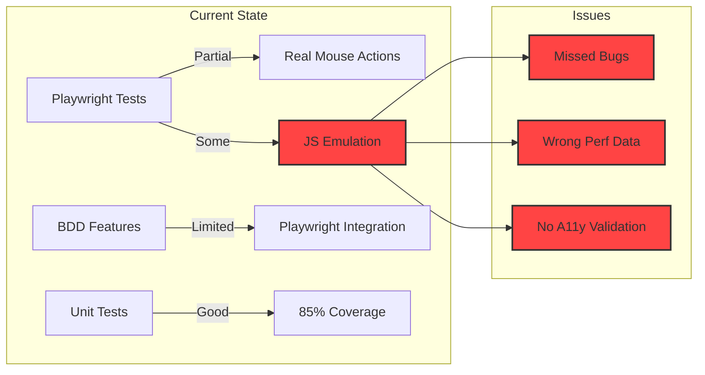
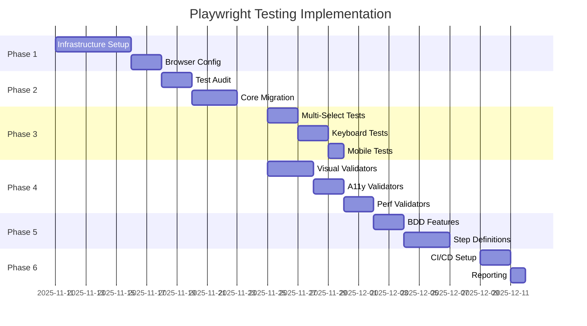

# Playwright User Action Testing Implementation Plan

**Document**: 041-2025-11-11-Playwright-User-Action-Testing-Implementation-Plan-v1.md
**Status**: ACTIVE
**Date**: 2025-11-11
**Author**: System Architect
**Revision**: 1.0

## 1. Executive Summary

This implementation plan provides a comprehensive 8-step roadmap for migrating multicardz testing infrastructure to Playwright with real user actions. The plan ensures systematic transition from any JavaScript-emulated tests to authentic browser interaction testing that validates actual user experience.

**Scope**: Complete testing infrastructure overhaul focusing on drag-drop operations, multi-selection, keyboard navigation, and accessibility validation using real browser events.

**Timeline**: 4-week implementation with parallel tracks for infrastructure setup, test migration, and validation framework development.

**Success Criteria**: 100% of interaction tests use real browser actions, zero page.evaluate() calls for user interactions, full accessibility validation coverage, and sub-second performance for all user operations.

## 2. Current State Analysis

### 2.1 Existing Test Infrastructure



### 2.2 Identified Gaps

1. **Test Coverage Gaps**:
   - Limited multi-selection testing
   - No keyboard-only navigation tests
   - Minimal touch/mobile interaction tests
   - Missing visual feedback validation

2. **Technical Debt**:
   - Some tests use page.evaluate() for setup
   - Direct DOM manipulation in fixtures
   - Inconsistent wait strategies
   - No performance benchmarking

3. **Infrastructure Needs**:
   - Page object models not fully implemented
   - No reusable action libraries
   - Missing debug/trace utilities
   - CI/CD pipeline needs enhancement

## 3. Implementation Phases

### Phase 1: Foundation (Week 1)

#### 3.1 Infrastructure Setup

**Objective**: Establish robust testing foundation with proper tooling and patterns.

**Tasks**:
```python
# Task 1.1: Create Test Infrastructure
tests/
├── playwright/
│   ├── __init__.py
│   ├── conftest.py              # Global fixtures
│   ├── fixtures/
│   │   ├── __init__.py
│   │   ├── browser.py           # Browser setup
│   │   ├── auth.py              # Authentication
│   │   └── data.py              # Test data generation
│   ├── actions/
│   │   ├── __init__.py
│   │   ├── drag_drop.py         # Drag-drop helpers
│   │   ├── selection.py         # Multi-select actions
│   │   ├── keyboard.py          # Keyboard navigation
│   │   └── touch.py             # Mobile interactions
│   ├── validators/
│   │   ├── __init__.py
│   │   ├── dom.py               # DOM state validation
│   │   ├── visual.py            # Visual feedback checks
│   │   ├── accessibility.py     # A11y validation
│   │   └── performance.py       # Performance metrics
│   └── pages/
│       ├── __init__.py
│       ├── base.py              # Base page object
│       ├── workspace.py         # Workspace page
│       └── components/          # Reusable components
│           ├── tag_cloud.py
│           ├── filter_zones.py
│           └── card_grid.py
```

**Task 1.2: Browser Configuration**
```python
# conftest.py
import pytest
from playwright.async_api import async_playwright
from typing import AsyncGenerator, Dict, Any

@pytest.fixture(scope="session")
async def browser_config() -> Dict[str, Any]:
    """Browser configuration for all tests."""
    return {
        'headless': os.getenv('HEADLESS', 'false').lower() == 'true',
        'slow_mo': int(os.getenv('SLOW_MO', '0')),
        'devtools': os.getenv('DEVTOOLS', 'false').lower() == 'true',
        'viewport': {
            'width': int(os.getenv('VIEWPORT_WIDTH', '1920')),
            'height': int(os.getenv('VIEWPORT_HEIGHT', '1080'))
        },
        'record_video': {
            'dir': 'test-results/videos',
            'size': {'width': 1280, 'height': 720}
        },
        'screenshot': 'only-on-failure',
        'trace': 'retain-on-failure'
    }

@pytest.fixture(scope="function")
async def authenticated_context(browser_config):
    """Create authenticated browser context."""
    async with async_playwright() as p:
        browser = await p.chromium.launch(**browser_config)
        context = await browser.new_context(
            storage_state='auth-state.json' if os.path.exists('auth-state.json') else None,
            **browser_config
        )

        # Enable request/response logging
        context.on('request', lambda r: print(f"→ {r.method} {r.url}"))
        context.on('response', lambda r: print(f"← {r.status} {r.url}"))

        yield context

        # Save auth state for reuse
        if not os.path.exists('auth-state.json'):
            await context.storage_state(path='auth-state.json')

        await context.close()
        await browser.close()
```

**Task 1.3: Action Libraries**
```python
# actions/drag_drop.py
from typing import Optional, Tuple
import asyncio

class DragDropActions:
    """Reusable drag-drop actions with real mouse events."""

    @staticmethod
    async def drag_with_physics(
        page,
        source,
        target,
        velocity: float = 1.0,
        curve_type: str = 'bezier'
    ):
        """
        Perform realistic drag with physics simulation.

        Args:
            page: Playwright page object
            source: Source element locator
            target: Target element locator
            velocity: Speed multiplier (1.0 = normal)
            curve_type: Movement curve ('linear', 'bezier', 'arc')
        """
        source_box = await source.bounding_box()
        target_box = await target.bounding_box()

        if not source_box or not target_box:
            raise ValueError("Elements not visible")

        # Calculate path
        path = calculate_movement_path(
            start=(source_box['x'] + source_box['width']/2,
                   source_box['y'] + source_box['height']/2),
            end=(target_box['x'] + target_box['width']/2,
                 target_box['y'] + target_box['height']/2),
            curve_type=curve_type
        )

        # Execute drag
        await page.mouse.move(path[0][0], path[0][1])
        await page.mouse.down()

        # Move along path with velocity
        for i, (x, y) in enumerate(path[1:]):
            await page.mouse.move(x, y)
            await asyncio.sleep(0.01 / velocity)

        await page.mouse.up()

    @staticmethod
    async def multi_element_drag(page, elements, target):
        """Drag multiple elements to target."""
        # Select all elements first
        for element in elements:
            await page.keyboard.down('Control')
            await element.click()
            await page.keyboard.up('Control')

        # Drag the group
        first_element = elements[0]
        await DragDropActions.drag_with_physics(page, first_element, target)
```

**Deliverables**:
- Complete test infrastructure directory structure
- Reusable fixture library
- Action helper modules
- Base page objects

### Phase 2: Core Test Migration (Week 2)

#### 3.2 Migrate Existing Tests

**Objective**: Convert all existing tests to use real user actions.

**Task 2.1: Identify and Categorize Tests**
```python
# audit_tests.py
import ast
import os
from pathlib import Path

class TestAuditor:
    """Audit existing tests for JavaScript emulation."""

    def __init__(self, test_dir: Path):
        self.test_dir = test_dir
        self.violations = []

    def audit_file(self, filepath: Path):
        """Check file for page.evaluate usage."""
        with open(filepath) as f:
            tree = ast.parse(f.read())

        for node in ast.walk(tree):
            if isinstance(node, ast.Call):
                if self.is_evaluate_call(node):
                    self.violations.append({
                        'file': filepath,
                        'line': node.lineno,
                        'type': 'page.evaluate'
                    })

    def generate_migration_plan(self):
        """Create migration plan for violations."""
        plan = []
        for violation in self.violations:
            plan.append({
                'file': violation['file'],
                'priority': self.calculate_priority(violation),
                'estimated_hours': 0.5,
                'migration_strategy': self.suggest_strategy(violation)
            })
        return sorted(plan, key=lambda x: x['priority'])
```

**Task 2.2: Migrate Drag-Drop Tests**
```python
# BEFORE (with JS emulation)
async def test_drag_filter_old(page):
    await page.evaluate("""
        const tag = document.querySelector('.tag[data-tag="python"]');
        const zone = document.querySelector('.union-zone');
        zone.appendChild(tag);
        window.dragDropSystem.updateState();
    """)

# AFTER (with real actions)
async def test_drag_filter_new(page):
    tag = page.locator('.tag[data-tag="python"]')
    zone = page.locator('.union-zone')

    # Real drag with verification
    await tag.drag_to(zone)

    # Verify through DOM observation
    await expect(zone.locator('.tag[data-tag="python"]')).to_be_visible()

    # Verify API was called
    await page.wait_for_response('**/api/v2/render/cards')
```

**Task 2.3: Create Migration Utilities**
```python
# migration/converter.py
class TestConverter:
    """Convert tests from JS emulation to real actions."""

    CONVERSION_MAP = {
        'page.evaluate.*\.click()': 'page.click()',
        'page.evaluate.*\.focus()': 'element.focus()',
        'page.evaluate.*appendChild': 'element.drag_to()',
        'page.evaluate.*dispatch': 'real_action_equivalent'
    }

    def convert_test(self, test_content: str) -> str:
        """Convert test to use real actions."""
        for pattern, replacement in self.CONVERSION_MAP.items():
            test_content = re.sub(pattern, replacement, test_content)
        return test_content

    def validate_conversion(self, original, converted):
        """Ensure conversion maintains test intent."""
        # Parse and compare AST
        # Verify no page.evaluate remains
        # Check action coverage
        pass
```

**Deliverables**:
- Complete test audit report
- Migration plan with priorities
- Converted core drag-drop tests
- Migration validation suite

### Phase 3: Advanced Interactions (Week 3)

#### 3.3 Implement Complex Test Scenarios

**Objective**: Add comprehensive tests for complex interactions.

**Task 3.1: Multi-Selection Tests**
```python
# tests/test_multi_selection.py
import pytest
from playwright.async_api import Page, expect

class TestMultiSelection:
    """Test suite for multi-selection operations."""

    @pytest.mark.parametrize('selection_method', ['shift', 'ctrl', 'drag'])
    async def test_multi_select_methods(self, page: Page, selection_method: str):
        """Test different multi-selection methods."""
        workspace = WorkspacePage(page)
        await workspace.goto()

        tags_to_select = ['python', 'javascript', 'rust']

        if selection_method == 'shift':
            # Shift+Click for range selection
            await workspace.select_tag_range(tags_to_select[0], tags_to_select[-1])
        elif selection_method == 'ctrl':
            # Ctrl+Click for individual selection
            await workspace.select_tags_individually(tags_to_select)
        elif selection_method == 'drag':
            # Drag selection rectangle
            await workspace.drag_select_tags(tags_to_select)

        # Verify selection
        selected = await workspace.get_selected_tags()
        assert set(selected) == set(tags_to_select)

        # Test drag of selected group
        await workspace.drag_selection_to_zone('union')

        # Verify all moved
        union_tags = await workspace.get_zone_tags('union')
        assert set(union_tags) == set(tags_to_select)

    async def test_selection_persistence(self, page: Page):
        """Test selection persistence across operations."""
        workspace = WorkspacePage(page)
        await workspace.goto()

        # Select multiple tags
        await workspace.select_tags_individually(['python', 'rust'])

        # Perform other operation
        await page.click('#startWithAllCards')  # Toggle control

        # Verify selection maintained
        selected = await workspace.get_selected_tags()
        assert set(selected) == {'python', 'rust'}

        # Drag should still work on selection
        await workspace.drag_selection_to_zone('intersection')
        assert await workspace.get_zone_tags('intersection') == ['python', 'rust']
```

**Task 3.2: Keyboard Navigation Tests**
```python
# tests/test_keyboard_navigation.py
class TestKeyboardNavigation:
    """Complete keyboard accessibility testing."""

    async def test_tab_order(self, page: Page):
        """Verify correct tab order through interface."""
        await page.goto('http://localhost:8011/workspace')

        # Start from known position
        await page.click('body')
        await page.keyboard.press('Tab')

        expected_order = [
            '[data-testid="skip-to-main"]',
            '.tag:first-child',
            '.union-zone',
            '.intersection-zone',
            '.exclusion-zone',
            '#startWithAllCards',
            '#cardContainer'
        ]

        for expected_selector in expected_order:
            focused = await page.evaluate('document.activeElement')
            matches = await page.evaluate(
                f'document.activeElement.matches("{expected_selector}")'
            )
            assert matches, f"Expected focus on {expected_selector}"
            await page.keyboard.press('Tab')

    async def test_arrow_navigation(self, page: Page):
        """Test arrow key navigation within components."""
        # Focus tag cloud
        await page.focus('.tag:first-child')

        # Navigate with arrows
        await page.keyboard.press('ArrowRight')
        focused_tag = await page.evaluate('document.activeElement.dataset.tag')
        assert focused_tag != 'python'  # Moved from first tag

        # Navigate zones with arrows
        await page.focus('.union-zone')
        await page.keyboard.press('ArrowDown')
        focused_zone = await page.evaluate('document.activeElement.className')
        assert 'intersection-zone' in focused_zone

    async def test_keyboard_drag_drop(self, page: Page):
        """Test drag-drop using only keyboard."""
        # Focus and select tag
        await page.focus('.tag[data-tag="python"]')
        await page.keyboard.press('Space')  # Select

        # Navigate to zone
        await page.keyboard.press('Tab')  # Move to zones
        await page.keyboard.press('Tab')

        # Drop with Enter
        await page.keyboard.press('Enter')

        # Verify drop occurred
        zone_tags = await page.locator('.union-zone .tag').all_text_contents()
        assert 'python' in zone_tags
```

**Task 3.3: Touch/Mobile Tests**
```python
# tests/test_mobile_interactions.py
class TestMobileInteractions:
    """Test touch interactions for mobile devices."""

    @pytest.fixture
    async def mobile_page(self, browser):
        """Create mobile viewport page."""
        context = await browser.new_context(
            viewport={'width': 375, 'height': 812},
            is_mobile=True,
            has_touch=True,
            user_agent='Mozilla/5.0 (iPhone; CPU iPhone OS 14_0 like Mac OS X)'
        )
        page = await context.new_page()
        yield page
        await context.close()

    async def test_touch_drag_drop(self, mobile_page: Page):
        """Test drag-drop with touch events."""
        await mobile_page.goto('http://localhost:8011/workspace')

        tag = mobile_page.locator('.tag[data-tag="javascript"]')
        zone = mobile_page.locator('.union-zone')

        # Get positions
        tag_box = await tag.bounding_box()
        zone_box = await zone.bounding_box()

        # Touch and hold
        await mobile_page.touchscreen.tap(
            tag_box['x'] + tag_box['width']/2,
            tag_box['y'] + tag_box['height']/2
        )

        # Long press to initiate drag
        await mobile_page.touchscreen.touch_and_hold(
            tag_box['x'] + tag_box['width']/2,
            tag_box['y'] + tag_box['height']/2,
            duration=500
        )

        # Drag to zone
        await mobile_page.touchscreen.move(
            zone_box['x'] + zone_box['width']/2,
            zone_box['y'] + zone_box['height']/2,
            steps=10
        )

        # Release
        await mobile_page.touchscreen.release()

        # Verify drop
        await expect(zone.locator('.tag[data-tag="javascript"]')).to_be_visible()

    async def test_pinch_zoom_cards(self, mobile_page: Page):
        """Test pinch zoom on card grid."""
        await mobile_page.goto('http://localhost:8011/workspace')

        # Add some cards
        await mobile_page.tap('.tag[data-tag="bug"]')
        await mobile_page.tap('.union-zone')

        # Pinch to zoom
        await mobile_page.touchscreen.pinch_zoom(
            center={'x': 200, 'y': 400},
            scale=2.0
        )

        # Verify zoom applied
        transform = await mobile_page.evaluate("""
            window.getComputedStyle(document.querySelector('#cardContainer')).transform
        """)
        assert 'scale' in transform or 'matrix' in transform
```

**Deliverables**:
- Multi-selection test suite
- Complete keyboard navigation tests
- Mobile/touch interaction tests
- Cross-browser test matrix

### Phase 4: Validation Framework (Week 3-4)

#### 3.4 Build Comprehensive Validators

**Objective**: Create robust validation framework for all aspects of user interactions.

**Task 4.1: Visual State Validators**
```python
# validators/visual.py
class VisualStateValidator:
    """Validate visual feedback during interactions."""

    async def validate_drag_states(self, page: Page):
        """Validate all visual states during drag operation."""
        tag = page.locator('.tag').first
        zone = page.locator('.union-zone')

        # Initial state
        assert not await self.has_class(tag, 'dragging')
        assert not await self.has_class(zone, 'drag-over')

        # Start drag
        await page.mouse.move(await self.get_center(tag))
        await page.mouse.down()

        # Dragging state
        assert await self.has_class(tag, 'dragging')
        assert await page.evaluate('document.body.classList.contains("dragging")')

        # Hover over zone
        await page.mouse.move(await self.get_center(zone))
        assert await self.has_class(zone, 'drag-over')
        assert await self.has_class(zone, 'drop-valid')

        # Complete drag
        await page.mouse.up()

        # Final state
        assert not await self.has_class(tag, 'dragging')
        assert not await self.has_class(zone, 'drag-over')

    async def validate_transitions(self, page: Page, element, property: str):
        """Validate CSS transitions complete properly."""
        # Get transition duration
        duration = await page.evaluate(f"""
            getComputedStyle(document.querySelector('{element}'))
                .transitionDuration
        """)

        # Convert to ms
        duration_ms = float(duration.replace('s', '')) * 1000

        # Perform action that triggers transition
        yield

        # Wait for transition
        await page.wait_for_timeout(duration_ms + 50)

        # Verify transition completed
        # Check computed style matches expected end state
```

**Task 4.2: Accessibility Validators**
```python
# validators/accessibility.py
class AccessibilityValidator:
    """Comprehensive accessibility validation."""

    async def validate_aria_attributes(self, page: Page):
        """Validate ARIA attributes during interactions."""
        validations = []

        # Draggable elements
        draggables = await page.locator('[draggable="true"]').all()
        for element in draggables:
            validations.append({
                'element': element,
                'required_attrs': ['aria-grabbed', 'aria-label', 'role'],
                'states': {
                    'initial': {'aria-grabbed': 'false'},
                    'dragging': {'aria-grabbed': 'true'}
                }
            })

        # Drop zones
        zones = await page.locator('[data-droppable="true"]').all()
        for zone in zones:
            validations.append({
                'element': zone,
                'required_attrs': ['aria-dropeffect', 'aria-label'],
                'states': {
                    'initial': {'aria-dropeffect': 'none'},
                    'dragover': {'aria-dropeffect': 'move'}
                }
            })

        return validations

    async def validate_focus_management(self, page: Page):
        """Validate focus is properly managed."""
        # Test focus trap in modals
        # Test focus restoration after operations
        # Test focus indicators visible
        pass

    async def validate_screen_reader_announcements(self, page: Page):
        """Validate screen reader announcements."""
        # Check for live regions
        live_regions = await page.locator('[aria-live]').all()
        assert len(live_regions) > 0, "No ARIA live regions found"

        # Monitor announcements during operation
        announcements = []
        for region in live_regions:
            page.on('domnodemodified', lambda: announcements.append(
                region.text_content()
            ))

        # Perform operation
        yield

        # Verify announcements made
        assert len(announcements) > 0, "No screen reader announcements"
```

**Task 4.3: Performance Validators**
```python
# validators/performance.py
class PerformanceValidator:
    """Validate performance of user interactions."""

    def __init__(self, thresholds=None):
        self.thresholds = thresholds or {
            'interaction_start': 50,      # ms to start responding
            'visual_feedback': 100,        # ms to show feedback
            'operation_complete': 1000,    # ms to complete
            'fps_during_animation': 30     # minimum FPS
        }

    async def measure_interaction_timing(self, page: Page):
        """Measure timing of complete interaction."""
        await page.evaluate("""
            window.performanceMarks = {};

            // Override addEventListener to capture timings
            const originalAdd = EventTarget.prototype.addEventListener;
            EventTarget.prototype.addEventListener = function(type, handler, options) {
                const wrapped = function(event) {
                    performance.mark(`${type}_start`);
                    const result = handler.call(this, event);
                    performance.mark(`${type}_end`);
                    performance.measure(type, `${type}_start`, `${type}_end`);
                    return result;
                };
                return originalAdd.call(this, type, wrapped, options);
            };
        """)

        # Perform interaction
        yield

        # Collect measurements
        measurements = await page.evaluate("""
            performance.getEntriesByType('measure').map(m => ({
                name: m.name,
                duration: m.duration
            }))
        """)

        # Validate against thresholds
        for measure in measurements:
            if measure['name'] in self.thresholds:
                assert measure['duration'] < self.thresholds[measure['name']], \
                    f"{measure['name']} took {measure['duration']}ms"

    async def validate_fps_during_animation(self, page: Page):
        """Ensure smooth animations during interactions."""
        await page.evaluate("""
            window.fpsData = [];
            let lastTime = performance.now();

            function measureFPS() {
                const currentTime = performance.now();
                const fps = 1000 / (currentTime - lastTime);
                window.fpsData.push(fps);
                lastTime = currentTime;
                requestAnimationFrame(measureFPS);
            }
            measureFPS();
        """)

        # Perform animated interaction
        yield

        # Stop measuring and analyze
        fps_data = await page.evaluate('window.fpsData')
        avg_fps = sum(fps_data) / len(fps_data)
        min_fps = min(fps_data)

        assert avg_fps >= self.thresholds['fps_during_animation'], \
            f"Average FPS {avg_fps} below threshold"
        assert min_fps >= self.thresholds['fps_during_animation'] * 0.8, \
            f"Minimum FPS {min_fps} too low"
```

**Deliverables**:
- Visual state validation library
- Accessibility validation suite
- Performance measurement framework
- API response validators

### Phase 5: BDD Integration (Week 4)

#### 3.5 Complete BDD Implementation

**Objective**: Full BDD test coverage with real user actions.

**Task 5.1: Feature Files**
```gherkin
# features/drag_drop_filtering.feature
Feature: Spatial Card Filtering via Drag and Drop
  As a multicardz user
  I want to filter cards by dragging tags to spatial zones
  So that I can explore my data through spatial manipulation

  Background:
    Given I have a workspace with 500 cards
    And cards are tagged with "bug", "feature", "python", "javascript", "urgent"
    And I am on the workspace page
    And the drag-drop system is initialized

  @smoke @drag-drop
  Scenario: Single tag union filter
    When I drag the "python" tag to the union zone
    Then the union zone should contain the "python" tag
    And I should see only cards tagged with "python"
    And the card count should show "127 cards"
    And the API should be called with union_tags=["python"]

  @multi-select
  Scenario Outline: Multi-select with <method>
    When I select tags using <method>:
      | tag        |
      | python     |
      | javascript |
      | bug        |
    And I drag the selection to the <zone> zone
    Then the <zone> zone should contain all selected tags
    And cards should be filtered with <operation> logic

    Examples:
      | method | zone         | operation    |
      | ctrl   | union        | OR           |
      | shift  | intersection | AND          |
      | drag   | exclusion    | NOT          |

  @accessibility
  Scenario: Keyboard-only tag filtering
    When I navigate to the "rust" tag using Tab key
    And I select it with Space key
    And I navigate to the union zone with Tab key
    And I drop it with Enter key
    Then the union zone should contain the "rust" tag
    And screen reader should announce "Tag rust moved to union filter zone"

  @performance
  Scenario: Large-scale filtering performance
    When I select 20 tags using shift-click
    And I drag them to the intersection zone
    Then the operation should complete within 500ms
    And all 20 tags should appear in the zone
    And cards should update within 1000ms
    And no visual jank should occur (60 FPS maintained)
```

**Task 5.2: Step Definitions**
```python
# features/steps/drag_drop_steps.py
from pytest_bdd import given, when, then, scenarios, parsers
from playwright.async_api import Page, expect
import json

# Load all scenarios from feature file
scenarios('../features/drag_drop_filtering.feature')

@given('I have a workspace with <count> cards')
@given(parsers.parse('I have a workspace with {count:d} cards'))
async def setup_workspace(page: Page, count: int, test_data_factory):
    """Create workspace with specified number of cards."""
    cards = test_data_factory.generate_cards(count)

    # Mock API to return test data
    await page.route('**/api/v2/cards', lambda route: route.fulfill(
        status=200,
        content_type='application/json',
        body=json.dumps({'cards': cards})
    ))

@when(parsers.parse('I drag the "{tag}" tag to the {zone} zone'))
async def drag_tag_to_zone_real(page: Page, tag: str, zone: str):
    """Drag tag using real mouse actions."""
    tag_element = page.locator(f'.tag[data-tag="{tag}"]')
    zone_element = page.locator(f'.{zone}-zone')

    # Ensure visible
    await expect(tag_element).to_be_visible()
    await expect(zone_element).to_be_visible()

    # Perform realistic drag
    await perform_human_like_drag(page, tag_element, zone_element)

@when('I select tags using <method>')
async def select_tags_with_method(page: Page, method: str, data_table):
    """Select multiple tags using specified method."""
    tags = [row['tag'] for row in data_table]

    if method == 'ctrl':
        modifier = 'Control' if platform.system() != 'Darwin' else 'Meta'
        for tag in tags:
            await page.keyboard.down(modifier)
            await page.click(f'.tag[data-tag="{tag}"]')
            await page.keyboard.up(modifier)

    elif method == 'shift':
        await page.click(f'.tag[data-tag="{tags[0]}"]')
        await page.keyboard.down('Shift')
        await page.click(f'.tag[data-tag="{tags[-1]}"]')
        await page.keyboard.up('Shift')

    elif method == 'drag':
        await drag_select_rectangle(page, tags)

@then(parsers.parse('I should see only cards tagged with "{tag}"'))
async def verify_filtered_cards(page: Page, tag: str):
    """Verify cards are filtered correctly."""
    # Wait for update
    await page.wait_for_response('**/api/v2/render/cards')

    # Check all visible cards
    cards = await page.locator('#cardContainer .card').all()
    for card in cards:
        tags = await card.get_attribute('data-tags')
        assert tag in tags.split(','), f"Card doesn't have {tag} tag"

@then(parsers.parse('the API should be called with {params}'))
async def verify_api_call(page: Page, params: str, request_interceptor):
    """Verify API was called with correct parameters."""
    # Parse expected params
    expected = eval(params)  # Safe in test context

    # Get last API call
    last_call = request_interceptor.get_last_call('/api/v2/render/cards')
    assert last_call is not None, "API was not called"

    # Verify parameters
    actual_params = json.loads(last_call.post_data)
    for key, value in expected.items():
        assert actual_params.get(key) == value, \
            f"Expected {key}={value}, got {actual_params.get(key)}"

@then('no visual jank should occur (60 FPS maintained)')
async def verify_smooth_animation(page: Page, performance_validator):
    """Verify animation performance."""
    fps_data = await performance_validator.get_fps_data()
    avg_fps = sum(fps_data) / len(fps_data)
    assert avg_fps >= 60, f"Average FPS {avg_fps} below 60"
```

**Deliverables**:
- Complete BDD feature files
- Step definitions using real actions
- Custom validators for BDD
- Parallel execution support

### Phase 6: CI/CD Integration (Week 4)

#### 3.6 Setup Continuous Testing

**Objective**: Integrate tests into CI/CD pipeline with proper reporting.

**Task 6.1: GitHub Actions Configuration**
```yaml
# .github/workflows/playwright-tests.yml
name: Playwright User Action Tests

on:
  push:
    branches: [main, develop]
  pull_request:
    types: [opened, synchronize, reopened]

jobs:
  test-matrix:
    name: Test on ${{ matrix.browser }} / ${{ matrix.os }}
    runs-on: ${{ matrix.os }}

    strategy:
      fail-fast: false
      matrix:
        os: [ubuntu-latest, windows-latest, macos-latest]
        browser: [chromium, firefox, webkit]
        python-version: [3.11]

    steps:
    - uses: actions/checkout@v3

    - name: Set up Python
      uses: actions/setup-python@v4
      with:
        python-version: ${{ matrix.python-version }}

    - name: Cache dependencies
      uses: actions/cache@v3
      with:
        path: |
          ~/.cache/pip
          ~/.cache/playwright
        key: ${{ runner.os }}-pip-${{ hashFiles('**/requirements.txt') }}

    - name: Install dependencies
      run: |
        pip install --upgrade pip
        pip install -r requirements-test.txt
        playwright install --with-deps ${{ matrix.browser }}

    - name: Start application server
      run: |
        uvicorn apps.user.main:create_app --factory --port 8011 &
        sleep 5
        curl -I http://localhost:8011 || exit 1

    - name: Run Playwright tests
      env:
        BROWSER: ${{ matrix.browser }}
        HEADLESS: true
        SLOW_MO: 0
      run: |
        pytest tests/playwright \
          --browser=${{ matrix.browser }} \
          --video=retain-on-failure \
          --screenshot=only-on-failure \
          --tracing=on \
          --html=report-${{ matrix.browser }}-${{ matrix.os }}.html \
          --self-contained-html \
          --junit-xml=junit-${{ matrix.browser }}-${{ matrix.os }}.xml \
          --cov=apps \
          --cov-report=xml:coverage-${{ matrix.browser }}.xml

    - name: Upload test results
      if: always()
      uses: actions/upload-artifact@v3
      with:
        name: test-results-${{ matrix.browser }}-${{ matrix.os }}
        path: |
          report-*.html
          junit-*.xml
          test-results/
          coverage-*.xml

    - name: Upload traces
      if: failure()
      uses: actions/upload-artifact@v3
      with:
        name: traces-${{ matrix.browser }}-${{ matrix.os }}
        path: test-results/traces/

  test-report:
    name: Publish Test Results
    needs: test-matrix
    runs-on: ubuntu-latest
    if: always()

    steps:
    - name: Download artifacts
      uses: actions/download-artifact@v3

    - name: Publish test results
      uses: EnricoMi/publish-unit-test-result-action@v2
      with:
        files: '**/junit-*.xml'
        check_name: Playwright Test Results

    - name: Generate coverage report
      run: |
        pip install coverage
        coverage combine coverage-*.xml
        coverage report
        coverage html

    - name: Upload coverage to Codecov
      uses: codecov/codecov-action@v3
      with:
        files: ./coverage.xml
        flags: playwright
        name: playwright-coverage
```

**Task 6.2: Test Reporting**
```python
# utils/test_reporter.py
class TestReporter:
    """Generate comprehensive test reports."""

    def __init__(self, results_dir: Path):
        self.results_dir = results_dir

    def generate_html_report(self):
        """Generate HTML test report with screenshots."""
        template = """
        <!DOCTYPE html>
        <html>
        <head>
            <title>Playwright Test Report</title>
            <style>
                .test-pass { color: green; }
                .test-fail { color: red; }
                .screenshot { max-width: 800px; }
            </style>
        </head>
        <body>
            <h1>Test Execution Report</h1>
            <div class="summary">
                <p>Total: {total}</p>
                <p>Passed: {passed}</p>
                <p>Failed: {failed}</p>
            </div>
            <div class="results">
                {test_results}
            </div>
        </body>
        </html>
        """
        # Generate report content
        # Include screenshots for failures
        # Add performance metrics
        # Link to trace files
```

**Deliverables**:
- CI/CD pipeline configuration
- Multi-browser test matrix
- Test reporting dashboard
- Performance tracking

## 4. Implementation Timeline



## 5. Success Metrics

### 5.1 Coverage Metrics
- **Test Coverage**: >90% of user interactions covered
- **Browser Coverage**: 100% pass rate on Chrome, Firefox, Safari
- **Device Coverage**: Desktop, tablet, mobile viewports tested
- **Accessibility**: WCAG 2.1 AA compliance validated

### 5.2 Quality Metrics
- **No JS Emulation**: 0 instances of page.evaluate() for interactions
- **Real Actions**: 100% of tests use Playwright action APIs
- **Visual Validation**: All interactions verify visual feedback
- **Performance**: All operations complete within defined thresholds

### 5.3 Operational Metrics
- **CI/CD Integration**: Tests run on every commit
- **Execution Time**: Full suite completes in <10 minutes
- **Flakiness**: <1% flaky test rate
- **Debug Time**: Average issue resolution <30 minutes

## 6. Risk Management

### 6.1 Technical Risks

| Risk | Impact | Mitigation |
|------|--------|------------|
| Test flakiness | High | Implement robust wait strategies, retry logic |
| Performance overhead | Medium | Parallelize tests, optimize selectors |
| Browser differences | Medium | Test matrix covers all browsers |
| CI resource usage | Low | Cache dependencies, optimize pipeline |

### 6.2 Migration Risks

| Risk | Impact | Mitigation |
|------|--------|------------|
| Breaking existing tests | High | Gradual migration, maintain both versions temporarily |
| Learning curve | Medium | Team training, documentation, pair programming |
| Timeline slippage | Medium | Parallel tracks, buffer time built in |

## 7. Team Resources

### 7.1 Required Skills
- Playwright expertise
- Python async programming
- BDD/Gherkin experience
- CI/CD pipeline knowledge
- Performance testing

### 7.2 Training Plan
1. Week 1: Playwright fundamentals workshop
2. Week 2: Real actions vs emulation deep dive
3. Week 3: BDD test writing workshop
4. Week 4: Performance testing techniques

## 8. Maintenance Plan

### 8.1 Ongoing Maintenance
- Weekly test review for flakiness
- Monthly performance baseline updates
- Quarterly accessibility audit
- Continuous refactoring of common patterns

### 8.2 Documentation
- Maintain test writing guidelines
- Update pattern library regularly
- Document common issues and solutions
- Create onboarding guide for new developers

## 9. Compliance Checklist

### Pre-Implementation
- [ ] Current tests audited for JS emulation
- [ ] Infrastructure requirements defined
- [ ] Team training scheduled
- [ ] CI/CD resources allocated

### During Implementation
- [ ] Phase 1: Infrastructure complete
- [ ] Phase 2: Core tests migrated
- [ ] Phase 3: Advanced tests added
- [ ] Phase 4: Validators implemented
- [ ] Phase 5: BDD integrated
- [ ] Phase 6: CI/CD operational

### Post-Implementation
- [ ] All tests use real user actions
- [ ] Zero page.evaluate() for interactions
- [ ] Performance thresholds met
- [ ] Accessibility validated
- [ ] Documentation complete
- [ ] Team trained

## 10. Conclusion

This implementation plan provides a systematic approach to establishing robust Playwright testing with real user actions for multicardz. By following this 4-week roadmap, we will achieve comprehensive test coverage that validates actual user experience rather than internal implementation details.

The investment in proper testing infrastructure will yield significant returns through improved quality, reduced bugs in production, and confidence in our spatial tag manipulation system's reliability across all platforms and devices.

Success depends on strict adherence to real user actions, comprehensive validation, and continuous improvement of our testing practices.