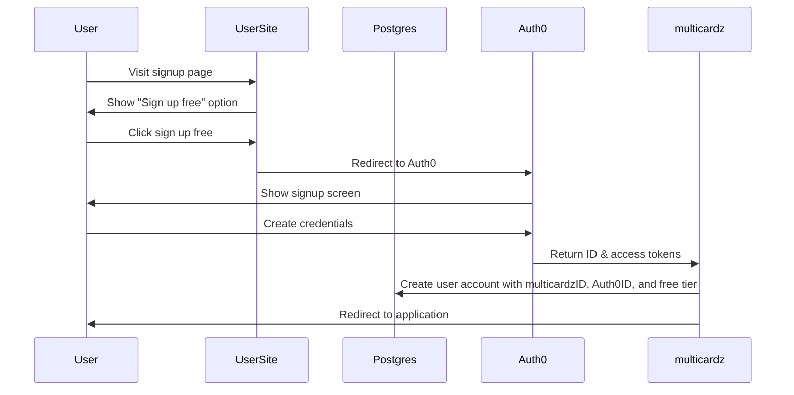
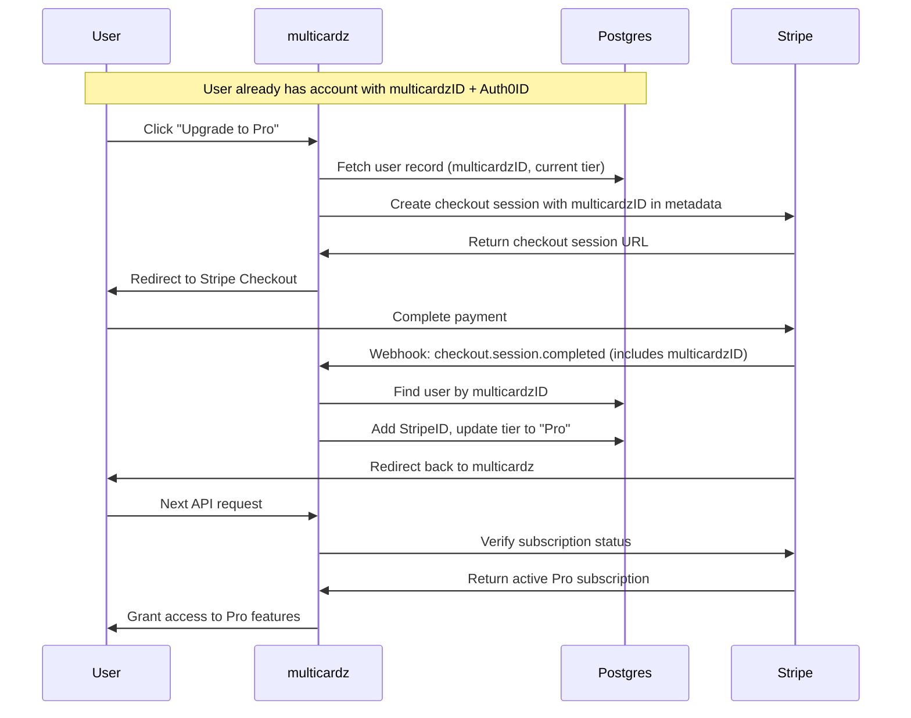
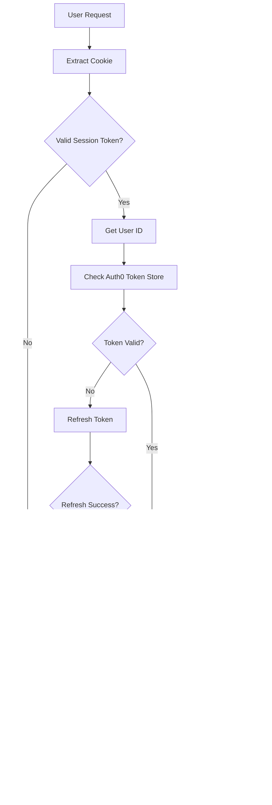

# multicardz Authentication, Subscription & User Management Requirements

---
**IMPLEMENTATION STATUS**: SUPERSEDED
**LAST VERIFIED**: 2025-11-06
**IMPLEMENTATION EVIDENCE**: Consolidated into doc 039-2025-11-06-Authentication-Architecture-and-Plan.md
**SUPERSEDED BY**: docs/architecture/039-2025-11-06-Authentication-Architecture-and-Plan.md
---

## Plain Language Summary

**What This Document Is:**
This document describes how people sign up for multicardz, how they log in, how they pay for subscriptions, and how their data stays private and secure.

**Why It Matters:**
When you use multicardz, you need confidence that:
- Your login is secure and works reliably
- Your payment information is protected
- Your data belongs only to you (nobody else can see it)
- The system works fast and doesn't break

**The Three Ways to Get Started:**

1. **Try It Free First** - You create an account instantly with Google, email, or other login methods. You get immediate access to basic features. If you like it, you can upgrade to paid features later.

2. **Start with a Paid Plan** - You choose a subscription plan and pay first. Then you create your login credentials and get full access right away.

3. **Upgrade Anytime** - If you started with a free account, you can upgrade to a paid plan at any time. Click "Upgrade", complete payment, and premium features activate immediately. Your data stays exactly the same, you just get more features.

**How We Keep You Safe:**
- Every time you access your data, the system automatically checks that you're allowed to see it
- We never show you someone else's cards or tags
- Payment processing uses Stripe (a trusted payment company) - we never see your credit card numbers
- Login uses Auth0 (a trusted security company) to keep your password safe

**What Happens Behind the Scenes:**
The technical teams use this document as a blueprint to build the signup, login, payment, and security systems. It ensures everyone builds the same way and nothing important gets forgotten.

**Testing and Quality:**
To ensure everything works correctly, developers can activate a special "testing mode" that lets them test the application without connecting to real login or payment services. This mode has strict safety measures:
- It only works on testing computers, never on the live system
- It still protects data - you can only see test data
- The system logs warnings constantly so nobody forgets it's enabled
- It automatically shuts down if someone tries to use it with real customer data

---

## Technical Overview

This section provides a technical explanation of the architecture without diving into code details. It bridges the plain language summary above with the detailed requirements below.

### Dual Registration Architecture

**Why Two Paths:**
multicardz supports both freemium (try before you buy) and premium-first business models. The dual-path registration architecture ensures:
- Low friction for users who want to try the product immediately
- Secure payment collection before granting premium access
- Consistent user identity management across both flows
- Seamless upgrade path from free to paid tiers

**Auth-First Flow (Free Users):**
The system leverages Auth0's Universal Login for immediate account creation. Upon successful authentication:
1. Auth0 returns an ID token containing user claims (email, name, sub)
2. The application extracts these claims and creates a database record
3. System generates a unique multicardzID for data isolation
4. Free tier subscription is automatically assigned
5. User profile is synchronized with Auth0 user metadata

This flow prioritizes speed and reduces friction - users are in the application within seconds.

**Pay-First Flow (Paid Users):**
The system uses Stripe Checkout as the entry point for premium subscriptions:
1. User selects a subscription plan, triggering Stripe checkout session creation
2. Stripe handles PCI-compliant payment collection
3. Stripe webhook notifies the application of successful payment
4. System creates database record with multicardzID and StripeID
5. User is redirected to Auth0 to create login credentials
6. Auth0ID is linked to the existing database record

This flow ensures payment before access, reducing fraud and failed payment issues.

**Upgrade Flow (Free to Paid):**
The system supports seamless upgrades for existing free users who want premium features:
1. User clicks "Upgrade" button within the application interface
2. System retrieves current user record from database (contains multicardzID, Auth0ID, current tier)
3. Stripe checkout session created with critical metadata:
   - multicardzID passed in session metadata
   - Selected subscription plan and pricing
   - Success/cancel redirect URLs back to application
4. User redirects to Stripe Checkout (leaves application temporarily)
5. User completes payment using credit card
6. Stripe validates payment and processes subscription creation
7. Stripe sends `checkout.session.completed` webhook to application
8. Webhook handler executes critical linking operation:
   - Extracts multicardzID from webhook event metadata
   - Queries database: `SELECT * FROM users WHERE multicardz_id = ?`
   - Locates existing user record (doesn't create new record)
   - Adds StripeID (Stripe customer ID) to existing user record
   - Updates subscription_tier from "free" to selected paid tier (e.g., "pro", "team")
   - Transaction committed atomically
9. Stripe redirects user back to application success URL
10. User's next API request includes session cookie (user_id unchanged)
11. Authentication middleware validates session and subscription status
12. Subscription middleware queries Stripe API for current subscription
13. Stripe confirms active paid subscription
14. System grants access to premium features immediately

**Critical Implementation Details:**
- **multicardzID as Linking Key**: The multicardzID (not email, not Auth0ID) links the payment to the user
- **Update, Not Create**: Webhook handler MUST update existing record, not create duplicate
- **Idempotent Processing**: Webhook may fire multiple times; check if StripeID already added
- **Atomic Transaction**: StripeID addition and tier update MUST occur atomically
- **No Re-Authentication**: User session remains valid; no logout/login required
- **Data Preservation**: All existing cards, tags, workspaces remain intact
- **Immediate Access**: Next authenticated request picks up new subscription status

**Why This Design:**
- Frictionless upgrade experience (no re-registration)
- Preserves user's existing work and data
- Uses same Stripe Checkout flow as pay-first (consistent UX)
- Leverages existing webhook infrastructure
- Maintains single source of truth (Stripe for subscription status)
- No race conditions (webhook updates database, next request reads it)

**Failure Scenarios:**
- **Payment Fails**: User redirected to cancel URL, remains on free tier, can retry
- **Webhook Delayed**: User sees free tier briefly, updates when webhook processes
- **Webhook Lost**: Stripe retries webhook; manual reconciliation available
- **Duplicate Webhook**: Idempotency check prevents duplicate StripeID writes

This three-flow architecture (auth-first, pay-first, upgrade) provides maximum flexibility for user acquisition while maintaining data integrity and security.

### Authentication Architecture

**Session Management Strategy:**
multicardz uses a dual-token architecture that separates concerns between user sessions and API access:

**Client-Side (Browser):**
- HTTP-only secure cookie containing a session token
- Cookie includes user_id claim for server-side lookups
- No sensitive tokens exposed to JavaScript (XSS protection)
- Automatic browser handling of cookie lifecycle

**Server-Side (Token Store):**
- Thread-safe in-memory store for Auth0 access/refresh tokens
- Tokens indexed by user_id for fast retrieval
- Automatic token refresh before expiration
- Cleanup of expired tokens to prevent memory leaks

**Request Flow:**
1. Browser sends HTTP-only cookie with every request
2. Middleware extracts and validates session token
3. System retrieves user_id from validated token
4. Auth0 access token fetched from server-side store
5. Token validated and refreshed if needed
6. Subscription status checked against Stripe
7. Request proceeds if all validations pass

This architecture provides security, performance, and automatic token management.

### Zero-Trust Data Isolation

**The UUID-Based Security Model:**
Every resource in multicardz (users, workspaces, cards, tags) has a globally unique identifier. The system enforces data isolation through automatic query filtering:

**data_filter Middleware:**
The data_filter middleware sits in the request pipeline after authentication but before route handlers. It automatically:
- Extracts user_id from the authenticated session
- Intercepts all database queries before execution
- Injects `WHERE user_id = ?` clause with the authenticated user's ID
- Ensures queries only return data owned by the requesting user
- Prevents developer error - filtering happens automatically, not manually

**Multi-Tenant Resource Access:**
For resources shared across workspaces:
- workspace_id provides the isolation boundary
- Users must have explicit access grants to workspaces
- Queries filter by both user_id (who you are) and workspace_id (what you can access)
- Invitation system manages workspace membership

**Defense in Depth:**
Even if a developer forgets to add filtering:
- Middleware catches it automatically
- No query executes without user_id filtering
- Database design prevents cross-user data leaks
- Audit logs track all data access attempts

This approach makes security the default, not an opt-in.

### Subscription Integration Architecture

**Stripe as Source of Truth:**
The system treats Stripe as the authoritative source for subscription status:

**Webhook-Driven Updates:**
- Stripe sends real-time webhooks for all subscription events
- Webhook handler validates signature to prevent spoofing
- Events update local database for fast access
- Background sync reconciles any discrepancies

**Subscription Validation Points:**
Authentication middleware checks subscription status on:
- Login (ensure active subscription)
- API requests (prevent access during grace period)
- Feature gates (enforce tier-based limits)

**Upgrade Flow (Free to Paid):**
When a free user decides to upgrade:
1. User clicks "Upgrade" button in application UI
2. System creates Stripe checkout session, passing multicardzID in metadata
3. User redirects to Stripe Checkout (leaves application temporarily)
4. User completes payment with credit card
5. Stripe sends `checkout.session.completed` webhook to application
6. Webhook handler extracts multicardzID from session metadata
7. System locates existing user record using multicardzID
8. StripeID added to user record (linking Stripe customer to user)
9. Subscription tier updated from "free" to selected paid tier
10. User redirected back to application
11. Next API request validates new subscription status with Stripe
12. Premium features become immediately accessible

**Key Difference from Pay-First Flow:**
- User already exists in database with Auth0ID and multicardzID
- Upgrade *updates* existing record (doesn't create new one)
- No Auth0 credential creation needed (user already authenticated)
- Subscription change takes effect immediately on next request

**Downgrade Flow (Paid to Free):**
Paid users downgrading or canceling:
1. Stripe subscription modified or canceled
2. Webhook updates subscription status
3. Grace period begins (data retained, access limited)
4. After grace period, user reverts to free tier

**Idempotency and Reliability:**
- Webhook handlers are idempotent (safe to replay)
- Transaction boundaries ensure data consistency
- Failed webhooks retry automatically
- Manual reconciliation tools for edge cases

This architecture ensures accurate billing and immediate feature access changes.

### Performance and Scalability Considerations

**Response Time Targets:**
- Authentication: < 500ms for 95th percentile
- Token validation: < 100ms
- Database queries: O(log n) using indexed UUID lookups
- Session cleanup: Background task, zero impact on requests

**Scalability Strategy:**
- Stateless application servers (horizontal scaling)
- Server-side token store with eventual persistence
- Database read replicas for query distribution
- Caching layer for subscription status (Redis)

**Failure Handling:**
- Circuit breakers for Auth0 and Stripe API calls
- Graceful degradation when external services fail
- Retry logic with exponential backoff
- Comprehensive error logging for debugging

---

## Document Information
- **Version**: 1.0
- **Date**: 2025-10-21
- **Status**: Draft
- **Purpose**: High-level functional and system requirements for authentication, subscription management, and user management systems
- **Audience**: Product managers, developers, security team, stakeholders

## 1. Overview

### 1.1 System Purpose
multicardz requires a comprehensive authentication, subscription, and user management system to:
- Securely authenticate and authorize users
- Manage subscription-based access to premium features
- Enforce zero-trust security principles with UUID-based data isolation
- Provide seamless user experience across authentication, payment, and application access

### 1.2 Scope
This document covers requirements for:
- Dual registration flows:
  - Auth-first flow for free users (Auth0 → Database → Free tier)
  - Pay-first flow for paid users (Stripe → Database → Auth0)
- User authentication via Auth0 with server-side token storage
- Subscription management and validation via Stripe
- User profile and workspace management
- Zero-trust security with UUID-based data isolation via data_filter middleware
- Integration points between Auth0, Stripe, and the multicardz application

### 1.3 Key Stakeholders
- End Users: Individuals and teams using multicardz for semantic tag management
- System Administrators: Managing user access and subscriptions
- Development Team: Implementing and maintaining the systems
- Security Team: Ensuring compliance and data protection

## 2. Functional Requirements

### 2.1 User Signup and Onboarding

#### 2.1.1 Registration Flows (Dual-Path Model)

**Free User Flow (Auth-First)**
- **FR-REG-001**: System SHALL allow users to sign up directly via Auth0 for free tier access
- **FR-REG-002**: System SHALL support Auth0 authentication with email/password and OAuth2 social providers (Google, Apple, Microsoft)
- **FR-REG-003**: System SHALL create user account in database from Auth0 ID token claims
- **FR-REG-004**: System SHALL assign unique multicardzID and Auth0ID to user account
- **FR-REG-005**: System SHALL automatically assign free tier subscription to new users
- **FR-REG-006**: System SHALL allow free users to upgrade to paid plans later

**Paid User Flow (Pay-First)**
- **FR-REG-007**: System SHALL initiate paid user registration via Stripe Checkout for subscription selection
- **FR-REG-008**: System SHALL create user account in database upon successful Stripe payment webhook
- **FR-REG-009**: System SHALL assign unique multicardzID and store StripeID in user account
- **FR-REG-010**: System SHALL redirect users to Auth0 after successful payment to create credentials
- **FR-REG-011**: System SHALL add Auth0ID to existing user account after credential creation

**Common Requirements**
- **FR-REG-012**: System SHALL support enterprise SSO connections via Auth0
- **FR-REG-013**: System SHALL validate email addresses during registration

**Upgrade Flow (Free to Paid)**
- **FR-REG-014**: System SHALL allow free users to upgrade to paid plans from within the application
- **FR-REG-015**: System SHALL create Stripe checkout session with existing user's multicardzID as metadata
- **FR-REG-016**: System SHALL redirect user to Stripe Checkout for payment
- **FR-REG-017**: System SHALL receive payment webhook and locate existing user record via multicardzID
- **FR-REG-018**: System SHALL add StripeID to existing user account upon successful payment
- **FR-REG-019**: System SHALL update subscription tier from free to paid immediately
- **FR-REG-020**: System SHALL make premium features available without requiring re-authentication

#### 2.1.2 Onboarding Experience
- **FR-ONB-001**: System SHALL redirect new users to profile setup after first authentication
- **FR-ONB-002**: System SHALL collect essential profile information (name, organization, use case)
- **FR-ONB-003**: System SHALL provide guided tour of key features for new users
- **FR-ONB-004**: System SHALL offer trial subscription for new users without payment

### 2.2 Subscription Management

#### 2.2.1 Subscription Plans
- **FR-SUB-001**: System SHALL support multiple subscription tiers (Free, Professional, Team, Enterprise)
- **FR-SUB-002**: System SHALL enforce feature access based on subscription tier
- **FR-SUB-003**: System SHALL support monthly and annual billing cycles
- **FR-SUB-004**: System SHALL provide trial periods for premium plans

#### 2.2.2 Payment Processing
- **FR-PAY-001**: System SHALL redirect users to Stripe Checkout for subscription payments
- **FR-PAY-002**: System SHALL create Stripe checkout session before redirecting users
- **FR-PAY-003**: System SHALL support credit/debit card payments via Stripe
- **FR-PAY-004**: System SHALL receive payment success webhook from Stripe
- **FR-PAY-005**: System SHALL create user account in database upon payment webhook receipt
- **FR-PAY-006**: System SHALL handle payment failures gracefully with retry logic
- **FR-PAY-007**: System SHALL send payment receipts and invoices via email
- **FR-PAY-008**: System SHALL support subscription upgrades and downgrades

#### 2.2.3 Subscription Lifecycle
- **FR-SLC-001**: System SHALL automatically activate subscriptions upon successful payment
- **FR-SLC-002**: System SHALL handle subscription renewals automatically
- **FR-SLC-003**: System SHALL support subscription cancellation with data retention
- **FR-SLC-004**: System SHALL provide grace period for failed payments
- **FR-SLC-005**: System SHALL sync subscription status between Stripe and local database
- **FR-SLC-006**: System SHALL support free user upgrades to paid plans via Stripe
- **FR-SLC-007**: System SHALL add StripeID to existing user account when free user upgrades

### 2.3 Authentication Flows

#### 2.3.1 Login Process
- **FR-AUTH-001**: System SHALL authenticate users via Auth0 OAuth2 authorization code flow with PKCE
- **FR-AUTH-002**: System SHALL maintain user sessions using secure HTTP-only cookies containing session tokens
- **FR-AUTH-003**: System SHALL validate session tokens on every request by extracting cookie and checking validity
- **FR-AUTH-004**: System SHALL store Auth0 access/refresh tokens server-side in token store
- **FR-AUTH-005**: System SHALL automatically refresh expired Auth0 tokens for active sessions
- **FR-AUTH-006**: System SHALL verify active subscription status with Stripe on authenticated requests
- **FR-AUTH-007**: System SHALL redirect users with inactive subscriptions to renewal page
- **FR-AUTH-008**: System SHALL support "Remember Me" functionality for extended sessions
- **FR-AUTH-009**: System SHALL handle authentication errors with clear user messaging
- **FR-AUTH-010**: System SHALL support password reset via Auth0

#### 2.3.2 Session Management
- **FR-SES-001**: System SHALL maintain user sessions for configurable duration (default: 4 hours)
- **FR-SES-002**: System SHALL refresh tokens automatically for active users
- **FR-SES-003**: System SHALL invalidate sessions on explicit logout
- **FR-SES-004**: System SHALL support concurrent sessions across devices
- **FR-SES-005**: System SHALL clean up expired sessions automatically

#### 2.3.3 Development/Test Mode
- **FR-DEV-001**: System SHALL support a development/test mode enabled via environment variable
- **FR-DEV-002**: Development mode SHALL bypass Auth0 authentication checks
- **FR-DEV-003**: Development mode SHALL bypass Stripe subscription validation
- **FR-DEV-004**: Development mode SHALL bypass token validation and refresh logic
- **FR-DEV-005**: Development mode SHALL still enforce UUID-based data isolation via data_filter middleware
- **FR-DEV-006**: Development mode SHALL inject a test user_id for data isolation testing
- **FR-DEV-007**: Development mode SHALL log warnings on every request when enabled
- **FR-DEV-008**: System SHALL refuse to start if development mode is enabled with production database
- **FR-DEV-009**: System SHALL require explicit key value in environment variable (not just boolean)
- **FR-DEV-010**: Development mode SHALL be documented as TESTING ONLY in all configuration files

### 2.4 User Profile Management

#### 2.4.1 Profile Information
- **FR-PROF-001**: System SHALL allow users to view and edit profile information
- **FR-PROF-002**: System SHALL sync profile updates with Auth0 user metadata
- **FR-PROF-003**: System SHALL support profile picture upload and management
- **FR-PROF-004**: System SHALL maintain audit trail of profile changes

#### 2.4.2 Account Settings
- **FR-ACC-001**: System SHALL allow users to manage notification preferences
- **FR-ACC-002**: System SHALL provide account security settings (MFA, password change)
- **FR-ACC-003**: System SHALL allow users to download their data (GDPR compliance)
- **FR-ACC-004**: System SHALL support account deletion with data purge

### 2.5 Workspace/Tenant Management

#### 2.5.1 Workspace Creation
- **FR-WS-001**: System SHALL support multiple workspaces per user account
- **FR-WS-002**: System SHALL enforce workspace limits based on subscription tier
- **FR-WS-003**: System SHALL provide workspace templates for common use cases
- **FR-WS-004**: System SHALL generate unique UUID identifiers for each workspace

#### 2.5.2 Access Control
- **FR-AC-001**: System SHALL support role-based access control (Owner, Admin, Member, Viewer)
- **FR-AC-002**: System SHALL allow workspace owners to invite team members
- **FR-AC-003**: System SHALL enforce permissions at the workspace level
- **FR-AC-004**: System SHALL support permission delegation and revocation
- **FR-AC-005**: System SHALL maintain access logs for audit purposes

## 3. System Requirements

### 3.1 Authentication System (Auth0 Integration)

#### 3.1.1 Core Authentication
- **SR-AUTH-001**: System SHALL integrate with Auth0 using OAuth2 authorization code flow
- **SR-AUTH-002**: System SHALL validate JWT tokens using Auth0's public keys
- **SR-AUTH-003**: System SHALL extract user identity from ID token claims
- **SR-AUTH-004**: System SHALL store Auth0 tokens securely server-side
- **SR-AUTH-005**: System SHALL implement token refresh mechanism

#### 3.1.2 Authentication Security
- **SR-ASEC-001**: System SHALL use PKCE for OAuth2 flow security
- **SR-ASEC-002**: System SHALL validate token signatures and expiration
- **SR-ASEC-003**: System SHALL implement rate limiting on authentication endpoints
- **SR-ASEC-004**: System SHALL log all authentication events for security monitoring

#### 3.1.3 Development/Test Mode Configuration
- **SR-DEV-001**: System SHALL check for DEV_MODE_KEY environment variable on startup
- **SR-DEV-002**: Development mode SHALL activate only if DEV_MODE_KEY matches expected secret value
- **SR-DEV-003**: System SHALL validate database connection string against production patterns
- **SR-DEV-004**: System SHALL terminate startup if dev mode enabled with production database URL
- **SR-DEV-005**: Authentication middleware SHALL skip Auth0 checks when dev mode is active
- **SR-DEV-006**: Subscription middleware SHALL skip Stripe checks when dev mode is active
- **SR-DEV-007**: System SHALL inject configurable test user_id from DEV_USER_ID environment variable
- **SR-DEV-008**: System SHALL default to test UUID if DEV_USER_ID not specified in dev mode
- **SR-DEV-009**: System SHALL log "DEVELOPMENT MODE ACTIVE" warning on every HTTP request
- **SR-DEV-010**: System SHALL include "X-Dev-Mode: true" header in all responses when dev mode active
- **SR-DEV-011**: data_filter middleware SHALL continue filtering queries by injected test user_id
- **SR-DEV-012**: System configuration SHALL document dev mode variables with TESTING ONLY warnings

### 3.2 Authorization Model (Zero-Trust, UUID Isolation)

#### 3.2.1 Zero-Trust Architecture
- **SR-ZT-001**: System SHALL implement middleware stack for request processing
- **SR-ZT-002**: System SHALL verify authentication on every request via auth middleware (see diagram 8.2)
- **SR-ZT-003**: System SHALL pass authenticated requests to route handlers
- **SR-ZT-004**: System SHALL apply data_filter middleware to automatically inject UUID filters on all database queries
- **SR-ZT-005**: System SHALL enforce least-privilege access principles
- **SR-ZT-006**: System SHALL isolate data using UUID-based filtering via data_filter middleware
- **SR-ZT-007**: System SHALL prevent cross-tenant data access
- **SR-ZT-008**: System SHALL validate resource ownership before any operation

#### 3.2.2 UUID-Based Isolation (via data_filter middleware)
- **SR-UUID-001**: System SHALL assign globally unique identifiers (multicardzID) to all user accounts
- **SR-UUID-002**: System SHALL implement data_filter middleware to automatically inject UUID filters before query execution
- **SR-UUID-003**: data_filter middleware SHALL add `WHERE user_id = ?` clause to all data access queries
- **SR-UUID-004**: data_filter middleware SHALL filter queries by workspace_id for multi-tenant resources
- **SR-UUID-005**: System SHALL return only filtered data matching authenticated user's UUID
- **SR-UUID-006**: System SHALL include UUID in all API responses
- **SR-UUID-007**: System SHALL validate UUID format and ownership

### 3.3 Payment Processing (Stripe Integration)

#### 3.3.1 Payment Infrastructure
- **SR-PAY-001**: System SHALL integrate with Stripe Checkout for payment collection
- **SR-PAY-002**: System SHALL create checkout sessions and redirect users to Stripe
- **SR-PAY-003**: System SHALL handle Stripe webhooks for payment success events
- **SR-PAY-004**: System SHALL create user accounts in database from payment webhooks
- **SR-PAY-005**: System SHALL store multicardzID and StripeID in user account upon creation
- **SR-PAY-006**: System SHALL verify webhook signatures for security
- **SR-PAY-007**: System SHALL maintain payment audit trail
- **SR-PAY-008**: System SHALL support PCI-DSS compliance requirements

#### 3.3.2 Subscription Synchronization
- **SR-SYNC-001**: System SHALL sync subscription status with Stripe in real-time
- **SR-SYNC-002**: System SHALL handle subscription lifecycle webhooks
- **SR-SYNC-003**: System SHALL maintain local subscription cache
- **SR-SYNC-004**: System SHALL reconcile subscription discrepancies

### 3.4 Data Security and Privacy

#### 3.4.1 Data Protection
- **SR-DP-001**: System SHALL encrypt sensitive data at rest
- **SR-DP-002**: System SHALL use TLS 1.3+ for data in transit
- **SR-DP-003**: System SHALL implement secure session management
- **SR-DP-004**: System SHALL sanitize all user inputs
- **SR-DP-005**: System SHALL prevent SQL injection via parameterized queries

#### 3.4.2 Privacy Compliance
- **SR-PRIV-001**: System SHALL support GDPR data access requests
- **SR-PRIV-002**: System SHALL implement data retention policies
- **SR-PRIV-003**: System SHALL provide data export functionality
- **SR-PRIV-004**: System SHALL support right-to-be-forgotten requests

### 3.5 API Requirements

#### 3.5.1 Authentication API
- **SR-API-001**: System SHALL provide RESTful endpoints for authentication operations
- **SR-API-002**: System SHALL return consistent error responses with proper status codes
- **SR-API-003**: System SHALL include security headers in all responses
- **SR-API-004**: System SHALL support CORS for approved origins

#### 3.5.2 Subscription API
- **SR-SAPI-001**: System SHALL expose endpoints for subscription management
- **SR-SAPI-002**: System SHALL validate subscription status before premium operations
- **SR-SAPI-003**: System SHALL provide subscription status webhook endpoint
- **SR-SAPI-004**: System SHALL support idempotent payment operations

## 4. Non-Functional Requirements

### 4.1 Performance Targets

- **NFR-PERF-001**: Authentication response time SHALL be < 500ms for 95% of requests
- **NFR-PERF-002**: Token validation SHALL complete in < 100ms
- **NFR-PERF-003**: System SHALL support 10,000 concurrent authenticated sessions
- **NFR-PERF-004**: Database queries SHALL use indexes for O(log n) lookup performance
- **NFR-PERF-005**: Session token cleanup SHALL not impact request processing

### 4.2 Security Standards

- **NFR-SEC-001**: System SHALL comply with OWASP Top 10 security guidelines
- **NFR-SEC-002**: System SHALL undergo quarterly security audits
- **NFR-SEC-003**: System SHALL implement defense-in-depth security layers
- **NFR-SEC-004**: System SHALL maintain security event logs for 90 days minimum
- **NFR-SEC-005**: System SHALL support multi-factor authentication via Auth0

### 4.3 Scalability Requirements

- **NFR-SCALE-001**: System SHALL scale horizontally to handle load increases
- **NFR-SCALE-002**: System SHALL support database read replicas for query distribution
- **NFR-SCALE-003**: System SHALL implement caching for frequently accessed data
- **NFR-SCALE-004**: System SHALL handle 100,000+ users without degradation
- **NFR-SCALE-005**: Token store SHALL efficiently manage memory with automatic cleanup

### 4.4 Availability Requirements

- **NFR-AVAIL-001**: System SHALL maintain 99.9% uptime for authentication services
- **NFR-AVAIL-002**: System SHALL implement circuit breakers for external services
- **NFR-AVAIL-003**: System SHALL provide graceful degradation during Auth0 outages
- **NFR-AVAIL-004**: System SHALL implement retry logic for transient failures

### 4.5 Compliance Requirements

- **NFR-COMP-001**: System SHALL comply with PCI-DSS for payment processing
- **NFR-COMP-002**: System SHALL comply with GDPR for EU users
- **NFR-COMP-003**: System SHALL comply with CCPA for California users
- **NFR-COMP-004**: System SHALL maintain SOC 2 Type II compliance
- **NFR-COMP-005**: System SHALL implement data residency controls

## 5. Architecture Constraints

### 5.1 Function-Based Architecture

- **AC-FUNC-001**: Business logic SHALL be implemented as pure functions with explicit dependencies
- **AC-FUNC-002**: System SHALL use immutable data structures (frozenset, tuple)
- **AC-FUNC-003**: System SHALL avoid classes except for Pydantic models and SQLAlchemy ORM
- **AC-FUNC-004**: System SHALL implement functional programming patterns
- **AC-FUNC-005**: Side effects SHALL be isolated to approved I/O operations

### 5.2 Zero-Trust UUID Isolation

- **AC-ZT-001**: Every API request SHALL include authentication verification
- **AC-ZT-002**: Database queries SHALL include user_id/workspace_id filters
- **AC-ZT-003**: System SHALL use UUID v4 for all resource identifiers
- **AC-ZT-004**: Cross-workspace operations SHALL be explicitly prohibited
- **AC-ZT-005**: Resource access SHALL require ownership validation

### 5.3 Integration Requirements

- **AC-INT-001**: Auth0 integration SHALL use official SDK/libraries
- **AC-INT-002**: Stripe integration SHALL use webhook endpoints for event processing
- **AC-INT-003**: System SHALL maintain local user records synchronized with Auth0
- **AC-INT-004**: External service failures SHALL not compromise core functionality
- **AC-INT-005**: Integration points SHALL implement circuit breaker patterns

### 5.4 Technology Stack Constraints

- **AC-TECH-001**: Backend SHALL use Python with FastAPI framework
- **AC-TECH-002**: Database SHALL use PostgreSQL with SQLAlchemy ORM
- **AC-TECH-003**: Frontend SHALL use HTMX for dynamic interactions
- **AC-TECH-004**: Session management SHALL use secure HTTP-only cookies
- **AC-TECH-005**: Caching SHALL use Redis for distributed cache

## 6. Success Criteria

### 6.1 Authentication Success Metrics

- **SC-AUTH-001**: 99.9% successful authentication rate for valid credentials
- **SC-AUTH-002**: < 1% authentication-related support tickets
- **SC-AUTH-003**: Zero unauthorized data access incidents
- **SC-AUTH-004**: 100% of sessions properly cleaned up after expiry

### 6.2 Subscription Success Metrics

- **SC-SUB-001**: 99.9% successful payment processing rate
- **SC-SUB-002**: < 2% involuntary churn due to payment failures
- **SC-SUB-003**: 100% accurate subscription status synchronization
- **SC-SUB-004**: < 24 hour resolution for subscription issues

### 6.3 Security Success Metrics

- **SC-SEC-001**: Zero security breaches or data leaks
- **SC-SEC-002**: 100% of API requests authenticated and authorized
- **SC-SEC-003**: All sensitive operations logged for audit
- **SC-SEC-004**: Quarterly security assessment pass rate of 100%

### 6.4 Performance Success Metrics

- **SC-PERF-001**: 95th percentile response time < 500ms
- **SC-PERF-002**: System uptime > 99.9%
- **SC-PERF-003**: Database query performance meets O(log n) targets
- **SC-PERF-004**: Memory usage remains stable under load

### 6.5 User Experience Success Metrics

- **SC-UX-001**: < 3 clicks to complete authentication
- **SC-UX-002**: < 5 minutes for new user onboarding
- **SC-UX-003**: User satisfaction score > 4.5/5
- **SC-UX-004**: < 1 minute to upgrade subscription

## 7. Acceptance Criteria

### 7.1 Authentication System

- Successful OAuth2 flow with Auth0 for all authentication methods
- Secure cookie-based session management with automatic cleanup
- Token validation and refresh working correctly
- Multi-factor authentication functional via Auth0
- All authentication events properly logged

### 7.2 Subscription System

- Stripe Checkout integration functioning for all payment flows
- Webhook processing correctly updating subscription status
- Subscription validation middleware blocking unauthorized access
- Upgrade/downgrade flows working without data loss
- Payment retry logic handling failed payments

### 7.3 User Management System

**Free User Registration Flow:**
- User accounts created in database from Auth0 ID token claims with multicardzID and Auth0ID
- Free tier subscription automatically assigned to new users
- Users able to upgrade to paid plans through Stripe integration

**Paid User Registration Flow:**
- User accounts created in database from Stripe payment webhook with multicardzID and StripeID
- Auth0ID added to user account after credential creation

**Upgrade Flow (Free to Paid):**
- Stripe checkout session created with multicardzID in metadata
- Payment webhook locates existing user record by multicardzID
- StripeID added to existing user account
- Subscription tier updated from free to paid
- Premium features immediately accessible on next request
- No re-authentication required

**Common:**
- User profiles synchronized between database and Auth0
- Workspace creation and management functional
- Role-based access control properly enforced
- UUID-based data isolation preventing cross-tenant access via data_filter middleware
- data_filter middleware automatically injecting WHERE user_id = ? on all queries
- Audit trails capturing all significant user actions

### 7.4 Security Implementation

- Middleware stack processing all requests with auth middleware (diagram 8.2)
- All API endpoints requiring authentication via session token validation
- Auth0 tokens stored server-side with automatic refresh
- Subscription status verified on authenticated requests
- data_filter middleware automatically filtering all database queries (diagram 8.3)
- data_filter middleware injecting WHERE user_id = ? clause on all data access queries
- No unauthorized data access possible - all queries filtered by user UUID
- Security headers present in all responses
- Penetration testing passing without critical issues

### 7.5 Development/Test Mode

**Environment Variable Configuration:**
- DEV_MODE_KEY environment variable enables development mode when set to expected secret value
- DEV_USER_ID environment variable allows specifying test user UUID for data isolation testing
- System validates database URL is not production before allowing dev mode activation
- System terminates with clear error message if dev mode attempted with production database

**Bypass Behavior:**
- Authentication middleware skips Auth0 token validation when dev mode active
- Subscription middleware skips Stripe subscription checks when dev mode active
- Token refresh logic bypassed entirely in dev mode
- Session validation bypassed in dev mode

**Security Preservation:**
- data_filter middleware continues to inject WHERE user_id = ? using test user_id
- UUID-based data isolation still enforced even in dev mode
- Database queries still filtered to prevent cross-user data access
- Test user can only access test user's data

**Visibility and Safety:**
- "DEVELOPMENT MODE ACTIVE" logged on every HTTP request
- "X-Dev-Mode: true" header included in all responses
- Configuration files document dev mode as TESTING ONLY with prominent warnings
- System refuses to start if production database detected with dev mode enabled

**Testing Use Cases:**
- Automated test suites can run without Auth0 or Stripe dependencies
- Integration tests can bypass authentication while testing business logic
- Data isolation tests can verify UUID filtering works correctly
- Performance tests can measure core functionality without external API latency

## 8. Workflow Diagrams

### 8.1 User Registration and Upgrade Flows

**Note**: multicardz supports three distinct flows:
1. **Free User Registration (Auth-First)**: User → Auth0 → Database (with free tier subscription)
2. **Paid User Registration (Pay-First)**: User → Stripe → Database → Auth0
3. **Upgrade Flow (Free to Paid)**: Existing User → Stripe → Update Database Record

#### 8.1.1 Paid User Registration and Subscription Flow (Pay-First)

#### 8.1.2 Free User Registration Flow (Auth-First)

#### 8.1.3 Upgrade Flow (Free to Paid)

### 8.2 Authentication Flow with Subscription Check

### 8.3 Zero-Trust Data Access Flow

```mermaid
flowchart LR
    A[API Request] --> B[Middleware Stack]
    B --> C[Auth Middleware - see 8.2]
    C --> D[Route Handler]
    D --> E[Database Query]
    E --> F[data_filter Middleware]
    F --> G[Inject WHERE user_id = ?]
    G --> H[Execute Filtered Query]
    H --> I[Return User's Data Only]
```

## 9. Appendices

### 9.1 Glossary

- **Auth0**: Third-party authentication and authorization platform
- **UUID**: Universally Unique Identifier for resource isolation (multicardzID)
- **PKCE**: Proof Key for Code Exchange, OAuth2 security extension
- **JWT**: JSON Web Token for secure information transmission
- **MFA**: Multi-Factor Authentication for enhanced security
- **Zero-Trust**: Security model requiring verification of every request
- **data_filter middleware**: Middleware component that automatically injects `WHERE user_id = ?` clauses into all database queries for UUID-based data isolation
- **multicardzID**: Unique identifier assigned to each user account
- **Auth-First Flow**: Registration flow where free users sign up via Auth0 first, then receive free tier access
- **Pay-First Flow**: Registration flow where paid users complete Stripe payment before creating Auth0 credentials
- **Development Mode**: Testing-only mode that bypasses Auth0 and Stripe checks while preserving data isolation
- **DEV_MODE_KEY**: Environment variable that activates development mode when set to expected secret value
- **DEV_USER_ID**: Environment variable that specifies test user UUID for data isolation testing in dev mode

### 9.2 References

- Auth0 Documentation: https://auth0.com/docs
- Stripe API Reference: https://stripe.com/docs/api
- OWASP Security Guidelines: https://owasp.org/www-project-top-ten/
- OAuth2 Specification: https://oauth.net/2/
- multicardz Architecture Documents: `/docs/architecture/`

### 9.3 Related Documents

- `/docs/architecture/multicardz_auth_architecture.md`
- `/docs/architecture/STRIPE_AUTH0_SECURITY_DOCUMENTATION.md`
- `/docs/biz/cardz-complete-patent.md`
- `/docs/biz/Provisional Patent Application - Semantic Tag Sets.md`

---

## Plain Language Conclusion

**What We're Building:**
A secure, user-friendly system that lets people sign up for multicardz in two ways:
1. Try it free → upgrade later if they like it
2. Choose a paid plan → create account → start using immediately

**Why This Design:**
- **Flexibility** - Users can try before they buy, or jump straight to premium features
- **Security** - Your data is locked to your account only; we use proven security services (Auth0 for login, Stripe for payments)
- **Speed** - Login takes less than half a second; everything feels instant
- **Reliability** - The system works 99.9% of the time, even during peak usage

**What You Can Trust:**
- Nobody can see your cards or tags except you (and people you invite to collaborate)
- Your payment information never touches our servers - Stripe handles it all
- If you cancel, your data stays safe for a grace period
- The system automatically prevents common security problems

**For Technical Teams:**
This document contains 142 specific requirements that must be implemented. Each requirement is measurable and testable. Follow the diagrams in Section 8 to understand the workflows, and use the acceptance criteria in Section 7 to validate your implementation.

**Next Steps:**
1. Product team reviews and approves requirements
2. Security team validates security requirements
3. Technical architect confirms feasibility
4. Development team creates implementation plan

---

## Document Control

- **Review Cycle**: Quarterly
- **Approval Required By**: Product Owner, Security Lead, Technical Architect
- **Distribution**: Development Team, Security Team, Product Management