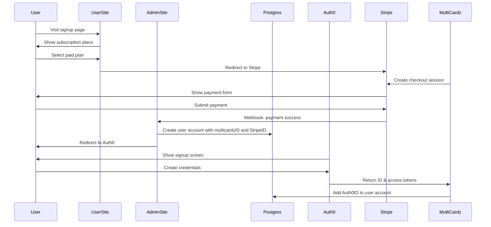
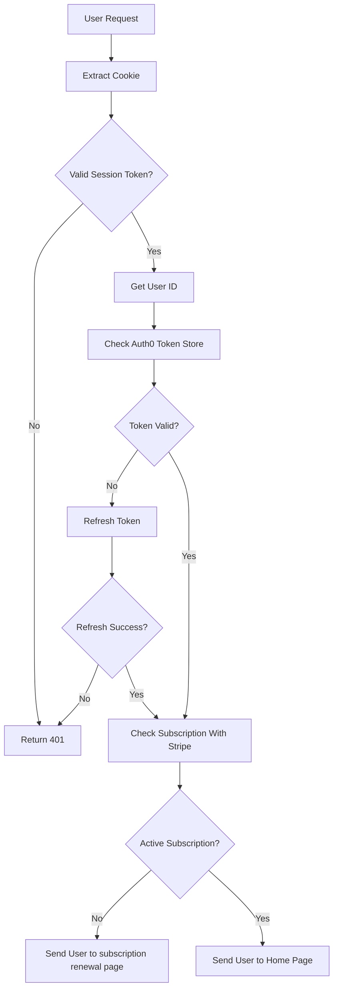

# MultiCardz Authentication, Subscription & User Management Requirements

## Document Information
- **Version**: 1.0
- **Date**: 2025-10-21
- **Status**: Draft
- **Purpose**: High-level functional and system requirements for authentication, subscription management, and user management systems

## 1. Overview

### 1.1 System Purpose
MultiCardz requires a comprehensive authentication, subscription, and user management system to:
- Securely authenticate and authorize users
- Manage subscription-based access to premium features
- Enforce zero-trust security principles with UUID-based data isolation
- Provide seamless user experience across authentication, payment, and application access

### 1.2 Scope
This document covers requirements for:
- Dual registration flows:
  - Auth-first flow for free users (Auth0 → Database → Free tier)
  - Pay-first flow for paid users (Stripe → Database → Auth0)
- User authentication via Auth0 with server-side token storage
- Subscription management and validation via Stripe
- User profile and workspace management
- Zero-trust security with UUID-based data isolation via data_filter middleware
- Integration points between Auth0, Stripe, and the MultiCardz application

### 1.3 Key Stakeholders
- End Users: Individuals and teams using MultiCardz for semantic tag management
- System Administrators: Managing user access and subscriptions
- Development Team: Implementing and maintaining the systems
- Security Team: Ensuring compliance and data protection

## 2. Functional Requirements

### 2.1 User Signup and Onboarding

#### 2.1.1 Registration Flows (Dual-Path Model)

**Free User Flow (Auth-First)**
- **FR-REG-001**: System SHALL allow users to sign up directly via Auth0 for free tier access
- **FR-REG-002**: System SHALL support Auth0 authentication with email/password and OAuth2 social providers (Google, Apple, Microsoft)
- **FR-REG-003**: System SHALL create user account in database from Auth0 ID token claims
- **FR-REG-004**: System SHALL assign unique multicardzID and Auth0ID to user account
- **FR-REG-005**: System SHALL automatically assign free tier subscription to new users
- **FR-REG-006**: System SHALL allow free users to upgrade to paid plans later

**Paid User Flow (Pay-First)**
- **FR-REG-007**: System SHALL initiate paid user registration via Stripe Checkout for subscription selection
- **FR-REG-008**: System SHALL create user account in database upon successful Stripe payment webhook
- **FR-REG-009**: System SHALL assign unique multicardzID and store StripeID in user account
- **FR-REG-010**: System SHALL redirect users to Auth0 after successful payment to create credentials
- **FR-REG-011**: System SHALL add Auth0ID to existing user account after credential creation

**Common Requirements**
- **FR-REG-012**: System SHALL support enterprise SSO connections via Auth0
- **FR-REG-013**: System SHALL validate email addresses during registration

#### 2.1.2 Onboarding Experience
- **FR-ONB-001**: System SHALL redirect new users to profile setup after first authentication
- **FR-ONB-002**: System SHALL collect essential profile information (name, organization, use case)
- **FR-ONB-003**: System SHALL provide guided tour of key features for new users
- **FR-ONB-004**: System SHALL offer trial subscription for new users without payment

### 2.2 Subscription Management

#### 2.2.1 Subscription Plans
- **FR-SUB-001**: System SHALL support multiple subscription tiers (Free, Professional, Team, Enterprise)
- **FR-SUB-002**: System SHALL enforce feature access based on subscription tier
- **FR-SUB-003**: System SHALL support monthly and annual billing cycles
- **FR-SUB-004**: System SHALL provide trial periods for premium plans

#### 2.2.2 Payment Processing
- **FR-PAY-001**: System SHALL redirect users to Stripe Checkout for subscription payments
- **FR-PAY-002**: System SHALL create Stripe checkout session before redirecting users
- **FR-PAY-003**: System SHALL support credit/debit card payments via Stripe
- **FR-PAY-004**: System SHALL receive payment success webhook from Stripe
- **FR-PAY-005**: System SHALL create user account in database upon payment webhook receipt
- **FR-PAY-006**: System SHALL handle payment failures gracefully with retry logic
- **FR-PAY-007**: System SHALL send payment receipts and invoices via email
- **FR-PAY-008**: System SHALL support subscription upgrades and downgrades

#### 2.2.3 Subscription Lifecycle
- **FR-SLC-001**: System SHALL automatically activate subscriptions upon successful payment
- **FR-SLC-002**: System SHALL handle subscription renewals automatically
- **FR-SLC-003**: System SHALL support subscription cancellation with data retention
- **FR-SLC-004**: System SHALL provide grace period for failed payments
- **FR-SLC-005**: System SHALL sync subscription status between Stripe and local database
- **FR-SLC-006**: System SHALL support free user upgrades to paid plans via Stripe
- **FR-SLC-007**: System SHALL add StripeID to existing user account when free user upgrades

### 2.3 Authentication Flows

#### 2.3.1 Login Process
- **FR-AUTH-001**: System SHALL authenticate users via Auth0 OAuth2 authorization code flow with PKCE
- **FR-AUTH-002**: System SHALL maintain user sessions using secure HTTP-only cookies containing session tokens
- **FR-AUTH-003**: System SHALL validate session tokens on every request by extracting cookie and checking validity
- **FR-AUTH-004**: System SHALL store Auth0 access/refresh tokens server-side in token store
- **FR-AUTH-005**: System SHALL automatically refresh expired Auth0 tokens for active sessions
- **FR-AUTH-006**: System SHALL verify active subscription status with Stripe on authenticated requests
- **FR-AUTH-007**: System SHALL redirect users with inactive subscriptions to renewal page
- **FR-AUTH-008**: System SHALL support "Remember Me" functionality for extended sessions
- **FR-AUTH-009**: System SHALL handle authentication errors with clear user messaging
- **FR-AUTH-010**: System SHALL support password reset via Auth0

#### 2.3.2 Session Management
- **FR-SES-001**: System SHALL maintain user sessions for configurable duration (default: 4 hours)
- **FR-SES-002**: System SHALL refresh tokens automatically for active users
- **FR-SES-003**: System SHALL invalidate sessions on explicit logout
- **FR-SES-004**: System SHALL support concurrent sessions across devices
- **FR-SES-005**: System SHALL clean up expired sessions automatically

### 2.4 User Profile Management

#### 2.4.1 Profile Information
- **FR-PROF-001**: System SHALL allow users to view and edit profile information
- **FR-PROF-002**: System SHALL sync profile updates with Auth0 user metadata
- **FR-PROF-003**: System SHALL support profile picture upload and management
- **FR-PROF-004**: System SHALL maintain audit trail of profile changes

#### 2.4.2 Account Settings
- **FR-ACC-001**: System SHALL allow users to manage notification preferences
- **FR-ACC-002**: System SHALL provide account security settings (MFA, password change)
- **FR-ACC-003**: System SHALL allow users to download their data (GDPR compliance)
- **FR-ACC-004**: System SHALL support account deletion with data purge

### 2.5 Workspace/Tenant Management

#### 2.5.1 Workspace Creation
- **FR-WS-001**: System SHALL support multiple workspaces per user account
- **FR-WS-002**: System SHALL enforce workspace limits based on subscription tier
- **FR-WS-003**: System SHALL provide workspace templates for common use cases
- **FR-WS-004**: System SHALL generate unique UUID identifiers for each workspace

#### 2.5.2 Access Control
- **FR-AC-001**: System SHALL support role-based access control (Owner, Admin, Member, Viewer)
- **FR-AC-002**: System SHALL allow workspace owners to invite team members
- **FR-AC-003**: System SHALL enforce permissions at the workspace level
- **FR-AC-004**: System SHALL support permission delegation and revocation
- **FR-AC-005**: System SHALL maintain access logs for audit purposes

## 3. System Requirements

### 3.1 Authentication System (Auth0 Integration)

#### 3.1.1 Core Authentication
- **SR-AUTH-001**: System SHALL integrate with Auth0 using OAuth2 authorization code flow
- **SR-AUTH-002**: System SHALL validate JWT tokens using Auth0's public keys
- **SR-AUTH-003**: System SHALL extract user identity from ID token claims
- **SR-AUTH-004**: System SHALL store Auth0 tokens securely server-side
- **SR-AUTH-005**: System SHALL implement token refresh mechanism

#### 3.1.2 Authentication Security
- **SR-ASEC-001**: System SHALL use PKCE for OAuth2 flow security
- **SR-ASEC-002**: System SHALL validate token signatures and expiration
- **SR-ASEC-003**: System SHALL implement rate limiting on authentication endpoints
- **SR-ASEC-004**: System SHALL log all authentication events for security monitoring

### 3.2 Authorization Model (Zero-Trust, UUID Isolation)

#### 3.2.1 Zero-Trust Architecture
- **SR-ZT-001**: System SHALL implement middleware stack for request processing
- **SR-ZT-002**: System SHALL verify authentication on every request via auth middleware (see diagram 8.2)
- **SR-ZT-003**: System SHALL pass authenticated requests to route handlers
- **SR-ZT-004**: System SHALL apply data_filter middleware to automatically inject UUID filters on all database queries
- **SR-ZT-005**: System SHALL enforce least-privilege access principles
- **SR-ZT-006**: System SHALL isolate data using UUID-based filtering via data_filter middleware
- **SR-ZT-007**: System SHALL prevent cross-tenant data access
- **SR-ZT-008**: System SHALL validate resource ownership before any operation

#### 3.2.2 UUID-Based Isolation (via data_filter middleware)
- **SR-UUID-001**: System SHALL assign globally unique identifiers (multicardzID) to all user accounts
- **SR-UUID-002**: System SHALL implement data_filter middleware to automatically inject UUID filters before query execution
- **SR-UUID-003**: data_filter middleware SHALL add `WHERE user_id = ?` clause to all data access queries
- **SR-UUID-004**: data_filter middleware SHALL filter queries by workspace_id for multi-tenant resources
- **SR-UUID-005**: System SHALL return only filtered data matching authenticated user's UUID
- **SR-UUID-006**: System SHALL include UUID in all API responses
- **SR-UUID-007**: System SHALL validate UUID format and ownership

### 3.3 Payment Processing (Stripe Integration)

#### 3.3.1 Payment Infrastructure
- **SR-PAY-001**: System SHALL integrate with Stripe Checkout for payment collection
- **SR-PAY-002**: System SHALL create checkout sessions and redirect users to Stripe
- **SR-PAY-003**: System SHALL handle Stripe webhooks for payment success events
- **SR-PAY-004**: System SHALL create user accounts in database from payment webhooks
- **SR-PAY-005**: System SHALL store multicardzID and StripeID in user account upon creation
- **SR-PAY-006**: System SHALL verify webhook signatures for security
- **SR-PAY-007**: System SHALL maintain payment audit trail
- **SR-PAY-008**: System SHALL support PCI-DSS compliance requirements

#### 3.3.2 Subscription Synchronization
- **SR-SYNC-001**: System SHALL sync subscription status with Stripe in real-time
- **SR-SYNC-002**: System SHALL handle subscription lifecycle webhooks
- **SR-SYNC-003**: System SHALL maintain local subscription cache
- **SR-SYNC-004**: System SHALL reconcile subscription discrepancies

### 3.4 Data Security and Privacy

#### 3.4.1 Data Protection
- **SR-DP-001**: System SHALL encrypt sensitive data at rest
- **SR-DP-002**: System SHALL use TLS 1.3+ for data in transit
- **SR-DP-003**: System SHALL implement secure session management
- **SR-DP-004**: System SHALL sanitize all user inputs
- **SR-DP-005**: System SHALL prevent SQL injection via parameterized queries

#### 3.4.2 Privacy Compliance
- **SR-PRIV-001**: System SHALL support GDPR data access requests
- **SR-PRIV-002**: System SHALL implement data retention policies
- **SR-PRIV-003**: System SHALL provide data export functionality
- **SR-PRIV-004**: System SHALL support right-to-be-forgotten requests

### 3.5 API Requirements

#### 3.5.1 Authentication API
- **SR-API-001**: System SHALL provide RESTful endpoints for authentication operations
- **SR-API-002**: System SHALL return consistent error responses with proper status codes
- **SR-API-003**: System SHALL include security headers in all responses
- **SR-API-004**: System SHALL support CORS for approved origins

#### 3.5.2 Subscription API
- **SR-SAPI-001**: System SHALL expose endpoints for subscription management
- **SR-SAPI-002**: System SHALL validate subscription status before premium operations
- **SR-SAPI-003**: System SHALL provide subscription status webhook endpoint
- **SR-SAPI-004**: System SHALL support idempotent payment operations

## 4. Non-Functional Requirements

### 4.1 Performance Targets

- **NFR-PERF-001**: Authentication response time SHALL be < 500ms for 95% of requests
- **NFR-PERF-002**: Token validation SHALL complete in < 100ms
- **NFR-PERF-003**: System SHALL support 10,000 concurrent authenticated sessions
- **NFR-PERF-004**: Database queries SHALL use indexes for O(log n) lookup performance
- **NFR-PERF-005**: Session token cleanup SHALL not impact request processing

### 4.2 Security Standards

- **NFR-SEC-001**: System SHALL comply with OWASP Top 10 security guidelines
- **NFR-SEC-002**: System SHALL undergo quarterly security audits
- **NFR-SEC-003**: System SHALL implement defense-in-depth security layers
- **NFR-SEC-004**: System SHALL maintain security event logs for 90 days minimum
- **NFR-SEC-005**: System SHALL support multi-factor authentication via Auth0

### 4.3 Scalability Requirements

- **NFR-SCALE-001**: System SHALL scale horizontally to handle load increases
- **NFR-SCALE-002**: System SHALL support database read replicas for query distribution
- **NFR-SCALE-003**: System SHALL implement caching for frequently accessed data
- **NFR-SCALE-004**: System SHALL handle 100,000+ users without degradation
- **NFR-SCALE-005**: Token store SHALL efficiently manage memory with automatic cleanup

### 4.4 Availability Requirements

- **NFR-AVAIL-001**: System SHALL maintain 99.9% uptime for authentication services
- **NFR-AVAIL-002**: System SHALL implement circuit breakers for external services
- **NFR-AVAIL-003**: System SHALL provide graceful degradation during Auth0 outages
- **NFR-AVAIL-004**: System SHALL implement retry logic for transient failures

### 4.5 Compliance Requirements

- **NFR-COMP-001**: System SHALL comply with PCI-DSS for payment processing
- **NFR-COMP-002**: System SHALL comply with GDPR for EU users
- **NFR-COMP-003**: System SHALL comply with CCPA for California users
- **NFR-COMP-004**: System SHALL maintain SOC 2 Type II compliance
- **NFR-COMP-005**: System SHALL implement data residency controls

## 5. Architecture Constraints

### 5.1 Function-Based Architecture

- **AC-FUNC-001**: Business logic SHALL be implemented as pure functions with explicit dependencies
- **AC-FUNC-002**: System SHALL use immutable data structures (frozenset, tuple)
- **AC-FUNC-003**: System SHALL avoid classes except for Pydantic models and SQLAlchemy ORM
- **AC-FUNC-004**: System SHALL implement functional programming patterns
- **AC-FUNC-005**: Side effects SHALL be isolated to approved I/O operations

### 5.2 Zero-Trust UUID Isolation

- **AC-ZT-001**: Every API request SHALL include authentication verification
- **AC-ZT-002**: Database queries SHALL include user_id/workspace_id filters
- **AC-ZT-003**: System SHALL use UUID v4 for all resource identifiers
- **AC-ZT-004**: Cross-workspace operations SHALL be explicitly prohibited
- **AC-ZT-005**: Resource access SHALL require ownership validation

### 5.3 Integration Requirements

- **AC-INT-001**: Auth0 integration SHALL use official SDK/libraries
- **AC-INT-002**: Stripe integration SHALL use webhook endpoints for event processing
- **AC-INT-003**: System SHALL maintain local user records synchronized with Auth0
- **AC-INT-004**: External service failures SHALL not compromise core functionality
- **AC-INT-005**: Integration points SHALL implement circuit breaker patterns

### 5.4 Technology Stack Constraints

- **AC-TECH-001**: Backend SHALL use Python with FastAPI framework
- **AC-TECH-002**: Database SHALL use PostgreSQL with SQLAlchemy ORM
- **AC-TECH-003**: Frontend SHALL use HTMX for dynamic interactions
- **AC-TECH-004**: Session management SHALL use secure HTTP-only cookies
- **AC-TECH-005**: Caching SHALL use Redis for distributed cache

## 6. Success Criteria

### 6.1 Authentication Success Metrics

- **SC-AUTH-001**: 99.9% successful authentication rate for valid credentials
- **SC-AUTH-002**: < 1% authentication-related support tickets
- **SC-AUTH-003**: Zero unauthorized data access incidents
- **SC-AUTH-004**: 100% of sessions properly cleaned up after expiry

### 6.2 Subscription Success Metrics

- **SC-SUB-001**: 99.9% successful payment processing rate
- **SC-SUB-002**: < 2% involuntary churn due to payment failures
- **SC-SUB-003**: 100% accurate subscription status synchronization
- **SC-SUB-004**: < 24 hour resolution for subscription issues

### 6.3 Security Success Metrics

- **SC-SEC-001**: Zero security breaches or data leaks
- **SC-SEC-002**: 100% of API requests authenticated and authorized
- **SC-SEC-003**: All sensitive operations logged for audit
- **SC-SEC-004**: Quarterly security assessment pass rate of 100%

### 6.4 Performance Success Metrics

- **SC-PERF-001**: 95th percentile response time < 500ms
- **SC-PERF-002**: System uptime > 99.9%
- **SC-PERF-003**: Database query performance meets O(log n) targets
- **SC-PERF-004**: Memory usage remains stable under load

### 6.5 User Experience Success Metrics

- **SC-UX-001**: < 3 clicks to complete authentication
- **SC-UX-002**: < 5 minutes for new user onboarding
- **SC-UX-003**: User satisfaction score > 4.5/5
- **SC-UX-004**: < 1 minute to upgrade subscription

## 7. Acceptance Criteria

### 7.1 Authentication System

- Successful OAuth2 flow with Auth0 for all authentication methods
- Secure cookie-based session management with automatic cleanup
- Token validation and refresh working correctly
- Multi-factor authentication functional via Auth0
- All authentication events properly logged

### 7.2 Subscription System

- Stripe Checkout integration functioning for all payment flows
- Webhook processing correctly updating subscription status
- Subscription validation middleware blocking unauthorized access
- Upgrade/downgrade flows working without data loss
- Payment retry logic handling failed payments

### 7.3 User Management System

**Free User Flow:**
- User accounts created in database from Auth0 ID token claims with multicardzID and Auth0ID
- Free tier subscription automatically assigned to new users
- Users able to upgrade to paid plans through Stripe integration

**Paid User Flow:**
- User accounts created in database from Stripe payment webhook with multicardzID and StripeID
- Auth0ID added to user account after credential creation

**Common:**
- User profiles synchronized between database and Auth0
- Workspace creation and management functional
- Role-based access control properly enforced
- UUID-based data isolation preventing cross-tenant access via data_filter middleware
- data_filter middleware automatically injecting WHERE user_id = ? on all queries
- Audit trails capturing all significant user actions

### 7.4 Security Implementation

- Middleware stack processing all requests with auth middleware (diagram 8.2)
- All API endpoints requiring authentication via session token validation
- Auth0 tokens stored server-side with automatic refresh
- Subscription status verified on authenticated requests
- data_filter middleware automatically filtering all database queries (diagram 8.3)
- data_filter middleware injecting WHERE user_id = ? clause on all data access queries
- No unauthorized data access possible - all queries filtered by user UUID
- Security headers present in all responses
- Penetration testing passing without critical issues

## 8. Workflow Diagrams

### 8.1 User Registration Flows

**Note**: MultiCardz supports two registration flows:
1. **Free User Flow (Auth-First)**: User → Auth0 → Database (with free tier subscription)
2. **Paid User Flow (Pay-First)**: User → Stripe → Database → Auth0 (shown below)

#### 8.1.1 Paid User Registration and Subscription Flow (Pay-First)

#### 8.1.2 Free User Registration Flow (Auth-First)

### 8.2 Authentication Flow with Subscription Check

### 8.3 Zero-Trust Data Access Flow

```mermaid
flowchart LR
    A[API Request] --> B[Middleware Stack]
    B --> C[Auth Middleware - see 8.2]
    C --> D[Route Handler]
    D --> E[Database Query]
    E --> F[data_filter Middleware]
    F --> G[Inject WHERE user_id = ?]
    G --> H[Execute Filtered Query]
    H --> I[Return User's Data Only]
```

## 9. Appendices

### 9.1 Glossary

- **Auth0**: Third-party authentication and authorization platform
- **UUID**: Universally Unique Identifier for resource isolation (multicardzID)
- **PKCE**: Proof Key for Code Exchange, OAuth2 security extension
- **JWT**: JSON Web Token for secure information transmission
- **MFA**: Multi-Factor Authentication for enhanced security
- **Zero-Trust**: Security model requiring verification of every request
- **data_filter middleware**: Middleware component that automatically injects `WHERE user_id = ?` clauses into all database queries for UUID-based data isolation
- **multicardzID**: Unique identifier assigned to each user account
- **Auth-First Flow**: Registration flow where free users sign up via Auth0 first, then receive free tier access
- **Pay-First Flow**: Registration flow where paid users complete Stripe payment before creating Auth0 credentials

### 9.2 References

- Auth0 Documentation: https://auth0.com/docs
- Stripe API Reference: https://stripe.com/docs/api
- OWASP Security Guidelines: https://owasp.org/www-project-top-ten/
- OAuth2 Specification: https://oauth.net/2/
- MultiCardz Architecture Documents: `/docs/architecture/`

### 9.3 Related Documents

- `/docs/architecture/multicardz_auth_architecture.md`
- `/docs/architecture/STRIPE_AUTH0_SECURITY_DOCUMENTATION.md`
- `/docs/biz/cardz-complete-patent.md`
- `/docs/biz/Provisional Patent Application - Semantic Tag Sets.md`

---

## Document Control

- **Review Cycle**: Quarterly
- **Approval Required By**: Product Owner, Security Lead, Technical Architect
- **Distribution**: Development Team, Security Team, Product Management